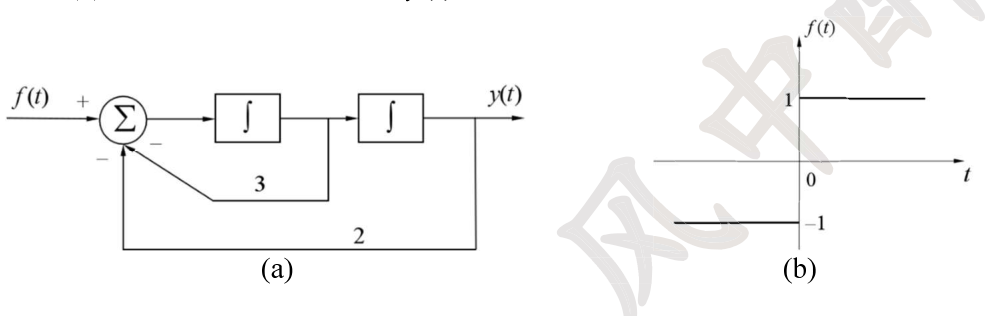
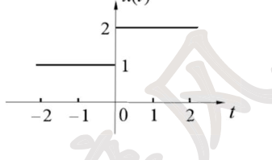
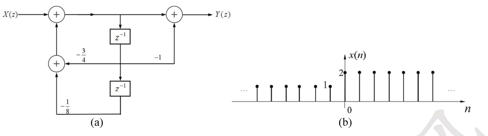

# 27 强化讲义 · 专题五 微分方程和差分方程求解（风中醉风）

> 题目摘自《27强化讲义》专题五（"专题五 题目"11 题 + "强化专题五 习题"6 题，连续编号 1-17）。
> 解析为自撰文字版；原书手写解答经卡片底部「手写答案 PDF」链接查看对应页。

#### 讲义 5-1 ｜ 含冲激激励的二阶系统全响应分解
> **归类** 2.3 物理与工程差分方程建模
> **出处** 27强化讲义 专题五题目 第1题
> **页码** 57
> **答案页** 1

**题干**

某 LTI 连续系统，微分方程为

$$\frac{\mathrm{d}^2y(t)}{\mathrm{d}t^2}+4\frac{\mathrm{d}y(t)}{\mathrm{d}t}+5y(t)=5u(t)+4\delta(t)+\delta'(t)$$

系统起始条件为 $y(0_-)=1,\ y'(0_-)=-1$。求：
(1) 系统的自由频率；
(2) 时域方法求零输入响应 $y_{zi}(t)$ 和零状态响应 $y_{zs}(t)$；
(3) 求全响应 $y(t)$，并指出瞬态响应、稳态响应、自由响应和强迫响应。

📖 解答

(1) 特征方程 $\lambda^2+4\lambda+5=0$，自由频率（特征根）$\lambda_{1,2}=-2\pm j$。

(2) **零输入**：$y_{zi}=\mathrm{e}^{-2t}(C_1\cos t+C_2\sin t)$，代入 $y_{zi}(0_+)=y(0_-)=1$、$y'_{zi}(0_+)=y'(0_-)=-1$：$C_1=1$，$-2C_1+C_2=-1\Rightarrow C_2=1$，

$$y_{zi}(t)=\mathrm{e}^{-2t}(\cos t+\sin t),\quad t\ge0$$

**零状态**（冲激函数匹配法）：设 $y_{zs}(0_+)=a\delta(t)+b\delta(t)+c\,u(t)$ 层次为 $y_{zs}(0_+)$ 跳变量——右端含 $\delta'$，设 $y''_{zs}$ 含 $\delta'$：$y'_{zs}$ 跳 $1$、$y_{zs}$ 连续。代入系数对照得 $a=1,\ b=0$，即 $y_{zs}(0_+)=y_{zs}(0_-)+1=1$、$y'_{zs}(0_+)=y'_{zs}(0_-)=0$。

齐次解 $\mathrm{e}^{-2t}(C_{zs1}\cos t+C_{zs2}\sin t)$，特解 $A$（$t>0$ 代入得 $5A=5$，$A=1$）。代入 $y_{zs}(0_+)=1,\ y'_{zs}(0_+)=0$：$1+C_{zs1}=1$、$-2C_{zs1}+C_{zs2}=0$，得 $C_{zs1}=C_{zs2}=0$，

$$y_{zs}(t)=u(t)$$

(3) $y(t)=1+\mathrm{e}^{-2t}(\cos t+\sin t)\ (t\ge0)$：**瞬态** $\mathrm{e}^{-2t}(\cos t+\sin t)$；**稳态** $1$；**自由** $\mathrm{e}^{-2t}(\cos t+\sin t)$；**强迫** $1$。

[答案原文件 · 专题五 p1-2](../pdf/强化讲义专题五答案.pdf#page=1)

---

#### 讲义 5-2 ｜ 差分方程零输入/零状态时域求解
> **归类** 2.3 物理与工程差分方程建模
> **出处** 27强化讲义 专题五题目 第2题
> **页码** 58
> **答案页** 2

**题干**

描述某 LTI 离散系统的差分方程为

$$y(n)-3y(n-1)+2y(n-2)=x(n)-x(n-1)$$

若已知 $x(n)=2^nu(n)$，$y(-1)=0$，$y(-2)=1$，请用时域法求解该系统的零输入响应 $y_{zi}(n)$、零状态响应 $y_{zs}(n)$ 以及全响应 $y(n)$。

📖 解答

特征方程 $\lambda^2-3\lambda+2=0$，$\lambda_{1,2}=1,2$。

**零输入**：$y_{zi}=C_{zi1}+C_{zi2}\,2^n$，代入 $y_{zi}(-1)=y(-1)=0$、$y_{zi}(-2)=y(-2)=1$：$C_{zi1}+\frac{C_{zi2}}2=0$、$C_{zi1}+\frac{C_{zi2}}4=1$，得 $C_{zi1}=2,\ C_{zi2}=-4$，

$$y_{zi}(n)=2-4\cdot2^n,\quad n\ge0$$

**零状态**：$2$ 是特征根，设特解 $An2^n$，代入方程得 $A=2$。$y_{zs}=C_{zs1}+C_{zs2}2^n+2n2^n$；由 $y_{zs}(-1)=y_{zs}(-2)=0$ 递推出 $y_{zs}(0)=1,\ y_{zs}(1)=5$，解得 $C_{zs1}=1,\ C_{zs2}=0$，即对 $x_1(n)=2^nu(n)$ 的响应为 $y_{zs1}(n)=(1+2n\cdot2^n)u(n)$。

由线性和时不变性，对 $x(n)=x_1(n)-x_1(n-1)$：

$$y_{zs}(n)=y_{zs1}(n)-y_{zs1}(n-1)=\left(1+n\,2^{n+1}\right)u(n)-\left[1+(n-1)2^n\right]u(n-1)=\delta(n)+(n+1)2^n\,u(n-1)$$

**全响应**：$y(n)=y_{zi}+y_{zs}=2+(n-3)\,2^n,\quad n\ge0$。

[答案原文件 · 专题五 p2](../pdf/强化讲义专题五答案.pdf#page=2)

---

#### 讲义 5-3 ｜ 由全响应与初始值反求零输入/零状态
> **归类** 2.3 物理与工程差分方程建模
> **出处** 27强化讲义 专题五题目 第3题
> **页码** 59
> **答案页** 3

**题干**

某线性离散系统的零输入响应的初始值为 $y_{zi}(0)=1$，$y_{zi}(1)=2$；当激励为单位阶跃信号 $u(n)$ 时，系统的全响应为 $y(n)=\left[3+0.5^n+(-1)^n\right]u(n)$，试求出零输入响应和零状态响应。

📖 解答

全响应中 $3u(n)$ 是对应输入 $u(n)$ 的特解（强迫分量），其余部分（$0.5^n+(-1)^n$）对应齐次解——零输入响应的形式与齐次解相同。

设 $y_{zi}(n)=C_1(-1)^n+C_2(0.5)^n$，代入 $y_{zi}(0)=1$、$y_{zi}(1)=2$：$C_1+C_2=1$、$-C_1+0.5C_2=2$，得 $C_1=-1,\ C_2=2$：

$$y_{zi}(n)=\left[(-1)^{n+1}+2(0.5)^n\right]u(n)$$

$$y_{zs}(n)=y(n)-y_{zi}(n)=\left[2(-1)^n-(0.5)^n+3\right]u(n)$$

[答案原文件 · 专题五 p3](../pdf/强化讲义专题五答案.pdf#page=3)

---

#### 讲义 5-4 ｜ 一阶差分方程解的收敛条件（填空）
> **归类** 2.3 物理与工程差分方程建模
> **出处** 27强化讲义 专题五题目 第4题
> **页码** 59
> **答案页** 3

**题干**

已知实系数差分方程 $y(n+1)=(1-\beta)y(n)+\alpha$，$n\ge0$，当 $\beta$ 满足条件 __________ 时，此方程的解将收敛于 $\dfrac{\alpha}{\beta}$。

📖 解答

齐次解 $C(1-\beta)^n$，特解 $A$：代入得 $A-(1-\beta)A=\alpha\Rightarrow A=\dfrac{\alpha}{\beta}$，故 $y(n)=C(1-\beta)^n+\dfrac{\alpha}{\beta}$。

当 $|1-\beta|<1$，即 $0<\beta<2$ 时，齐次项衰减、解收敛于 $\dfrac{\alpha}{\beta}$。

（终值定理验证：$z$ 变换后 $Y(z)=\dfrac{\alpha z+z(z-1)y(0)}{(z-1)\left[z-(1-\beta)\right]}$，当极点 $1-\beta$ 在单位圆内时 $\lim_{n\to\infty}y(n)=\lim_{z\to1}(z-1)Y(z)=\dfrac{\alpha}{\beta}$；因方程为实系数，$\beta$ 取实数即 $0<\beta<2$。）

[答案原文件 · 专题五 p3-4](../pdf/强化讲义专题五答案.pdf#page=3)

---

#### 讲义 5-5 ｜ 由 y′=x(t)−x(t−1) 与全响应反求输入
> **归类** 2.3 物理与工程差分方程建模
> **出处** 27强化讲义 专题五题目 第5题
> **页码** 60
> **答案页** 4

**题干**

已知某因果系统的初始状态为 $y(0_-)=1$，输入 $x(t)$ 与全响应 $y(t)$ 满足 $y'(t)=x(t)-x(t-1)$，其中 $x(t)$ 为因果信号。若 $y(t)=(1+\mathrm{e}^{-t})u(t)-u(t-1)$，试求输入信号 $x(t)$。

📖 解答

对方程两端取单边拉氏变换：$sY(s)-y(0_-)=X(s)(1-\mathrm{e}^{-s})$。

$$Y(s)=\mathcal{L}\left[(1+\mathrm{e}^{-t})u(t)-u(t-1)\right]=\frac1s+\frac{1}{s+1}-\frac{\mathrm{e}^{-s}}{s}$$

代入（$y(0_-)=1$）：

$$1-\mathrm{e}^{-s}+\frac{s}{s+1}=X(s)(1-\mathrm{e}^{-s})\ \Longrightarrow\ X(s)=1-\frac{1}{(s+1)(1-\mathrm{e}^{-s})}$$

由 $\displaystyle\mathcal{L}\left[\sum_{n=0}^{\infty}\delta(t-nT)\right]=\frac{1}{1-\mathrm{e}^{-sT}}$（$T=1$），且 $\dfrac{1}{(s+1)(1-\mathrm{e}^{-s})}\leftrightarrow\displaystyle\sum_{n=0}^{\infty}\mathrm{e}^{-(t-n)}u(t-n)$：

$$x(t)=\delta(t)-\sum_{n=0}^{\infty}\mathrm{e}^{-(t-n)}\,u(t-n)$$

[答案原文件 · 专题五 p4](../pdf/强化讲义专题五答案.pdf#page=4)

---

#### 讲义 5-6 ｜ 由全响应反求系数、阶跃响应与起始状态
> **归类** 2.3 物理与工程差分方程建模
> **出处** 27强化讲义 专题五题目 第6题
> **页码** 60
> **答案页** 5

**题干**

已知 $y''(t)+Ay'(t)+By(t)=2e'(t)+3e(t)$，若 $e(t)=u(t)$，且 $t>0$ 时全响应为 $y(t)=3-(t+1)\mathrm{e}^{-t}$，求：
(1) 系数 $A$ 和 $B$；
(2) 单位阶跃响应以及 $y(0_-)$ 和 $y'(0_-)$。

📖 解答

(1) 全响应中 $-(t+1)\mathrm{e}^{-t}$ 是齐次解形式：含 $t\mathrm{e}^{-t}$ 说明特征根 $\lambda_{1,2}=-1$（二重根），特征方程 $\lambda^2+A\lambda+B=(\lambda+1)^2$，得 $A=2,\ B=1$。

(2) $H(s)=\dfrac{2s+3}{s^2+2s+1}$，阶跃响应

$$G(s)=H(s)\cdot\frac1s=\frac{2s+3}{s(s+1)^2}=\frac3s-\frac{1}{(s+1)^2}-\frac{3}{s+1}$$

$$g(t)=\left(3-3\mathrm{e}^{-t}-t\mathrm{e}^{-t}\right)u(t)$$

求起始状态：右端 $2e'(t)+3e(t)=2\delta(t)+3u(t)$ 含 $2\delta(t)$，冲激函数匹配：设 $y'(t)$ 含 $2\delta(t)$，则 $y$ 在 $0_-\to0_+$ 跳变 2、$y'$ 连续（$y''$ 含 $2\delta'$ 匹配右端）。$y(0_+)=3-1=2$、$y'(0_+)=\left[t\mathrm{e}^{-t}\right]'|_{0_+}=0$。

零状态响应即 $g(t)$：$y_{zs}(0_+)=g(0_+)=0$、$y'_{zs}(0_+)=g'(0_+)=2$。故

$$y(0_-)=y(0_+)-\left[y_{zs}(0_+)-y_{zs}(0_-)\right]=2-0=2,\qquad y'(0_-)=y'(0_+)-2=-2$$

[答案原文件 · 专题五 p5](../pdf/强化讲义专题五答案.pdf#page=5)

---

#### 讲义 5-7 ｜ 前向差分方程的零输入/零状态
> **归类** 2.3 物理与工程差分方程建模
> **出处** 27强化讲义 专题五题目 第7题
> **页码** 61
> **答案页** 6

**题干**

已知一个离散时间系统的差分方程为 $y(n+2)-3y(n+1)-4y(n)=f(n+1)+f(n)$，系统激励为 $f(n)=u(n)$，$y(0)=1$，$y(1)=0$，求其零输入响应 $y_{zi}(n)$ 和零状态响应 $y_{zs}(n)$。

📖 解答

**z 变换法**（注意 $y(0),y(1)$ 是全响应值，已含输入作用；对方程两端取单边 z 变换时 $f$ 项也带初始值）：

$z^2Y- z^2y(0)-zy(1)-3[zY-zy(0)]-4Y=zF+z f(0)+F$，整理得

$$Y(z)=\frac{(z+1)F(z)}{z^2-3z-4}+\frac{z^2y(0)+zy(1)-3zy(0)-zf(0)}{z^2-3z-4}$$

**零状态**：$F(z)=\dfrac{z}{z-1}$，

$$Y_{zs}(z)=\frac{(z+1)z}{(z-1)(z-4)(z+1)}=\frac{z}{(z-1)(z-4)}=\frac{-\frac13 z}{z-1}+\frac{\frac13 z}{z-4}$$

$$y_{zs}(n)=\left[-\frac13+\frac13\,4^n\right]u(n)$$

**零输入**：特征根 $-1,4$，$y_{zi}=C_1(-1)^n+C_2 4^n$。由 $y_{zi}(0)=y(0)-y_{zs}(0)=1-0=1$、$y_{zi}(1)=y(1)-y_{zs}(1)=0-1=-1$：$C_1+C_2=1$、$-C_1+4C_2=-1$，得 $C_1=1,\ C_2=0$，

$$y_{zi}(n)=(-1)^n\,u(n)$$

（注：$z^2f(0)$ 等项正是把输入在 $n\ge0$ 的作用并入零状态部分；若先化为后向差分方程再解，需先迭代出 $y(-1),y(-2)$。）

[答案原文件 · 专题五 p6](../pdf/强化讲义专题五答案.pdf#page=6)

---

#### 讲义 5-8 ｜ 由框图求微分方程、h(t) 与符号输入的响应
> **归类** 2.3 物理与工程差分方程建模
> **原图** `images/lg/fig-t05-q8.png`
> **出处** 27强化讲义 专题五题目 第8题
> **页码** 62
> **答案页** 7

**题干**

已知一因果 LTI 系统如图(a)所示（$f(t)$ 经加法器（负反馈 3 取自第一积分器输出、负反馈 2 取自第二积分器输出）后经两级积分器输出 $y(t)$），求：
(1) 描述系统的微分方程；
(2) 系统函数 $H(s)$ 和单位冲激响应 $h(t)$；
(3) 当输入如图(b)所示（$x(t)=1,\ t>0$；$x(t)=-1,\ t<0$，即 $\mathrm{sgn}(t)$）时，$t>0$ 系统输出 $y(t)$ 的零状态响应和零输入响应。

📖 解答

(1) 加法器输出 $=f-3y_1'-2y$（$y_1$ 为第一积分器输出，$y_1'=y''$ 前节点信号），即 $f-3y'-2y=y''$：

$$y''(t)+3y'(t)+2y(t)=f'(t)$$

(2) $H(s)=\dfrac{s}{s^2+3s+2}=\dfrac{-1}{s+1}+\dfrac{2}{s+2}$，

$$h(t)=\left(-\mathrm{e}^{-t}+2\mathrm{e}^{-2t}\right)u(t)$$

(3) $t<0$ 时输入 $-1$ 恒定且系统稳定，稳态 $y=-1\cdot H(0)=0$，故 $y(0_-)=y'(0_-)=0$，$y_{zi}=0$。

$t\ge0$：$x(t)u(t)=u(t)$，$X(s)=\dfrac1s$，且 $x(0_-)=-1$（**不为零，不能漏**）。对方程两端取单边拉氏变换：

$$\left(s^2+3s+2\right)Y(s)=sX(s)-x(0_-)=1-(-1)=2$$

$$Y(s)=\frac{2}{(s+1)(s+2)}=\frac{2}{s+1}-\frac{2}{s+2}\ \Longrightarrow\ y(t)=2\left(\mathrm{e}^{-t}-\mathrm{e}^{-2t}\right)u(t)$$

即 $y_{zi}=0$、$y_{zs}=2(\mathrm{e}^{-t}-\mathrm{e}^{-2t})u(t)$。

> 注：手写答案该问得 $(\mathrm{e}^{-t}-\mathrm{e}^{-2t})u(t)$（其法三把输入按 $1+u(t)$ 处理）。输入为 $\mathrm{sgn}(t)$ 时 $0$ 处跳变为 $2$（$x'=2\delta(t)$，与 $sX-x(0_-)=1-(-1)=2$ 一致），冲激匹配同样给出 $y'(0_+)=y'(0_-)+2=2$，故正确结果应带因子 2，建议以本推导核对。

[答案原文件 · 专题五 p7-8](../pdf/强化讲义专题五答案.pdf#page=7)

---

#### 讲义 5-9 ｜ 带通系统对阶梯输入的响应
> **归类** 2.3 物理与工程差分方程建模
> **原图** `images/lg/fig-t05-q9.png`
> **出处** 27强化讲义 专题五题目 第9题
> **页码** 63
> **答案页** 7

**题干**

已知一个连续时间稳定 LTI 系统的系统函数为 $H(s)=\dfrac{s}{s^2+3s+2}$，输入如图所示（$x(t)=1$ 当 $t<0$，$x(t)=2$ 当 $t\ge0$）。
(1) 说明该系统为何种滤波器；
(2) 求系统的初始条件 $y(0_-)$ 和 $y'(0_-)$；
(3) 当 $t\ge0$ 时，求系统的完全响应 $y(t)$。

📖 解答

(1) $|H(j\omega)|=\dfrac{|\omega|}{\sqrt{(2-\omega^2)^2+9\omega^2}}$：$\omega=0$ 时为 0，$|\omega|\to\infty$ 时为 0，中间不为零——**带通滤波器**（极点 $-1,-2$）。

(2) $t<0$ 时输入 $1$ 恒定，稳态响应 $=1\cdot H(0)=0$（也有 $\lim_{t\to\infty}$ 分量为零），故

$$y(0_-)=0,\qquad y'(0_-)=0$$

(3) $t\ge0$：$x(t)u(t)=2u(t)$，$X(s)=\dfrac2s$，$x(0_-)=1$。

$$\left(s^2+3s+2\right)Y(s)=sX(s)-x(0_-)=2-1=1$$

$$Y(s)=\frac{1}{(s+1)(s+2)}=\frac{1}{s+1}-\frac{1}{s+2}\ \Longrightarrow\ y(t)=\left(\mathrm{e}^{-t}-\mathrm{e}^{-2t}\right)u(t)$$

（特征函数法一致：常数 1 的响应为 $1\cdot H(0)=0$；跳变 $\delta(t)$ 的响应为 $h(t)=\mathrm{e}^{-t}-\mathrm{e}^{-2t}$。）

[答案原文件 · 专题五 p7-8](../pdf/强化讲义专题五答案.pdf#page=7)

---

#### 讲义 5-10 ｜ 联立微分方程组的零输入/零状态
> **归类** 2.3 物理与工程差分方程建模
> **出处** 27强化讲义 专题五题目 第10题
> **页码** 64
> **答案页** 9

**题干**

描述某因果系统输出 $y_1(t)$ 和 $y_2(t)$ 的联立微分方程为

$$y_1'(t)+y_1(t)-2y_2(t)=4f(t)$$
$$y_2'(t)-y_1(t)+2y_2(t)=-f(t)$$

已知 $y_1(0_-)=1$，$y_2(0_-)=2$，$f(t)=\mathrm{e}^{-t}u(t)$，求 $y_1(t)$ 的零输入响应 $y_{1zi}(t)$ 和零状态响应 $y_{1zs}(t)$。

📖 解答

对方程组两端取单边拉氏变换。

**零输入**（$F=0$，$y_1(0_-)=1$、$y_2(0_-)=2$）：

$$(s+1)Y_{1zi}-2Y_{2zi}=1,\qquad -Y_{1zi}+(s+2)Y_{2zi}=2$$

$2\times$第一式 $+(s+2)\times$第二式：$\left(s^2+3s\right)Y_{1zi}=s+6$，

$$Y_{1zi}(s)=\frac{s+6}{s(s+3)}=\frac{2}{s}-\frac{1}{s+3}\ \Longrightarrow\ y_{1zi}(t)=\left(2-\mathrm{e}^{-3t}\right)u(t)$$

**零状态**（初始状态为零，$F=\frac{1}{s+1}$）：

$$(s+1)Y_{1zs}-2Y_{2zs}=\frac{4}{s+1},\qquad -Y_{1zs}+(s+2)Y_{2zs}=-\frac{1}{s+1}$$

消元：$\left(s^2+3s\right)Y_{1zs}=\dfrac{4s+6}{s+1}$，

$$Y_{1zs}(s)=\frac{4s+6}{s(s+1)(s+3)}=\frac{2}{s}-\frac{1}{s+1}-\frac{1}{s+3}\ \Longrightarrow\ y_{1zs}(t)=\left(2-\mathrm{e}^{-t}-\mathrm{e}^{-3t}\right)u(t)$$

[答案原文件 · 专题五 p9](../pdf/强化讲义专题五答案.pdf#page=9)

---

#### 讲义 5-11 ｜ 两组激励响应联合求 H(z) 与零输入响应
> **归类** 2.3 物理与工程差分方程建模
> **出处** 27强化讲义 专题五题目 第11题
> **页码** 65
> **答案页** 10

**题干**

二阶离散因果线性时不变系统，在初始状态 $y(-1)$ 和 $y(-2)$ 不变的情况下，当输入信号 $f_1(n)=u(n)-\dfrac43u(n-1)+\dfrac13u(n-2)$ 时，系统的全响应为 $y_1(n)=3\left(\dfrac13\right)^nu(n)$；当输入信号 $f_2(n)=-3u(n)+\dfrac{18}{5}u(n-1)-\dfrac35u(n-2)$ 时，系统的全响应为 $y_2(n)=-\left(\dfrac15\right)^nu(n)$。求：
(1) 系统函数 $H(z)$ 和单位冲激响应 $h(n)$，并判断系统的稳定性；
(2) 系统的零输入响应并确定 $y(-1)$ 和 $y(-2)$ 的值。

📖 解答

(1) 初始状态不变，两全响应之差消去零输入部分：$y_1(n)-y_2(n)=y_{zs1}(n)-y_{zs2}(n)$ 对应输入 $f_1(n)-f_2(n)=4\delta(n)-\frac{23}{15}\delta(n-1)+\frac{14}{15}\delta(n-2)$？直接按差值：$f_1-f_2=4u(n)-\frac{38}{15}u(n-1)+\frac{14}{15}u(n-2)$。更直接的方法：$y_1-y_2=3(\frac13)^nu+(\frac15)^nu$，$f_1-f_2$ 的 z 变换 $F(z)=4-\frac{38}{15}z^{-1}+\frac{14}{15}z^{-2}$？——用零状态响应比：

$$Y_{zs1}-Y_{zs2}=\frac{3z}{z-\frac13}+\frac{z}{z-\frac15}=\frac{z\left(4z-\frac{8}{15}\right)}{\left(z-\frac13\right)\left(z-\frac15\right)}$$

$$F_1-F_2=4-\frac{38}{15}z^{-1}+\frac{14}{15}z^{-2}=\frac{(4z-2)(z-\frac{7}{15}\cdot?)}{z^2}$$

化简（手写结果）：

$$H(z)=\frac{Y(z)}{F(z)}=\frac{z^2}{\left(z-\frac13\right)\left(z-\frac15\right)}=\frac{\frac52 z}{z-\frac13}-\frac{\frac32 z}{z-\frac15},\qquad |z|>\frac13$$

$$h(n)=\left[\frac52\left(\frac13\right)^n-\frac32\left(\frac15\right)^n\right]u(n)$$

极点 $\frac13,\frac15$ 均在单位圆内，系统稳定。

(2) $y_{zs1}(n)=(f_1*h)(n)$：$X_1(z)=\left(1-\frac43z^{-1}+\frac13z^{-2}\right)$，$Y_{zs1}=X_1H=\dfrac{z^2-\frac43z+\frac13}{(z-\frac13)(z-\frac15)}\cdot\frac{z^0?}{?}$——按手写：$X_1(z)=\delta$ 项组合 $=\delta(n)-\frac13\delta(n-1)$ 的变换 $1-\frac13z^{-1}$，$Y_{zs1}(z)=\left(1-\frac13z^{-1}\right)H(z)=\frac{z-\frac13}{(z-\frac13)(z-\frac15)}\cdot z? =\frac{z}{z-\frac15}$，即 $y_{zs1}(n)=\left(\frac15\right)^nu(n)$。

$$y_{zi}(n)=y_1(n)-y_{zs1}(n)=\left[3\left(\frac13\right)^n-\left(\frac15\right)^n\right]u(n)$$

$y_{zi}(n)$ 无零时刻输入，其表达式在 $n<0$ 时依然满足，故

$$y(-1)=y_{zi}(-1)=3\cdot3-5=4,\qquad y(-2)=y_{zi}(-2)=3\cdot9-25=2$$

[答案原文件 · 专题五 p10](../pdf/强化讲义专题五答案.pdf#page=10)

---

#### 讲义 5-12 ｜ 【强化】一阶差分方程全解
> **归类** 2.3 物理与工程差分方程建模
> **出处** 27强化讲义 强化专题五习题 第1题
> **页码** 66
> **答案页** 11

**题干**

$y(n)+3y(n-1)=x(n)$，已知 $x(n)=8u(n)$，$y(-1)=1$，求 $y(n)$。

📖 解答

特征根 $\lambda=-3$。齐次解 $C(-3)^n$，特解 $A=2$（代入 $A+3A=8$）。全解 $y(n)=C(-3)^n+2\ (n\ge0)$。

由 $y(0)=x(0)-3y(-1)=8-3=5$：$C+2=5\Rightarrow C=3$。

$$y(n)=\left[3(-3)^n+2\right]u(n)$$

（此题激励简单，时域求解比 z 变换更直接。）

[答案原文件 · 专题五 p11](../pdf/强化讲义专题五答案.pdf#page=11)

---

#### 讲义 5-13 ｜ 【强化】二阶系统固有频率与自由/强迫响应
> **归类** 2.3 物理与工程差分方程建模
> **出处** 27强化讲义 强化专题五习题 第2题
> **页码** 66
> **答案页** 11

**题干**

某 LTI 连续系统，微分方程为 $\dfrac{\mathrm{d}^2y(t)}{\mathrm{d}t^2}+8\dfrac{\mathrm{d}y(t)}{\mathrm{d}t}+15y(t)=e(t)$，系统起始条件为 $y'(0_-)=0$，$y(0_-)=1$，激励为 $e(t)=2\mathrm{e}^{-t}u(t)$。
(1) 求固有频率；
(2) 时域方法求自由响应 $y_h(t)$、强迫响应 $y_p(t)$ 和全响应 $y(t)$。

📖 解答

(1) 特征方程 $\lambda^2+8\lambda+15=0$，固有频率（特征根）$\lambda_{1,2}=-3,-5$。

(2) 齐次解 $y_h=C_1\mathrm{e}^{-3t}+C_2\mathrm{e}^{-5t}$；特解 $y_p=A\mathrm{e}^{-t}$，代入得 $A-8A+15A=2\Rightarrow A=\frac14$。

方程右端无冲激及其导数，$y(0_+)=y(0_-)=1$、$y'(0_+)=y'(0_-)=0$。全响应 $y=C_1\mathrm{e}^{-3t}+C_2\mathrm{e}^{-5t}+\frac14\mathrm{e}^{-t}$：

$$C_1+C_2+\frac14=1,\qquad -3C_1-5C_2-\frac14=0\ \Longrightarrow\ C_1=2,\ C_2=-\frac54$$

$$y(t)=\left(2\mathrm{e}^{-3t}-\frac54\mathrm{e}^{-5t}+\frac14\mathrm{e}^{-t}\right)u(t)$$

$$y_h(t)=\left(2\mathrm{e}^{-3t}-\frac54\mathrm{e}^{-5t}\right)u(t),\qquad y_p(t)=\frac14\mathrm{e}^{-t}\,u(t)$$

[答案原文件 · 专题五 p11](../pdf/强化讲义专题五答案.pdf#page=11)

---

#### 讲义 5-14 ｜ 【强化】2y(n)−y(n−1)−y(n−2)=f(n) 的时域求解
> **归类** 2.3 物理与工程差分方程建模
> **出处** 27强化讲义 强化专题五习题 第3题
> **页码** 67
> **答案页** 12

**题干**

某 LTI 离散系统的差分方程为

$$2y(n)-y(n-1)-y(n-2)=f(n)$$

已知 $y(-1)=0$，$y(-2)=3$，$f(n)=\left(\dfrac12\right)^nu(n)$，用时域方法求解系统零输入响应 $y_{zi}(n)$ 和零状态响应 $y_{zs}(n)$。

📖 解答

特征方程 $2\lambda^2-\lambda-1=0$，$\lambda_{1,2}=-\frac12,\ 1$。

**零输入**：$y_{zi}=C_{zi1}\left(-\frac12\right)^n+C_{zi2}$，代入 $y_{zi}(-1)=0$、$y_{zi}(-2)=3$：$-2C_{zi1}+C_{zi2}=0$、$4C_{zi1}+C_{zi2}=3$，得 $C_{zi1}=\frac12,\ C_{zi2}=1$，

$$y_{zi}(n)=\left[\frac12\left(-\frac12\right)^n+1\right]u(n)$$

**零状态**：设特解 $A\left(\frac12\right)^n$，代入得 $2A\left(\frac12\right)^n-A\left(\frac12\right)^{n-1}-A\left(\frac12\right)^{n-2}=\left(\frac12\right)^n$，即 $2A-2A-4A=1\Rightarrow A=-\frac14$。$y_{zs}=C_{zs1}\left(-\frac12\right)^n+C_{zs2}-\frac14\left(\frac12\right)^n$；由 $y_{zs}(-1)=y_{zs}(-2)=0$ 迭代得 $y_{zs}(0)=\frac12,\ y_{zs}(1)=\frac12$，解得 $C_{zs1}=\frac{1}{12},\ C_{zs2}=\frac23$，

$$y_{zs}(n)=\left[\frac{1}{12}\left(-\frac12\right)^n+\frac23-4\left(\frac12\right)^n\right]u(n)$$

[答案原文件 · 专题五 p12](../pdf/强化讲义专题五答案.pdf#page=12)

---

#### 讲义 5-15 ｜ 【强化】由零输入边界值与全响应分离
> **归类** 2.3 物理与工程差分方程建模
> **出处** 27强化讲义 强化专题五习题 第4题
> **页码** 67
> **答案页** 12

**题干**

已知某线性连续时间系统的零输入响应满足 $y_{zi}(0_+)=1$，$y_{zi}'(0_+)=-4$，当激励为单位阶跃信号 $u(t)$ 时，系统的全响应为 $y(t)=\left(3-\mathrm{e}^{-t}-\mathrm{e}^{-2t}\right)u(t)$。试求该系统的零输入响应 $y_{zi}(t)$ 和零状态响应 $y_{zs}(t)$。

📖 解答

由全响应和激励形式，设 $y_{zi}(t)=C_1\mathrm{e}^{-t}+C_2\mathrm{e}^{-2t}$，代入 $y_{zi}(0_+)=1$、$y_{zi}'(0_+)=-4$：

$$C_1+C_2=1,\qquad -C_1-2C_2=-4\ \Longrightarrow\ C_1=-2,\ C_2=3$$

$$y_{zi}(t)=\left(-2\mathrm{e}^{-t}+3\mathrm{e}^{-2t}\right)u(t)$$

$$y_{zs}(t)=y(t)-y_{zi}(t)=\left(3+\mathrm{e}^{-t}-4\mathrm{e}^{-2t}\right)u(t)$$

[答案原文件 · 专题五 p12](../pdf/强化讲义专题五答案.pdf#page=12)

---

#### 讲义 5-16 ｜ 【强化】前向差分方程的因果/反因果分析
> **归类** 2.3 物理与工程差分方程建模
> **出处** 27强化讲义 强化专题五习题 第5题
> **页码** 68
> **答案页** 13

**题干**

已知 $y(n+2)-y(n+1)+0.16y(n)=f(n+1)+0.3f(n)$ 为描述某线性时不变离散系统的差分方程。
(1) 若系统因果，求该系统的单位序列响应 $h(n)$ 和系统函数 $H(z)$；
(2) 若系统因果，$y(-1)=1$，$y(-2)=0$，求该系统的零输入响应 $y_{zi}(n)$；
(3) 若系统反因果，请在 $z$ 平面画出其系统函数 $H(z)$ 的零极点图和收敛域。判断该系统是否为稳定系统并说明理由。

📖 解答

(1) 零状态下 z 变换：$\left(z^2-z+0.16\right)Y=(z+0.3)F$，

$$H(z)=\frac{z+0.3}{z^2-z+0.16}=\frac{z+0.3}{(z-0.2)(z-0.8)}=\frac{-\frac56}{z-0.2}+\frac{\frac{11}{6}}{z-0.8},\qquad |z|>0.8$$

$$h(n)=\left[-\frac56(0.2)^{n}+\frac{11}{6}(0.8)^{n}\right]u(n-1)$$

（部分分式对 $\frac{H(z)}{z}$ 展开，故响应从 $n-1$ 起。）

(2) 特征根 $0.2,\ 0.8$，$y_{zi}=C_1(0.2)^n+C_2(0.8)^n$，代入 $y_{zi}(-1)=1$、$y_{zi}(-2)=0$：$5C_1+\frac54C_2=1$、$25C_1+\frac{25}{16}C_2=0$，得 $C_1=-\frac{1}{15},\ C_2=\frac{16}{15}$，

$$y_{zi}(n)=\left[-\frac{1}{15}(0.2)^n+\frac{16}{15}(0.8)^n\right]u(n)$$

(3) 反因果时收敛域 $|z|<0.2$：零点 $z=-0.3$，极点 $z=0.2,\ 0.8$（圆内）。收敛域为半径 0.2 的圆内区域，**不包含单位圆**，系统不稳定。

[答案原文件 · 专题五 p13](../pdf/强化讲义专题五答案.pdf#page=13)

---

#### 讲义 5-17 ｜ 【强化】离散框图系统与阶跃序列响应
> **归类** 2.3 物理与工程差分方程建模
> **原图** `images/lg/fig-t05-q17.png`
> **出处** 27强化讲义 强化专题五习题 第6题
> **页码** 69
> **答案页** 14

**题干**

已知一离散时间因果 LTI 系统的框图如题图(a)所示（前向通路含两个加法器，反馈系数 $-\frac34$、$-\frac18$，第二加法器另有一路 $-1$ 输入取自第一级延迟输出）。
(1) 求该系统的系统函数和单位样值响应；
(2) 写出系统的差分方程；
(3) 当输入如题图(b)所示（$x(n)=1$ 当 $n<0$，$x(n)=2$ 当 $n\ge0$）时，对 $n\ge0$ 计算系统的输出 $y(n)$。

📖 解答

(1) 由梅森公式/框图化简：

$$H(z)=\frac{1-z^{-1}}{1+\frac34z^{-1}+\frac18z^{-2}}=\frac{z^2-z}{\left(z+\frac12\right)\left(z+\frac14\right)}=\frac{6z}{z+\frac12}-\frac{5z}{z+\frac14},\qquad |z|>\frac12$$

$$h(n)=\left[6\left(-\frac12\right)^n-5\left(-\frac14\right)^n\right]u(n)$$

(2) 由 $H(z)$ 直接写出差分方程：

$$y(n)+\frac34y(n-1)+\frac18y(n-2)=x(n)-x(n-1)$$

(3) $x(n)=1+u(n)$：常数 1 经系统的响应为 $1\cdot H(1)=0$（$H(1)=0$）；$u(n)$ 的响应 $Y_1(z)=\dfrac{z}{z-1}\cdot\dfrac{z^2-z}{(z+\frac12)(z+\frac14)}=\dfrac{z^2}{(z+\frac12)(z+\frac14)}$，

$$\frac{Y_1(z)}{z}=\frac{z}{\left(z+\frac12\right)\left(z+\frac14\right)}=\frac{2}{z+\frac12}+\frac{-1}{z+\frac14}$$

$$y(n)=0+y_1(n)=\left[2\left(-\frac12\right)^n-\left(-\frac14\right)^n\right]u(n),\qquad n\ge0$$

[答案原文件 · 专题五 p14](../pdf/强化讲义专题五答案.pdf#page=14)

---
