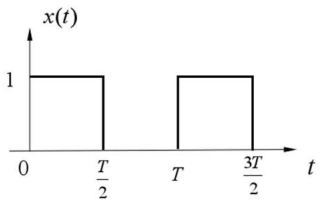
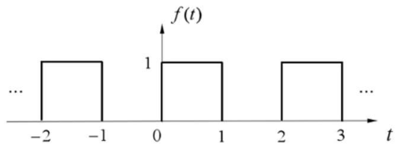
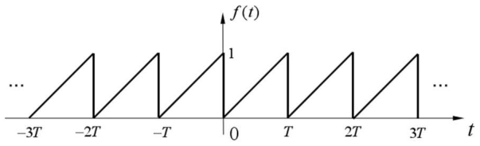
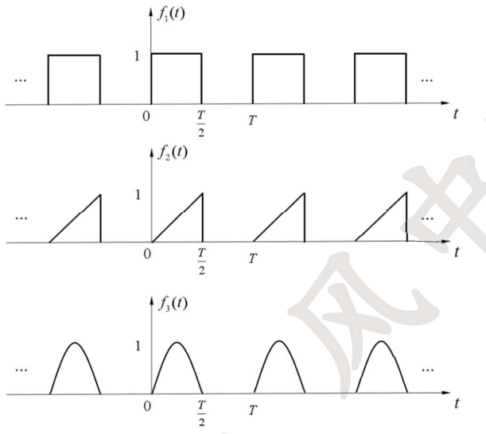
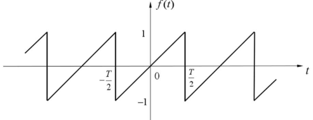
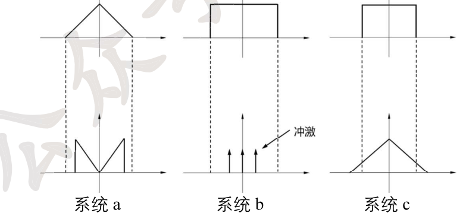

# 27 强化讲义 · 专题六 傅里叶级数（风中醉风）

> 题目摘自《27强化讲义》专题六（"专题六 题目"12 题 + "强化专题六 习题"6 题，连续编号 1-18）。
> 解析为自撰文字版；原书手写解答经卡片底部「手写答案 PDF」链接查看对应页。

#### 讲义 6-1 ｜ 奇函数傅里叶级数的表达形式（选择题）
> **归类** 3.4 周期信号傅里叶级数与稳态频响
> **出处** 27强化讲义 专题六题目 第1题
> **页码** 71
> **答案页** 1

**题干**

如果 $f(t)$ 是周期的，并且有 $f(-t)=-f(t)$，那么 $f(t)$ 可以表示成(　　)。
A. $f(t)=F_0+\displaystyle\sum_{n=1}^{\infty}2F_n\cos(n\omega_0t)$
B. $f(t)=\displaystyle\sum_{n=1}^{\infty}2jF_n\sin(n\omega_0t)$
C. $f(t)=\displaystyle\sum_{n=1}^{\infty}2jF_n\cos(n\omega_0t)$
D. $f(t)=-2\displaystyle\sum_{n=1}^{\infty}|F_n|\sin(n\omega_0t)$

📖 解答

**选 B**。$f(t)$ 为奇函数，三角形式傅里叶级数只含正弦分量：$f(t)=\sum b_n\sin(n\omega_0t)$（$a_0=a_n=0$）。由 $F_n=\dfrac{a_n-jb_n}{2}=\dfrac{-jb_n}{2}$ 得 $b_n=2jF_n$，故

$$f(t)=\sum_{n=1}^{\infty}2jF_n\sin(n\omega_0t)$$

（另法：由 $f(t)=-f(-t)$ 得 $F_n=-F_{-n}$、$F_0=0$，$f(t)=\sum_{n\ge1}\left[F_n\mathrm{e}^{jn\omega_0t}+F_{-n}\mathrm{e}^{-jn\omega_0t}\right]=\sum_{n\ge1}F_n\left(\mathrm{e}^{jn\omega_0t}-\mathrm{e}^{-jn\omega_0t}\right)=\sum 2jF_n\sin(n\omega_0t)$。）

[答案原文件 · 专题六 p1](../pdf/强化讲义专题六答案.pdf#page=1)

---

#### 讲义 6-2 ｜ 由时域表达式读傅里叶复系数（填空）
> **归类** 3.4 周期信号傅里叶级数与稳态频响
> **出处** 27强化讲义 专题六题目 第2题
> **页码** 72
> **答案页** 1

**题干**

周期信号 $f(t)=1+2\cos\left(t+\dfrac{\pi}{3}\right)+\cos\left(2t+\dfrac{\pi}{6}\right)$，在其指数型傅里叶级数中，傅里叶复系数 $F_2=$ ______。

📖 解答

二次谐波分量为 $\cos\left(2t+\dfrac{\pi}{6}\right)$，幅度 $C_2=1$、初相 $\varphi_2=\dfrac{\pi}{6}$。指数级数中

$$F_2=\frac{C_2}{2}\mathrm{e}^{j\varphi_2}=\frac12\,\mathrm{e}^{j\pi/6}$$

（欧拉公式验证：$\cos(2t+\frac\pi6)=\frac12\mathrm{e}^{j(2t+\pi/6)}+\frac12\mathrm{e}^{-j(2t+\pi/6)}$，$2t$ 项系数即 $\frac12\mathrm{e}^{j\pi/6}$ ✓。）

[答案原文件 · 专题六 p1](../pdf/强化讲义专题六答案.pdf#page=1)

---

#### 讲义 6-3 ｜ 反折移位信号的傅里叶系数（填空）
> **归类** 3.4 周期信号傅里叶级数与稳态频响
> **出处** 27强化讲义 专题六题目 第3题
> **页码** 72
> **答案页** 2

**题干**

已知 $x\left(-\dfrac{t}{2}+3\right)$ 的基波频率为 $\omega_0$，指数形式级数傅里叶系数为 $C_n$，则 $x(t)$ 的傅里叶系数为 __________。

📖 解答

令 $u=-\dfrac t2+3$（即 $t=-2u+6$）。$x(u)=\displaystyle\sum_n C_ne^{jn\omega_0u}$，则

$$x(t)=\sum_n C_n\,\mathrm{e}^{jn\omega_0(-2t+6)/2\cdot2?}=\sum_n C_n\,\mathrm{e}^{jn\omega_0(6-2t)\cdot\frac12\cdot2}$$

代入 $u=\dfrac{6-t}{2}$：$x(t)=\displaystyle\sum_n C_n\,\mathrm{e}^{jn\omega_0(6-t)/2}=\sum_n C_n\,\mathrm{e}^{j3n\omega_0}\,\mathrm{e}^{-jn\omega_0t}$。

注意新信号 $x(t)$ 的基波频率为 $2\omega_0$（周期变为原来的一半）。令 $n=-m$：

$$x(t)=\sum_m C_{-m}\,\mathrm{e}^{j6m\omega_0}\,\mathrm{e}^{jm\omega_0t}\cdot?$$

按基波 $\omega_0'$ 统一写（手写结论）：

$$x(t)\text{ 的傅里叶系数}=C_{-n}\,\mathrm{e}^{j6n\omega_0}\quad(\text{以 }2\omega_0\text{ 为基波时})$$

即系数为 $C_{-n}$ 乘以时移因子 $\mathrm{e}^{j6n\omega_0}$（反折使 $n\to-n$、右移 3 使基波频率加倍并引入相位因子）。

[答案原文件 · 专题六 p2](../pdf/强化讲义专题六答案.pdf#page=2)

---

#### 讲义 6-4 ｜ 周期方波的偶谐性与高次系数（填空）
> **归类** 3.4 周期信号傅里叶级数与稳态频响
> **原图** `images/lg/fig-t06-q4.png`
> **出处** 27强化讲义 专题六题目 第4题
> **页码** 73
> **答案页** 2

**题干**

已知周期方波信号 $x(t)$ 如下图所示（周期 $2T$，$0\sim\frac T2$ 与 $T\sim\frac{3T}2$ 为 1），令 $x_n$ 表示该信号以 $2T$ 为周期的傅里叶级数系数，则 $x_{2027}=$ ________。

📖 解答

以 $2T$ 为周期观察：$x(t+T)=x(t)$，即信号是**偶谐函数**（半周期重复），其傅里叶级数只含偶次谐波分量（含直流），奇次谐波全部为零。

$2027$ 为奇数，故 $x_{2027}=0$。

[答案原文件 · 专题六 p2](../pdf/强化讲义专题六答案.pdf#page=2)

---

#### 讲义 6-5 ｜ |sin 3πt| 的级数谐波结构（选择题）
> **归类** 3.4 周期信号傅里叶级数与稳态频响
> **出处** 27强化讲义 专题六题目 第5题
> **页码** 73
> **答案页** 3

**题干**

将周期信号 $f(t)=\left|\sin(3\pi t)\right|$ 在区间 $(0,1)$ 上展开为三角形式的傅里叶级数，以下说法正确的是(　　)。
A. 展开式中只有偶次谐波分量（含直流分量）
B. 展开式中只有奇次谐波分量
C. 展开式中只有直流分量和基波分量
D. 展开式中非 $3m$ 次谐波分量（$m=0,1,2\cdots$）一定等于零

📖 解答

**选 D**。$f(t)=|\sin3\pi t|$ 的最小正周期为 $\frac13$，但以 $T=1$ 为周期展开也可以——对同一周期信号选择不同的周期做傅里叶展开，级数本质一样，只是基波频率与各次谐波的归略有差别（讲义 p93）。

以 $T_1=\frac13$ 展开：只有直流与 $6\pi$ 的整数倍频率分量（$F_{1,2},F_{1,4},F_{1,5}\cdots$ 中除 $3$ 的倍数外为零）；以 $T_2=1$ 展开：$F_{2,1},F_{2,2},F_{2,4},F_{2,5}$ 等均为零，且 $F_{2,0}=F_{1,0}$、$F_{2,3}=F_{1,1}\cdots$——即只有 $n=3m$（$m=0,1,2,\cdots$）次的谐波可能非零，非 $3m$ 次谐波一定为零。

（$f$ 还是偶函数，展开只含余弦与直流，但 A、B、C 的表述都不完整准确。）

[答案原文件 · 专题六 p3](../pdf/强化讲义专题六答案.pdf#page=3)

---

#### 讲义 6-6 ｜ 对称条件 f(t)=f(π−t) 的级数特征（选择题）
> **归类** 3.4 周期信号傅里叶级数与稳态频响
> **出处** 27强化讲义 专题六题目 第6题
> **页码** 73
> **答案页** 3

**题干**

已知 $f(t)$ 的周期为 $\pi$，且 $f(t)=f(\pi-t)$，则下列叙述正确的是(　　)。
A. 该周期信号的傅里叶级数中一定只有直流分量
B. 该周期信号的傅里叶级数中正弦项系数均为零
C. 该周期信号的傅里叶级数中余弦项系数均为零
D. 以上都不对

📖 解答

**选 B**。由周期 $\pi$：$f(\pi-t)=f\left[\pi-(t+\pi)\right]\cdot?=f(-t)$（把 $t$ 换成 $t+\pi$：$f(\pi-t-\pi)=f(-t)$，而 $f(t+\pi)=f(t)$）。结合 $f(t)=f(\pi-t)$ 得 $f(t)=f(-t)$——$f$ 是**偶函数**。

偶函数的三角级数只含直流与余弦分量，正弦项系数 $b_n=0$。

（另一法：$f(t)=a_0+\sum[a_n\cos2nt+b_n\sin2nt]$，由 $f(t)=f(-t)$ 对照得 $b_n=-b_n\Rightarrow b_n=0$。）

[答案原文件 · 专题六 p3](../pdf/强化讲义专题六答案.pdf#page=3)

---

#### 讲义 6-7 ｜ 周期矩形脉冲的谱线间隔、带宽与基波幅度
> **归类** 3.4 周期信号傅里叶级数与稳态频响
> **出处** 27强化讲义 专题六题目 第7题
> **页码** 74
> **答案页** 4

**题干**

已知两个周期矩形脉冲信号 $f_1(t)$ 和 $f_2(t)$：
(1) 若 $f_1(t)$ 的矩形宽度 $\tau=1\mu s$，周期 $T=2\mu s$，幅度 $E=1V$，试问该信号的谱线间隔是多少？带宽是多少？
(2) 若 $f_2(t)$ 的矩形宽度 $\tau=2\mu s$，周期 $T=4\mu s$，幅度 $E=3V$，试问该信号的谱线间隔是多少？带宽是多少？
(3) $f_1(t)$ 和 $f_2(t)$ 的基波幅度之比是多少？

📖 解答

周期矩形脉冲 $F_n=\dfrac{E\tau}{T}Sa\left(\dfrac{n\omega_0\tau}{2}\right)$，谱线间隔 $\omega_1=\dfrac{2\pi}{T}$，带宽（第一个零点）$B_\omega=\dfrac{2\pi}{\tau}$。

(1) $\omega_1=\dfrac{2\pi}{2\mu s}=10^6\pi\ \mathrm{rad/s}$（即 $f_1=\dfrac{1}{T}=5\times10^5\ \mathrm{Hz}$）；带宽 $B_\omega=\dfrac{2\pi}{1\mu s}=2\pi\times10^6\ \mathrm{rad/s}$（$B_f=\dfrac{1}{\tau}=10^6\ \mathrm{Hz}$）。

(2) $\omega_1=\dfrac{2\pi}{4\mu s}=5\times10^5\pi\ \mathrm{rad/s}$（$f_1=2.5\times10^5\ \mathrm{Hz}$）；带宽 $B_\omega=\dfrac{2\pi}{2\mu s}=10^6\pi\ \mathrm{rad/s}$（$B_f=5\times10^5\ \mathrm{Hz}$）。

(3) 基波幅度 $F_1=\dfrac{E\tau}{T}Sa\left(\dfrac{\pi\tau}{T}\right)$：$f_1$ 为 $\dfrac12Sa\left(\dfrac\pi2\right)=\dfrac1\pi$；$f_2$ 为 $\dfrac32Sa\left(\dfrac\pi2\right)=\dfrac3\pi$。基波幅度之比 $1:3$。

[答案原文件 · 专题六 p4](../pdf/强化讲义专题六答案.pdf#page=4)

---

#### 讲义 6-8 ｜ 对称方波级数与莱布尼茨级数和
> **归类** 3.4 周期信号傅里叶级数与稳态频响
> **原图** `images/lg/fig-t06-q8.png`
> **出处** 27强化讲义 专题六题目 第8题
> **页码** 75
> **答案页** 5

**题干**

如图所示信号 $f(t)$（周期 2 的方波，$0\sim1$ 为 1），求：
(1) 三角型傅里叶级数；
(2) 级数 $S=1-\dfrac13+\dfrac15-\dfrac17+\cdots$ 的和。

📖 解答

(1) $f$ 可分解为直流 $\frac12$ 加奇函数部分。$a_0=a_n=\frac12?$——直流 $a_0=\frac12$，周期 $T=2$、$\omega_1=\pi$：

$$b_n=\frac22\int_0^1\sin(n\pi t)\,\mathrm{d}t=\left.-\frac{\cos n\pi t}{n\pi}\right|_0^1=\frac{1-\cos n\pi}{n\pi}=\begin{cases}\frac{2}{n\pi}, & n\text{ 奇}\\ 0, & n\text{ 偶}\end{cases}$$

$$f(t)=\frac12+\sum_{n=1,3,5\cdots}\frac{2}{n\pi}\sin(n\pi t)=\frac12+\frac2\pi\left(\sin\pi t+\frac13\sin3\pi t+\frac15\sin5\pi t+\cdots\right)$$

(2) 令 $t=\frac12$：$f\left(\frac12\right)=1$（连续点），

$$1=\frac12+\frac2\pi\left(1-\frac13+\frac15-\frac17+\cdots\right)\ \Longrightarrow\ S=1-\frac13+\frac15-\cdots=\frac{1-\frac12}{2/\pi}=\frac{\pi}{4}$$

[答案原文件 · 专题六 p5](../pdf/强化讲义专题六答案.pdf#page=5)

---

#### 讲义 6-9 ｜ 锯齿波的级数系数、傅里叶变换与 Σ1/k²
> **归类** 3.4 周期信号傅里叶级数与稳态频响
> **原图** `images/lg/fig-t06-q9.png`
> **出处** 27强化讲义 专题六题目 第9题
> **页码** 75
> **答案页** 5

**题干**

已知连续时间信号 $f(t)$ 的波形如图所示（周期 $T$ 锯齿波，一个周期内 $0\le t<T$ 从 0 线性升到 1）。
(1) 求 $f(t)$ 傅里叶级数系数 $a_k$；
(2) 求 $f(t)$ 傅里叶变换；
(3) 计算 $\displaystyle\sum_{k=1}^{\infty}\frac{1}{k^2}$。

📖 解答

(1) $\omega_1=\dfrac{2\pi}{T}$，

$$a_k=\frac1T\int_0^T\frac{t}{T}\,\mathrm{e}^{-jk\omega_1t}\,\mathrm{d}t=\frac{1}{T^2}\left[-\frac{t\,\mathrm{e}^{-jk\omega_1t}}{jk\omega_1}\bigg|_0^T+\int_0^T\frac{\mathrm{e}^{-jk\omega_1t}}{jk\omega_1}\mathrm{d}t\right]=\frac{1}{T^2}\left[\frac{-T\mathrm{e}^{-jk2\pi}}{jk\omega_1}+\frac{\mathrm{e}^{-jk2\pi}-1}{(jk\omega_1)^2}\right]=\frac{-1}{jk\omega_1T}=\frac{j}{2\pi k}\ (k\ne0)$$

直流分量 $a_0=\dfrac1T\int_0^T\frac tT\mathrm{d}t=\frac12$。

$$a_k=\begin{cases}\dfrac12, & k=0\\[1mm]\dfrac{j}{2\pi k}, & k\ne0\end{cases}$$

(2) 周期信号频谱 $X(\omega)=2\pi\displaystyle\sum_{k=-\infty}^{\infty}a_k\delta(\omega-k\omega_1)=\pi\delta(\omega)+\sum_{k\ne0}\frac{j}{k}\,\delta\left(\omega-\frac{2\pi k}{T}\right)$。

（另法：单周期 $x_0'(t)=\frac1T\left[u(t)-u(t-T)\right]$，$X_0(\omega)=\dfrac{Sa(\frac{\omega T}2)\mathrm{e}^{-j\frac{\omega T}2}-\mathrm{e}^{-j\omega T}}{j\omega}$，$a_k=\frac1T X_0(k\omega_1)$，结果相同。）

(3) $a_k=\frac{j}{2\pi k}$，考虑 $\sum|a_k|^2$：帕塞瓦尔 $P=\sum_{k=-\infty}^{\infty}|a_k|^2=\frac14+2\sum_{k=1}^{\infty}\frac{1}{4\pi^2k^2}=\frac14+\frac{1}{2\pi^2}\sum_{k=1}^{\infty}\frac1{k^2}$；时域 $P=\frac1T\int_0^T\left(\frac tT\right)^2\mathrm{d}t=\frac13$。

$$\frac13=\frac14+\frac{1}{2\pi^2}\sum_{k=1}^{\infty}\frac{1}{k^2}\ \Longrightarrow\ \sum_{k=1}^{\infty}\frac{1}{k^2}=\frac{\pi^2}{6}$$

[答案原文件 · 专题六 p5-6](../pdf/强化讲义专题六答案.pdf#page=5)

---

#### 讲义 6-10 ｜ 高通滤波器对周期信号的作用
> **归类** 3.4 周期信号傅里叶级数与稳态频响
> **出处** 27强化讲义 专题六题目 第10题
> **页码** 77
> **答案页** 7

**题干**

考虑一连续时间 LTI 系统，其频率响应是 $H(j\omega)=\begin{cases}1, & |\omega|\ge250\\ 0, & \text{其它}\end{cases}$。当输入信号 $f(t)$ 是一个基波周期 $T=\dfrac{\pi}{7}$、傅里叶级数系数为 $a_k$ 的信号时，发现输出 $y(t)=f(t)$。试问 $k$ 满足什么条件时，$a_k=0$？

📖 解答

基波频率 $\omega_0=\dfrac{2\pi}{T}=14$。周期信号经 LTI 系统：$y(t)=\sum_k H(j14k)\,a_k\,\mathrm{e}^{j14kt}$。

$y=f$ 要求每个谐波分量都保留：$a_k=H(j14k)\,a_k$。当 $|14k|<250$ 即 $|k|\le17$ 时 $H(j14k)=0$，此时必须有 $a_k=0$（否则该分量被滤掉、$y\ne f$）。

$$|k|\le17\ (\text{即 } |14k|<250)\ \text{时}\ a_k=0$$

[答案原文件 · 专题六 p7](../pdf/强化讲义专题六答案.pdf#page=7)

---

#### 讲义 6-11 ｜ 低通滤波保留 90% 功率的截止频率条件
> **归类** 3.4 周期信号傅里叶级数与稳态频响
> **出处** 27强化讲义 专题六题目 第11题
> **页码** 77
> **答案页** 7

**题干**

周期信号 $x(t)$ 的傅里叶级数为 $x(t)=\displaystyle\sum_{n=-\infty}^{\infty}a^{|n|}\mathrm{e}^{j\frac{n\pi t}{4}}$（$a$ 实数且 $0<a<1$），$x(t)$ 通过 $H(j\omega)=\begin{cases}1, & \omega\le|\omega_c|\\ 0, & \omega>|\omega_c|\end{cases}$ 的低通滤波器后，若要求 $x(t)$ 至少保留 90% 的平均功率。试求滤波器的截止频率 $\omega_c$ 应满足什么条件？

📖 解答

基波频率 $\omega_1=\dfrac\pi4$。总平均功率（帕塞瓦尔）：

$$P=\sum_{n=-\infty}^{\infty}|F_n|^2=\sum_{n=-\infty}^{\infty}a^{2|n|}=1+2\sum_{n=1}^{\infty}a^{2n}=1+\frac{2a^2}{1-a^2}=\frac{1+a^2}{1-a^2}$$

设滤波器保留直流和前 $N$ 对谐波（$|\omega_c|$ 介于 $N\omega_1$ 与 $(N+1)\omega_1$ 之间），保留功率

$$P_N=\sum_{n=-N}^{N}a^{2|n|}=1+2\cdot\frac{a^2(1-a^{2N})}{1-a^2}=\frac{1+a^2-2a^{N+1}}{1-a^2}$$

要求 $P_N\ge0.9P$：

$$1+a^2-2a^{N+1}\ge0.9(1+a^2)\ \Longrightarrow\ a^{N+1}\le\frac{0.1(1+a^2)}{2}=\frac{1+a^2}{20}$$

$$N\ge\frac12\log_a\left(\frac{1+a^2}{20}\right)-1\quad(\text{取满足式的最小正整数 } N;\ a^{2n}\text{ 单调递减})$$

为使前 $N$ 对谐波全部通过：$\omega_c>\dfrac{N\pi}{4}$。

[答案原文件 · 专题六 p7-8](../pdf/强化讲义专题六答案.pdf#page=7)

---

#### 讲义 6-12 ｜ LTI 系统能否产生新波形（奇谐性判断）
> **归类** 3.4 周期信号傅里叶级数与稳态频响
> **原图** `images/lg/fig-t06-q12.png`
> **出处** 27强化讲义 专题六题目 第12题
> **页码** 78
> **答案页** 8

**题干**

将如图所示的 $f_1(t)$（周期 $T$ 方波）作为激励信号经过线性时不变系统，从理论上讲可否产生 $f_2(t)$（周期锯齿波）或 $f_3(t)$（周期半波余弦拱）的波形？为什么？

📖 解答

**都不能**。去除直流分量后 $f_1(t)=-f_1\left(t+\frac T2\right)$，是**奇谐信号**，其傅里叶级数展开式中偶次谐波为零：

$$f_1(t)=\sum_{n}F_n\mathrm{e}^{jn\omega_1t},\qquad F_n=0,\ n=\pm2,\pm4,\cdots$$

$f_1(t)$ 经过 LTI 系统的输出 $y_1(t)=\sum_n H(jn\omega_1)F_n\mathrm{e}^{jn\omega_1t}$，由于 $F_n=0\ (n$ 偶$)$，输出 $y_1(t)$ 也必为奇谐信号，不可能含偶次谐波。

而 $f_2(t)$ 和 $f_3(t)$ 都不是奇谐信号（含偶次谐波分量），故 $f_1(t)$ 经 LTI 系统不能产生 $f_2(t)$ 或 $f_3(t)$ 的波形。

总结：LTI 系统不会产生新的频率分量，只能对输入信号中已有的谐波分量进行幅度和相位的调整；对于傅里叶级数，在某频率 $\omega_0$ 处若 $X(j\omega_0)=0$，则 $Y(j\omega_0)=0$。

[答案原文件 · 专题六 p8](../pdf/强化讲义专题六答案.pdf#page=8)

---

#### 讲义 6-13 ｜ 【强化】由时域式读 F₋₁（填空）
> **归类** 3.4 周期信号傅里叶级数与稳态频响
> **出处** 27强化讲义 强化专题六习题 第1题
> **页码** 79
> **答案页** 9

**题干**

周期信号 $f(t)=3-2\sin\left(2t+\dfrac{\pi}{4}\right)+5\cos\left(6t-\dfrac{\pi}{3}\right)$，在其指数型傅里叶级数中，傅里叶复系数 $F_{-1}=$ ________。

📖 解答

基波 $\omega_1=2$。$-2\sin\left(2t+\frac\pi4\right)=2\cos\left(2t+\frac{3\pi}4\right)$，即基波分量幅度 $C_1=2$、初相 $\varphi_1=\frac{3\pi}4$。

$$|F_{\pm1}|=\frac{C_1}{2}=1,\qquad F_{-1}=|F_{-1}|\,\mathrm{e}^{-j\varphi_1}=\mathrm{e}^{-j\frac{3\pi}4}$$

（欧拉公式验证：$-2\sin(2t+\frac\pi4)=j\mathrm{e}^{j(2t+\pi/4)}-j\mathrm{e}^{-j(2t+\pi/4)}$，$\mathrm{e}^{-j2t}$ 项系数 $=-j\mathrm{e}^{-j\pi/4}=\mathrm{e}^{-j3\pi/4}$ ✓。）

$$F_{-1}=\mathrm{e}^{-j\frac{3\pi}{4}}$$

[答案原文件 · 专题六 p9](../pdf/强化讲义专题六答案.pdf#page=9)

---

#### 讲义 6-14 ｜ 【强化】奇谐方波的 x₂₀₂₆（填空）
> **归类** 3.4 周期信号傅里叶级数与稳态频响
> **出处** 27强化讲义 强化专题六习题 第2题
> **页码** 79
> **答案页** 9

**题干**

已知周期信号 $x(t)$ 在一个周期内为 $x(t)=\begin{cases}1, & 0<t<T\\ -1, & T<t<2T\end{cases}$，令 $x_n$ 表示其指数型傅里叶级数系数，求 $x_{2026}$。

📖 解答

波形满足 $x(t+T)=-x(t)$（前半周期与后半周期反号），是**奇谐函数**，傅里叶级数中偶次谐波全部为零。

$2026$ 为偶数，故

$$x_{2026}=0$$

[答案原文件 · 专题六 p9](../pdf/强化讲义专题六答案.pdf#page=9)

---

#### 讲义 6-15 ｜ 【强化】锯齿波级数必含分量（选择题）
> **归类** 3.4 周期信号傅里叶级数与稳态频响
> **原图** `images/lg/fig-t06-q16.png`
> **出处** 27强化讲义 强化专题六习题 第3题
> **页码** 79
> **答案页** 9

**题干**

信号 $f(t)$（周期 $T$ 的锯齿波，$-\frac T2\sim\frac T2$ 从 $-1$ 线性升到 $1$）如图所示，其傅里叶级数中一定包含(　　)。
A. 正弦分量　　B. 余弦分量　　C. 直流分量　　D. 以上全包括

📖 解答

**选 A**。$f(t)$ 是奇函数（$f(-t)=-f(t)$，波形关于原点对称），奇函数的傅里叶级数中只包含正弦分量（$a_0=a_n=0$，无直流、无余弦）。

[答案原文件 · 专题六 p9](../pdf/强化讲义专题六答案.pdf#page=9)

---

#### 讲义 6-16 ｜ 【强化】截取余弦半波的周期延拓：系数、谱与功率
> **归类** 3.4 周期信号傅里叶级数与稳态频响
> **出处** 27强化讲义 强化专题六习题 第4题
> **页码** 80
> **答案页** 9

**题干**

设信号 $f(t)=\cos(\pi t)\left[u\left(t+\dfrac12\right)-u\left(t-\dfrac12\right)\right]$，令周期信号 $x(t)=\displaystyle\sum_{n=-\infty}^{\infty}f(t-2n)$，试计算：
(1) $x(t)$ 的傅里叶级数的系数 $F_n$；
(2) $x(t)$ 的幅度谱和相位谱表达式；
(3) $x(t)$ 的平均功率。

📖 解答

$x(t)$ 周期 $T=2$，基波 $\omega_1=\pi$。单周期即 $f(t)$（支撑 $[-\frac12,\frac12]$）。

(1) $F(\omega)=\mathcal{F}[f(t)]=\dfrac12\left[Sa\left(\dfrac{\omega+\pi}2\right)+Sa\left(\dfrac{\omega-\pi}2\right)\right]$（门调制的频移性质），

$$F_n=\frac1T F(\omega)\Big|_{\omega=n\pi}=\frac14\left[Sa\left(\frac{(n+1)\pi}{2}\right)+Sa\left(\frac{(n-1)\pi}{2}\right)\right]=\frac{\cos\frac{n\pi}2}{\pi(1-n^2)}\ (n\ne\pm1),\qquad F_{\pm1}=\frac14$$

(2) 记 $F_n=|F_n|\mathrm{e}^{j\varphi_n}$：

$$|F_n|=\begin{cases}0, & n\text{ 为奇数且 } n\ne\pm1\\ \dfrac{1}{\pi|1-n^2|}, & n\text{ 偶数}\\ \dfrac14, & n=\pm1\end{cases}\qquad \varphi_n=\begin{cases}0, & n=0,\pm1\text{ 或 } n\text{ 为奇数}\\ \pi, & n=4k\ (k\ne0)\\ 0, & n=4k+2\end{cases}$$

（$n$ 为偶数时 $\cos\frac{n\pi}2=(-1)^{n/2}$：$n=4k$ 为负、$n=4k+2$ 为正。）

(3) $P=\dfrac12\displaystyle\int_{-\frac12}^{\frac12}\cos^2(\pi t)\,\mathrm{d}t=\frac14\int_{-\frac12}^{\frac12}\left(1+\cos2\pi t\right)\mathrm{d}t=\frac14$

[答案原文件 · 专题六 p9-10](../pdf/强化讲义专题六答案.pdf#page=9)

---

#### 讲义 6-17 ｜ 【强化】冲激串通过 RC 型系统的输出级数系数
> **归类** 3.4 周期信号傅里叶级数与稳态频响
> **出处** 27强化讲义 强化专题六习题 第5题
> **页码** 81
> **答案页** 10

**题干**

已知 $h(t)=\mathrm{e}^{-4t}u(t)$，求输入为 $x(t)=\displaystyle\sum_{n=-\infty}^{\infty}(-1)^n\delta(t-n)$ 时的输出 $y(t)$ 的傅里叶级数系数 $F_n$。

📖 解答

$x(t)$ 周期为 2，基波 $\omega_1=\dfrac{2\pi}{2}=\pi$：

$$X_n=\frac12\int_{-0.5}^{1.5}\left[\delta(t)-\delta(t-1)\right]\mathrm{e}^{-jn\pi t}\,\mathrm{d}t=\frac12\left(1-\mathrm{e}^{-jn\pi}\right)=\begin{cases}1, & n\text{ 奇}\\ 0, & n\text{ 偶}\end{cases}$$

$$H(j\omega)=\frac{1}{4+j\omega}\ \Longrightarrow\ y(t)=\sum_n H(n\pi)X_n\,\mathrm{e}^{jn\pi t}$$

$$F_n=H(n\pi)X_n=\begin{cases}\dfrac{1}{4+jn\pi}, & n\text{ 奇}\\ 0, & n\text{ 偶}\end{cases}$$

[答案原文件 · 专题六 p10](../pdf/强化讲义专题六答案.pdf#page=10)

---

#### 讲义 6-18 ｜ 【强化】由频谱变化判断非 LTI 系统（选择题）
> **归类** 3.4 周期信号傅里叶级数与稳态频响
> **原图** `images/lg/fig-t06-q18.png`
> **出处** 27强化讲义 强化专题六习题 第6题
> **页码** 81
> **答案页** 10

**题干**

输入信号经过一个系统的频谱变化如图所示（系统 a：三角谱→深谷 M 形谱；系统 b：矩形谱→离散冲激谱；系统 c：矩形谱→三角谱），问哪一个系统一定不是线性时不变系统？

📖 解答

**选系统 b**。对线性时不变系统必有 $Y(j\omega)=H(j\omega)X(j\omega)$：若在某频率 $\omega_0$ 处 $X(j\omega_0)=0$，则 $Y(j\omega_0)$ 必定为 0——LTI 系统不能在输入谱为零的频率处产生非零输出。

系统 b 的输入谱为连续矩形谱，输出却变成离散冲激谱：输入谱处处非零的区间内，输出在某些频率处为冲激（其余频率为零），无法写成 $H(j\omega)X(j\omega)$ 的形式（$H$ 无法既让"非零×有界=冲激"又让相邻频率输出为零），故系统 b 一定不是 LTI 系统。

系统 a、c 的输出谱 support 都在输入谱 support 之内（幅度加权），可以由某个 $H(j\omega)$ 实现，可能是 LTI 系统。

[答案原文件 · 专题六 p10](../pdf/强化讲义专题六答案.pdf#page=10)

---
