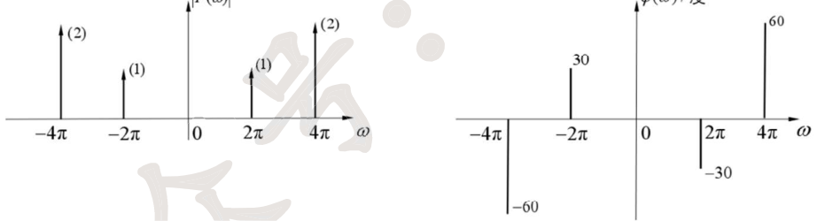
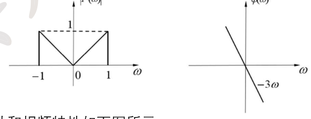
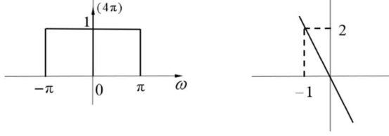
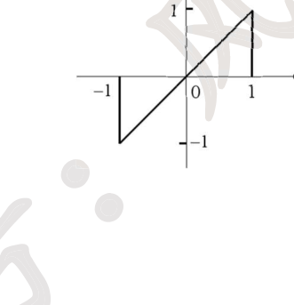
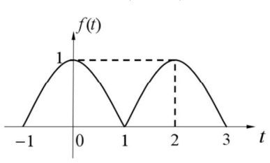
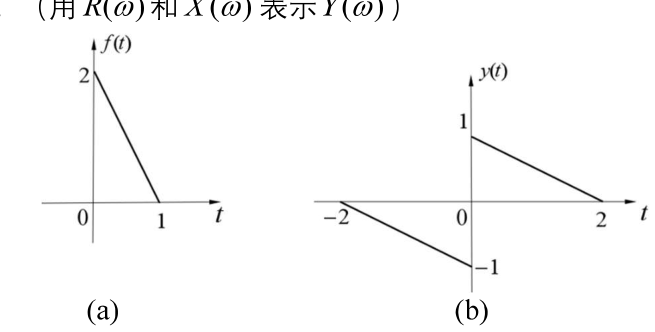
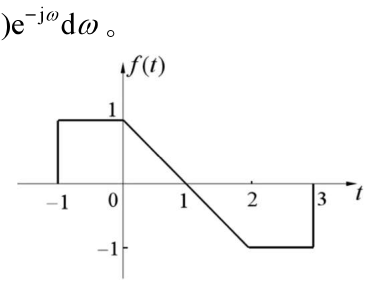
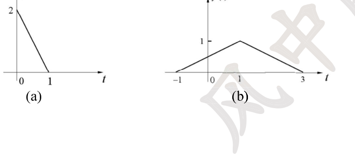

# 27 强化讲义 · 专题七 傅里叶变换的性质及常用结论（风中醉风）

> 题目摘自《27强化讲义》专题七（"专题七 题目"10 题 + "强化专题七 习题"7 题，连续编号 1-17）。
> 解析为自撰文字版；原书手写解答经卡片底部「手写答案 PDF」链接查看对应页。

#### 讲义 7-1 ｜ 由 F(ω) 求复合信号的傅里叶变换（四小问）
> **归类** 3.1 傅里叶变换性质综合运算
> **出处** 27强化讲义 专题七题目 第1题
> **页码** 85
> **答案页** 1

**题干**

已知 $\mathcal{F}[f(t)]=F(\omega)$，求下列信号的傅里叶变换。
(1) $(1-t)f(1-t)$；　　(2) $\displaystyle\int_{-\infty}^{0.5t}f(\tau)\mathrm{d}\tau$；　　(3) $\mathrm{e}^{jt}f(3-2t)$；　　(4) $\dfrac{\mathrm{d}f(t)}{\mathrm{d}t}*\dfrac{1}{\pi t}$

📖 解答

(1) 记 $g(t)=f(1-t)$，$G(\omega)=F(-\omega)\mathrm{e}^{-j\omega}$。$(1-t)g(t)=g(t)-tg(t)$，而 $tg(t)\leftrightarrow j\dfrac{\mathrm{d}G}{\mathrm{d}\omega}$：

$$\mathcal{F}[(1-t)f(1-t)]=G(\omega)-jG'(\omega)=jF'(-\omega)\,\mathrm{e}^{-j\omega}$$

(2) 记 $g(t)=\displaystyle\int_{-\infty}^{t}f(\tau)\mathrm{d}\tau$，$G(\omega)=\dfrac{F(\omega)}{j\omega}+\pi F(0)\delta(\omega)$。原式 $=g(0.5t)$，由尺度性质（$\delta(2\omega)=\frac12\delta(\omega)$）：

$$\mathcal{F}\left[\int_{-\infty}^{0.5t}f(\tau)\mathrm{d}\tau\right]=2\,G(2\omega)=\frac{F(2\omega)}{j\omega}+\pi F(0)\,\delta(\omega)$$

(3) $f(3-2t)=f\left(-2\left(t-\frac32\right)\right)$：反折+尺度+右移，

$$\mathcal{F}[f(3-2t)]=\frac12F\left(-\frac{\omega}{2}\right)\mathrm{e}^{-j\frac32\omega}\ \xrightarrow{\ \mathrm{e}^{jt}\text{ 频移}\ }\ \frac12F\left(-\frac{\omega-1}{2}\right)\mathrm{e}^{-j\frac32(\omega-1)}$$

(4) $\mathcal{F}[f'(t)]=j\omega F(\omega)$，$\mathcal{F}\left[\dfrac{1}{\pi t}\right]=-j\,\mathrm{sgn}(\omega)$，时域卷积定理：

$$j\omega F(\omega)\cdot(-j)\,\mathrm{sgn}(\omega)=|\omega|\,F(\omega)$$

[答案原文件 · 专题七 p1](../pdf/强化讲义专题七答案.pdf#page=1)

---

#### 讲义 7-2 ｜ 求七类信号的傅里叶变换
> **归类** 3.1 傅里叶变换性质综合运算
> **出处** 27强化讲义 专题七题目 第2题
> **页码** 86
> **答案页** 1

**题干**

求下列信号的傅里叶变换。
(1) $f(t)=\dfrac{\sin 2\pi(t-2)}{\pi(t-2)}$；　　(2) $f(t)=\dfrac{2\alpha}{\alpha^2+t^2},\ \alpha>0$；　　(3) $f(t)=-\dfrac{1}{\pi t^2}$；
(4) $f(t)=t^n$；　　(5) $f(t)=u\left(\dfrac13t-2\right)$；　　(6) $f(t)=\mathrm{e}^{-j2t}\cos(3t)u(t)$；　　(7) $f(t)=\dfrac{t\cos t-\sin t}{t^2}$

📖 解答

(1) $\dfrac{\sin 2\pi t}{\pi t}=2Sa(2\pi t)\leftrightarrow g_{4\pi}(\omega)$，时移 2：$\boxed{g_{4\pi}(\omega)\,\mathrm{e}^{-j2\omega}}$。

(2) $\mathcal{F}[\mathrm{e}^{-\alpha|t|}]=\dfrac{2\alpha}{\alpha^2+\omega^2}$，由对偶性：$\boxed{2\pi\,\mathrm{e}^{-\alpha|\omega|}}$。

(3) $\mathcal{F}\left[\dfrac{1}{t}\right]=-j\pi\,\mathrm{sgn}(\omega)$，频域微分（$t\cdot\dfrac{1}{t}=1$）：$\mathcal{F}\left[\dfrac{1}{t^2}\right]=-\pi\omega\,\mathrm{sgn}(\omega)=-\pi|\omega|$，故 $\boxed{|\omega|}$。

(4) $\mathcal{F}[1]=2\pi\delta(\omega)$，频域微分 $n$ 次：$\mathcal{F}[(-jt)^n]=2\pi\delta^{(n)}(\omega)$，故 $\boxed{2\pi j^n\,\delta^{(n)}(\omega)}$。

(5) $u\left(\dfrac t3-2\right)=u(t-6)$，$\mathcal{F}[u(t)]=\dfrac{1}{j\omega}+\pi\delta(\omega)$，时移：

$$\frac{\mathrm{e}^{-j6\omega}}{j\omega}+\pi\delta(\omega)\,\mathrm{e}^{-j6\omega}=\boxed{\frac{\mathrm{e}^{-j6\omega}}{j\omega}+\pi\delta(\omega)}$$

(6) $\mathcal{F}[\cos 3t\,u(t)]=\dfrac12\left[\dfrac{1}{j(\omega-3)}+\pi\delta(\omega-3)+\dfrac{1}{j(\omega+3)}+\pi\delta(\omega+3)\right]$，频移 $\mathrm{e}^{-j2t}$（$\omega\to\omega+2$）：

$$\frac12\left[\frac{1}{j(\omega-1)}+\pi\delta(\omega-1)+\frac{1}{j(\omega+5)}+\pi\delta(\omega+5)\right]$$

(7) $\dfrac{t\cos t-\sin t}{t^2}=\dfrac{\mathrm{d}}{\mathrm{d}t}\left(\dfrac{\sin t}{t}\right)$，而 $\dfrac{\sin t}{t}=Sa(t)\leftrightarrow\pi g_2(\omega)$，时域微分：

$$j\omega\cdot\pi g_2(\omega)$$

[答案原文件 · 专题七 p1-3](../pdf/强化讲义专题七答案.pdf#page=1)

---

#### 讲义 7-3 ｜ 求五个频谱的傅里叶逆变换
> **归类** 3.1 傅里叶变换性质综合运算
> **原图** `images/lg/fig-t07-q3a.png`
> **原图** `images/lg/fig-t07-q3b.png`
> **原图** `images/lg/fig-t07-q3c.png`
> **出处** 27强化讲义 专题七题目 第3题
> **页码** 87
> **答案页** 3

**题干**

求下列频谱的傅里叶逆变换。
(1) $F(\omega)=\dfrac{1}{\omega^2}$；
(2) $F(\omega)=6\pi\delta(\omega)+\dfrac{1}{(j\omega+2)(j\omega+3)}$；
(3) 信号 $f(t)$ 的幅频特性和相频特性如下图（离散谱：(1)@±2π、(2)@±4π；相位 30°@−2π、−30°@2π、60°@4π、−60°@−4π）所示；
(4) 信号 $f(t)$ 的幅频特性（V 形 $|F|=|\omega|$，$|\omega|<1$）和相频特性（$\varphi=-3\omega$）如下图所示；
(5) 信号 $f(t)$ 的幅频特性（门 $-\pi\sim\pi$ 高 1）和相频特性（过 $(-1,2)$ 的直线 $\varphi=-2\omega$）如下图所示。

📖 解答

(1) $\mathcal{F}[\mathrm{sgn}(t)]=\dfrac{2}{j\omega}$，频域微分：$\mathcal{F}[t\,\mathrm{sgn}(t)]=j\dfrac{2}{j\omega}\cdot?=j\cdot\dfrac{-2}{\omega^2}\cdot?=-\dfrac{2}{\omega^2}$，故

$$\mathcal{F}^{-1}\left[\frac{1}{\omega^2}\right]=-\frac12\,t\,\mathrm{sgn}(t)=-\frac12|t|$$

(2) 把 $\dfrac{1}{(j\omega+2)(j\omega+3)}=\dfrac{1}{j\omega+2}-\dfrac{1}{j\omega+3}$：

$$f(t)=3+\mathrm{e}^{-2t}u(t)-\mathrm{e}^{-3t}u(t)$$

(3) 由图：$F(\omega)=\mathrm{e}^{-j\pi/6}\delta(\omega-2\pi)+\mathrm{e}^{j\pi/6}\delta(\omega+2\pi)+2\mathrm{e}^{j\pi/3}\delta(\omega-4\pi)+2\mathrm{e}^{-j\pi/3}\delta(\omega+4\pi)$。由 $\mathcal{F}[\cos(\omega_0t+\varphi)]=\pi[\mathrm{e}^{j\varphi}\delta(\omega-\omega_0)+\mathrm{e}^{-j\varphi}\delta(\omega+\omega_0)]$：

$$f(t)=\frac{1}{\pi}\cos\left(2\pi t-\frac{\pi}{6}\right)+\frac{2}{\pi}\cos\left(4\pi t+\frac{\pi}{3}\right)$$

(4) $|F|=|\omega|=[g_2(\omega)-\Delta_2(\omega)]$（门减三角形），$\mathcal{F}^{-1}[g_2]=\dfrac{Sa(t)}{\pi}$、$\mathcal{F}^{-1}[\Delta_2]=\dfrac{Sa^2(t/2)}{2\pi}$，右移 3：

$$f(t)=\frac{1}{\pi}Sa(t-3)-\frac{1}{2\pi}Sa^2\left(\frac{t-3}{2}\right)$$

(5) $F(\omega)=[g_{2\pi}(\omega)+4\pi\delta(\omega)]\,\mathrm{e}^{-j2\omega}$，由 $\mathcal{F}[Sa(\pi t)]=g_{2\pi}(\omega)$：

$$f(t)=Sa\left(\pi(t-2)\right)+2$$

> 注：手写答案第 (5) 问按 $\varphi=-3\omega$ 处理得 $Sa(\pi(t-3))+2$；图中相位直线过 $(-1,2)$，斜率应为 $-2$，以图为准。

[答案原文件 · 专题七 p3-4](../pdf/强化讲义专题七答案.pdf#page=3)

---

#### 讲义 7-4 ｜ 傅里叶变换求五类积分
> **归类** 3.1 傅里叶变换性质综合运算
> **出处** 27强化讲义 专题七题目 第4题
> **页码** 89
> **答案页** 4

**题干**

求下列各积分
(1) $\dfrac{1}{\pi}\displaystyle\int_{-\infty}^{\infty}Sa(\omega)\,\mathrm{d}\omega$；　(2) $\displaystyle\int_{-\infty}^{\infty}Sa^2(at)\,\mathrm{d}t$；　(3) $\displaystyle\int_{-\infty}^{\infty}Sa^4(at)\,\mathrm{d}t$；　(4) $\displaystyle\int_{-\infty}^{\infty}Sa^3(at)\,\mathrm{d}t$；　(5) $\displaystyle\int_{-\infty}^{\infty}\frac{1}{(a^2+t^2)^2}\,\mathrm{d}t$

📖 解答

(1) $\dfrac{1}{\pi}\displaystyle\int_{-\infty}^{\infty}Sa(\omega)\,\mathrm{d}\omega=\dfrac{1}{\pi}\int_{-\infty}^{\infty}Sa(t)\,\mathrm{d}t=g_2(0)=1$。

(2) $\mathcal{F}[Sa(at)]=\dfrac{\pi}{a}g_{2a}(\omega)$，帕塞瓦尔：

$$\int_{-\infty}^{\infty}Sa^2(at)\,\mathrm{d}t=\frac{1}{2\pi}\int_{-a}^{a}\left(\frac{\pi}{a}\right)^2\mathrm{d}\omega=\frac{\pi}{a}$$

(3) $\displaystyle\int Sa^4(at)\,\mathrm{d}t=\int\left[Sa^2(at)\right]^2\mathrm{d}t=\frac{1}{2\pi}\int_{-2a}^{2a}\left(\frac{\pi}{a}\right)^2\left(1-\frac{|\omega|}{2a}\right)^2\mathrm{d}\omega=\frac{\pi}{a^2}\int_0^{2a}\left(1-\frac{\omega}{2a}\right)^2\mathrm{d}\omega=\frac{2\pi}{3a}$

(4) $\displaystyle\int Sa^3(at)\,\mathrm{d}t=\mathcal{F}[Sa^3(at)]\big|_{\omega=0}=\frac{1}{2\pi}\left[\frac{\pi}{a}g_{2a}(\omega)*F_1(\omega)\right]_{\omega=0}$，其中 $F_1(\omega)=\mathcal{F}[Sa^2(at)]$ 为底 $4a$ 高 $\frac{\pi}{a}$ 的三角形。卷积在 $\omega=0$ 处：

$$\int_{-\infty}^{\infty}Sa^3(at)\,\mathrm{d}t=\frac{1}{2a}\left(2a\cdot\frac{\pi}{a}+\frac12\cdot2a\cdot\frac{\pi}{a}\right)=\frac{3\pi}{4a}$$

(5) $\mathcal{F}\left[\dfrac{1}{a^2+t^2}\right]=\dfrac{\pi}{a}\mathrm{e}^{-a|\omega|}$，由帕塞瓦尔（被积函数为实偶函数的平方）：

$$\int_{-\infty}^{\infty}\frac{\mathrm{d}t}{(a^2+t^2)^2}=\frac{1}{2\pi}\int_{-\infty}^{\infty}\frac{\pi^2}{a^2}\,\mathrm{e}^{-2a|\omega|}\,\mathrm{d}\omega=\frac{\pi}{2a^2}\cdot2\int_0^{\infty}\mathrm{e}^{-2a\omega}\mathrm{d}\omega=\frac{\pi}{2a^3}$$

[答案原文件 · 专题七 p4-5](../pdf/强化讲义专题七答案.pdf#page=4)

---

#### 讲义 7-5 ｜ 由波形求三个频域积分
> **归类** 3.1 傅里叶变换性质综合运算
> **原图** `images/lg/fig-t07-q5.png`
> **出处** 27强化讲义 专题七题目 第5题
> **页码** 90
> **答案页** 5

**题干**

已知连续时间信号 $x(t)$ 如下图所示（$x(t)=t$，$|t|<1$；其余为 0，奇函数），$x(t)$ 的傅里叶变换为 $X(j\omega)$，求
(1) $\displaystyle\int_{-\infty}^{\infty}X\left(j(\omega-2)\right)\mathrm{d}\omega$；
(2) $\left.\dfrac{\mathrm{d}X(j\omega)}{\mathrm{d}\omega}\right|_{\omega=0}$；
(3) $\displaystyle\int_{-\infty}^{\infty}\left|X\left(\frac{j\omega}{3}\right)\right|^2\mathrm{d}\omega$。

📖 解答

(1) 频移性质：$\mathcal{F}^{-1}[X(j(\omega-2))]=x(t)\mathrm{e}^{j2t}$，故

$$\int_{-\infty}^{\infty}X(j(\omega-2))\,\mathrm{d}\omega=2\pi\,x(0)\,\mathrm{e}^{j2t}\Big|_{t=0}=2\pi x(0)=0$$

(2) 频域微分：$\dfrac{\mathrm{d}X(j\omega)}{\mathrm{d}\omega}=\displaystyle\int_{-\infty}^{\infty}(-jt)x(t)\,\mathrm{e}^{-j\omega t}\mathrm{d}t$，

$$\left.\frac{\mathrm{d}X(j\omega)}{\mathrm{d}\omega}\right|_{\omega=0}=-j\int_{-1}^{1}t\cdot t\,\mathrm{d}t=-j\cdot\frac23=-\frac23j$$

(3) 尺度性质 $\mathcal{F}[x(3t)]=\frac13X(j\omega/3)$，即 $X(j\omega/3)=3\mathcal{F}[x(3t)]$，由帕塞瓦尔：

$$\int_{-\infty}^{\infty}\left|X\left(\frac{j\omega}{3}\right)\right|^2\mathrm{d}\omega=9\int_{-\infty}^{\infty}|X(j\omega')|^2\,\mathrm{d}\omega'=9\cdot2\pi\int_{-\infty}^{\infty}|x(t)|^2\mathrm{d}t=18\pi\int_{-1}^{1}t^2\,\mathrm{d}t=12\pi$$

[答案原文件 · 专题七 p5-6](../pdf/强化讲义专题七答案.pdf#page=5)

---

#### 讲义 7-6 ｜ 双半波余弦的幅度相位、频域积分与实部逆变换
> **归类** 3.1 傅里叶变换性质综合运算
> **原图** `images/lg/fig-t07-q6.png`
> **出处** 27强化讲义 专题七题目 第6题
> **页码** 91
> **答案页** 6

**题干**

$f(t)$ 的波形如图所示（两个半波余弦：$-1\sim1$ 与 $1\sim3$ 各一拱，峰 1），其傅里叶变换为 $F(\omega)=|F(\omega)|\mathrm{e}^{j\varphi(\omega)}$
(1) 求 $\varphi(\omega)$；
(2) 求 $\displaystyle\int_{-\infty}^{\infty}F(\omega)\,\mathrm{d}\omega$；
(3) 求 $F(0)$；
(4) 画出 $\mathrm{Re}[F(\omega)]$ 的傅里叶逆变换的波形图。

📖 解答

记 $f(t)=f_1(t)+f_1(t-2)$，$f_1(t)=\cos\frac{\pi t}{2}g_2(t)$：

$$F(\omega)=\left[Sa\left(\omega+\frac{\pi}{2}\right)+Sa\left(\omega-\frac{\pi}{2}\right)\right]\left(1+\mathrm{e}^{-j2\omega}\right)=\frac{2\pi\cos^2\omega}{\frac{\pi^2}{4}-\omega^2}\,\mathrm{e}^{-j\omega}$$

(1) 因子 $\dfrac{2\pi\cos^2\omega}{\frac{\pi^2}{4}-\omega^2}$ 在 $|\omega|<\frac\pi2$ 为正、$|\omega|>\frac\pi2$ 为负（$\cos^2\omega\ge0$），故

$$\varphi(\omega)=\begin{cases}-\omega, & |\omega|<\frac{\pi}{2}\\ -\omega+\pi, & |\omega|>\frac{\pi}{2}\end{cases}$$

（注：即使 $f$ 是实偶函数，也不能断定 $F(\omega)$ 相位恒为 0——$F(\omega)$ 还可能变号。）

(2) $\displaystyle\int_{-\infty}^{\infty}F(\omega)\,\mathrm{d}\omega=2\pi f(0)=2\pi$。

(3) $F(0)=\displaystyle\int_{-\infty}^{\infty}f(t)\,\mathrm{d}t=2\int_{-1}^{1}\cos\frac{\pi t}{2}\,\mathrm{d}t=\frac{8}{\pi}$（与 (1) 中令 $\omega=0$ 一致）。

(4) $f$ 是实信号，$\mathcal{F}^{-1}[\mathrm{Re}[F(\omega)]]=f_e(t)=\dfrac{f(t)+f(-t)}{2}$：中央一拱（$-1\sim1$，高 1）加两侧半高拱（$-3\sim-1$ 与 $1\sim3$，高 $\frac12$）。

[答案原文件 · 专题七 p6](../pdf/强化讲义专题七答案.pdf#page=6)

---

#### 讲义 7-7 ｜ 矩形脉冲的局部能量（含 Si 函数）
> **归类** 3.1 傅里叶变换性质综合运算
> **出处** 27强化讲义 专题七题目 第7题
> **页码** 91
> **答案页** 6

**题干**

已知 $x(t)=u(t)-u(t-2)$，其傅里叶变换为 $X(j\omega)$，计算 $\displaystyle\int_{-\pi}^{\pi}\left|X(j\omega)\right|^2\mathrm{d}\omega$。（$Si(y)=\displaystyle\int_0^y\frac{\sin x}{x}\mathrm{d}x$）

📖 解答

$X(j\omega)=2Sa(\omega)\,\mathrm{e}^{-j\omega}$，$|X(j\omega)|^2=4Sa^2(\omega)$。

$$\int_{-\pi}^{\pi}4Sa^2(\omega)\,\mathrm{d}\omega=4\int_{-\infty}^{\infty}Sa^2(\omega)\,g_{2\pi}(\omega)\,\mathrm{d}\omega$$

频域乘积 ↔ 时域卷积：$\mathcal{F}[2\Delta_4(t)]=4Sa^2(\omega)$（$\Delta_4$ 为底宽 8？——$2\Delta_4(t)$ 指 $2-|t|,\ |t|<2$ 的三角形，$\mathcal{F}[2-|t|]=4Sa^2(\omega)$），$\mathcal{F}^{-1}[g_{2\pi}(\omega)]=\dfrac{Sa(\pi t)}{\pi?}$——用 $g_{2\pi}\leftrightarrow\dfrac{\sin\pi t}{\pi t}=Sa(\pi t)$：

$$\int_{-\pi}^{\pi}|X|^2\mathrm{d}\omega=2\pi\left[2\Delta(t)*Sa(\pi t)\right]\Big|_{t=0}=2\pi\int_{-\infty}^{\infty}(2-|\tau|)\,\frac{\sin\pi\tau}{\pi\tau}\,\mathrm{d}\tau\Big|_{\text{偶}=}4\pi\int_0^2(2-\tau)\frac{\sin\pi\tau}{\pi\tau}\,\mathrm{d}\tau$$

$$=4\pi\left[2\int_0^2 Sa(\pi\tau)\,\mathrm{d}\tau-\frac1\pi\int_0^2\sin\pi\tau\,\mathrm{d}\tau\right]=8\int_0^2Sa(\pi\tau)\,\mathrm{d}(\pi\tau)=8\,Si(2\pi)$$

（第二项 $\int_0^2\sin\pi\tau\,\mathrm{d}\tau=0$。）

$$\int_{-\pi}^{\pi}\left|X(j\omega)\right|^2\mathrm{d}\omega=8\,Si(2\pi)$$

[答案原文件 · 专题七 p6-7](../pdf/强化讲义专题七答案.pdf#page=6)

---

#### 讲义 7-8 ｜ 由频域条件反求非负实信号
> **归类** 3.1 傅里叶变换性质综合运算
> **出处** 27强化讲义 专题七题目 第8题
> **页码** 92
> **答案页** 7

**题干**

非负实信号 $f(t)\leftrightarrow F(j\omega)$ 且满足：
(1) $\displaystyle\int_{-\infty}^{\infty}A\mathrm{e}^{-2t}u(t)\,\mathrm{e}^{-j\omega t}\,\mathrm{d}t=(1+j\omega)F(j\omega)$
(2) $\displaystyle\int_{-\infty}^{\infty}\left|F(j\omega)\right|^2\mathrm{d}\omega=2\pi$
求 $f(t)$。

📖 解答

条件 (1) 左端即 $\mathcal{F}[A\mathrm{e}^{-2t}u(t)]=\dfrac{A}{2+j\omega}$，故

$$F(j\omega)=\frac{A}{(2+j\omega)(1+j\omega)}=\frac{A}{j\omega+1}-\frac{A}{j\omega+2}\ \Longrightarrow\ f(t)=A\left(\mathrm{e}^{-t}-\mathrm{e}^{-2t}\right)u(t)$$

条件 (2) 由帕塞瓦尔：$\displaystyle\int|F|^2\mathrm{d}\omega=2\pi\int|f(t)|^2\mathrm{d}t=2\pi$，即 $\displaystyle\int_0^{\infty}A^2\left(\mathrm{e}^{-t}-\mathrm{e}^{-2t}\right)^2\mathrm{d}t=1$：

$$A^2\left(\frac12-\frac23+\frac14\right)=\frac{A^2}{12}=1\ \Longrightarrow\ A^2=12$$

$f(t)$ 非负（$t>0$ 时 $\mathrm{e}^{-t}>\mathrm{e}^{-2t}$），取正根：

$$f(t)=2\sqrt3\left(\mathrm{e}^{-t}-\mathrm{e}^{-2t}\right)u(t)$$

[答案原文件 · 专题七 p7](../pdf/强化讲义专题七答案.pdf#page=7)

---

#### 讲义 7-9 ｜ 由 f 的频谱实虚部表示 y 的频谱
> **归类** 3.1 傅里叶变换性质综合运算
> **原图** `images/lg/fig-t07-q9.png`
> **出处** 27强化讲义 专题七题目 第9题
> **页码** 93
> **答案页** 8

**题干**

如图(a)所示 $f(t)$（$0\sim1$ 从 2 线性降到 0），其傅里叶变换 $F(\omega)=R(\omega)+jX(\omega)$，则图(b)所示的 $y(t)$（$-2\sim0$ 从 0 线性降到 $-1$、$0\sim2$ 从 1 线性降到 0）的傅里叶变换 $Y(\omega)=$ __________。（用 $R(\omega)$ 和 $X(\omega)$ 表示 $Y(\omega)$）

📖 解答

**法一**：$y(t)$ 是 $f$ 的奇分量压缩移位：$y(t)=f_o\left(\dfrac t2\right)$，其中 $f_o(t)=\dfrac{f(t)-f(-t)}{2}$。$f$ 是实信号，奇分量 ↔ $jX(\omega)$（虚部、奇对称）：

$$Y(\omega)=\mathcal{F}\left[f_o\left(\frac t2\right)\right]=2\,jX(2\omega)$$

**法二**：由波形 $y(t)=\dfrac12f\left(\dfrac t2\right)-\dfrac12f\left(-\dfrac t2\right)$，

$$Y(\omega)=\frac12\cdot2F(2\omega)-\frac12\cdot2F(-2\omega)=F(2\omega)-F(-2\omega)$$

$f$ 实 $\Rightarrow F(-\omega)=R(\omega)-jX(\omega)$（实部偶、虚部奇），代入：

$$Y(\omega)=\left[R(2\omega)+jX(2\omega)\right]-\left[R(2\omega)-jX(2\omega)\right]=2jX(2\omega)$$

[答案原文件 · 专题七 p8](../pdf/强化讲义专题七答案.pdf#page=8)

---

#### 讲义 7-10 ｜ 由幅度谱条件求实偶信号（填空）
> **归类** 3.1 傅里叶变换性质综合运算
> **出处** 27强化讲义 专题七题目 第10题
> **页码** 93
> **答案页** 8

**题干**

连续时间实偶信号 $x(t)$ 的傅里叶变换 $X(j\omega)$ 是连续函数且幅值满足 $\ln\left|X(j\omega)\right|=-|\omega|$，则 $x(t)=$ __________。

📖 解答

$|X(j\omega)|=\mathrm{e}^{-|\omega|}$。$x(t)$ 实偶 $\Rightarrow X(j\omega)$ 实偶，相位只能取 $0$ 或 $\pi$；又 $X(j\omega)$ 连续，故不会出现时正时负，$X(j\omega)=\pm\mathrm{e}^{-|\omega|}$（整体同号）。

由 $\mathcal{F}[\mathrm{e}^{-a|t|}]=\dfrac{2a}{a^2+\omega^2}$（$a>0$）及对偶性：$\mathcal{F}^{-1}\left[\mathrm{e}^{-|\omega|}\right]=\dfrac{1}{\pi(1+t^2)}$，

$$x(t)=\pm\frac{1}{\pi(1+t^2)}$$

[答案原文件 · 专题七 p8](../pdf/强化讲义专题七答案.pdf#page=8)

---

#### 讲义 7-11 ｜ 【强化】变上限积分的频谱（填空）
> **归类** 3.1 傅里叶变换性质综合运算
> **出处** 27强化讲义 强化专题七习题 第1题
> **页码** 94
> **答案页** 9

**题干**

已知 $f(t)$ 的频谱为 $F(j\omega)$，则 $\displaystyle\int_{-\infty}^{1-t}f(\tau)\,\mathrm{d}\tau$ 的频谱为 __________。

📖 解答

记 $g(t)=\displaystyle\int_{-\infty}^{t}f(\tau)\mathrm{d}\tau$，$G(j\omega)=\dfrac{F(j\omega)}{j\omega}+\pi F(j0)\delta(\omega)$。原式 $=g(1-t)=g(-(t-1))$：反折 + 右移 1：

$$\mathcal{F}[g(1-t)]=G(-j\omega)\,\mathrm{e}^{-j\omega}=\left[\frac{F(-j\omega)}{-j\omega}+\pi F(-j0)\,\delta(\omega)\right]\mathrm{e}^{-j\omega}$$

即 $\dfrac{jF(-j\omega)}{\omega}\,\mathrm{e}^{-j\omega}+\pi F(0)\,\delta(\omega)\,\mathrm{e}^{-j\omega}$（$F(0)$ 为实数，$f$ 实时 $\pi F(0)\delta(\omega)$）。

[答案原文件 · 专题七 p9](../pdf/强化讲义专题七答案.pdf#page=9)

---

#### 讲义 7-12 ｜ 【强化】复合运算信号的频谱
> **归类** 3.1 傅里叶变换性质综合运算
> **出处** 27强化讲义 强化专题七习题 第2题
> **页码** 94
> **答案页** 9

**题干**

已知 $\mathcal{F}[x(t)]=X(\omega)$，$y(t)=\mathrm{e}^{-jt}\dfrac{\mathrm{d}}{\mathrm{d}t}\left[x(t)\mathrm{e}^{jt}\right]-jt\displaystyle\int_{-\infty}^{\infty}x(t-\tau)\,\mathrm{e}^{-2j\tau}\,\mathrm{d}\tau$，求 $y(t)$ 的傅里叶变换。

📖 解答

第一项：$x(t)\mathrm{e}^{jt}\leftrightarrow X(\omega-1)$，微分 $\leftrightarrow j\omega X(\omega-1)$，再频移 $\mathrm{e}^{-jt}$（$\omega\to\omega+1$）：

$$\mathcal{F}\left[\mathrm{e}^{-jt}\frac{\mathrm{d}}{\mathrm{d}t}\left(x(t)\mathrm{e}^{jt}\right)\right]=j(\omega+1)\,X(j\omega)$$

第二项：$\displaystyle\int_{-\infty}^{\infty}x(t-\tau)\mathrm{e}^{-2j\tau}\mathrm{d}\tau=\mathrm{e}^{-2jt}*x(t)$（把 $\tau$ 看作卷积变量），其频谱 $=2\pi X(-2)\,\delta(\omega+2)$；再乘 $-jt$（频域微分 $t\,g(t)\leftrightarrow j\dfrac{\mathrm{d}G}{\mathrm{d}\omega}$）：

$$\mathcal{F}\left[-jt\int_{-\infty}^{\infty}x(t-\tau)\mathrm{e}^{-2j\tau}\mathrm{d}\tau\right]=-j\cdot j\,\frac{\mathrm{d}}{\mathrm{d}\omega}\left[2\pi X(-2)\delta(\omega+2)\right]=2\pi X(-2)\,\delta'(\omega+2)$$

$$Y(j\omega)=j(\omega+1)\,X(j\omega)+2\pi X(-2)\,\delta'(\omega+2)$$

[答案原文件 · 专题七 p9](../pdf/强化讲义专题七答案.pdf#page=9)

---

#### 讲义 7-13 ｜ 【强化】压缩卷积信号的复合频谱
> **归类** 3.1 傅里叶变换性质综合运算
> **出处** 27强化讲义 强化专题七习题 第3题
> **页码** 94
> **答案页** 9

**题干**

已知 $y(t)=f(t)*h(t)$，$g(t)=f(2t)*h(2t)$，且 $y(t)$ 的频谱为 $Y(j\omega)$，试求 $(1-t)g(1-t)$ 的频谱。

📖 解答

由时域卷积 + 尺度：$g(t)=f(2t)*h(2t)=\dfrac12y(2t)$，$G(j\omega)=\dfrac14Y\left(j\dfrac{\omega}{2}\right)$。

$g(1-t)=g(-(t-1))\leftrightarrow G(-j\omega)\,\mathrm{e}^{-j\omega}=\dfrac14Y\left(-j\dfrac{\omega}{2}\right)\mathrm{e}^{-j\omega}$。记 $H(\omega)=\dfrac14Y\left(-j\dfrac{\omega}{2}\right)\mathrm{e}^{-j\omega}$，则 $(1-t)g(1-t)=g(1-t)-t\cdot g(1-t)$：

$$\mathcal{F}=H(\omega)-j\frac{\mathrm{d}H}{\mathrm{d}\omega}$$

$\dfrac{\mathrm{d}H}{\mathrm{d}\omega}=\dfrac14\left[-\dfrac12Y'\left(-j\dfrac{\omega}{2}\right)\mathrm{e}^{-j\omega}-jY\left(-j\dfrac{\omega}{2}\right)\mathrm{e}^{-j\omega}\right]$（$Y'$ 为 $Y$ 对其自变量的导数），代入化简：

$$\mathcal{F}[(1-t)g(1-t)]=\frac{j}{8}\,Y'\left(-j\frac{\omega}{2}\right)\mathrm{e}^{-j\omega}$$

[答案原文件 · 专题七 p9](../pdf/强化讲义专题七答案.pdf#page=9)

---

#### 讲义 7-14 ｜ 【强化】双 Sa 乘积信号的能量与滤波输出
> **归类** 3.1 傅里叶变换性质综合运算
> **出处** 27强化讲义 强化专题七习题 第4题
> **页码** 95
> **答案页** 10

**题干**

设 $x(t)=\dfrac{\sin t\cdot\sin\frac t2}{\pi t}$，试求：
(1) $A=\displaystyle\int_{-\infty}^{\infty}\left|x(t)\right|^2\mathrm{d}t$ 的值；
(2) 将 $x(t)$ 输入频率响应为 $H(j\omega)=2\mathrm{e}^{-j\omega}$ 的滤波器，求输出信号 $y(t)$。

📖 解答

$x(t)=\sin t\cdot\dfrac{\sin(t/2)}{\pi t}$，其中 $\mathcal{F}\left[\dfrac{\sin(t/2)}{\pi t}\right]=g_1(\omega)$（$|\omega|<1$ 高 1）、$\mathcal{F}[\sin t]=j\pi[\delta(\omega+1)-\delta(\omega-1)]$，频域卷积：

$$X(j\omega)=\frac{j}{2}\left[g_1(\omega+1)-g_1(\omega-1)\right]$$

即 $|X|^2=\dfrac14$ 于 $(0.5,1.5)$ 和 $(-1.5,-0.5)$、其余为 0。

(1) 帕塞瓦尔：$A=\dfrac{1}{2\pi}\displaystyle\int_{-\infty}^{\infty}|X(j\omega)|^2\mathrm{d}\omega=\frac{1}{2\pi}\cdot\frac14\cdot2=\frac{1}{4\pi}$

(2) $h(t)=2\delta(t-1)$，$y(t)=x(t)*h(t)=2x(t-1)=\dfrac{2\sin(t-1)\cdot\sin\frac{t-1}{2}}{\pi(t-1)}$

[答案原文件 · 专题七 p10](../pdf/强化讲义专题七答案.pdf#page=10)

---

#### 讲义 7-15 ｜ 【强化】由波形求 F²(jω) 的加权积分
> **归类** 3.1 傅里叶变换性质综合运算
> **原图** `images/lg/fig-t07-q12.png`
> **出处** 27强化讲义 强化专题七习题 第5题
> **页码** 95
> **答案页** 10

**题干**

已知信号 $f(t)$ 的波形如图所示（$-1\sim0$ 平台 1、$0\sim2$ 从 1 线性降到 $-1$、$2\sim3$ 平台 $-1$），且 $f(t)\leftrightarrow F(j\omega)$，求积分 $\displaystyle\int_{-\infty}^{\infty}F^2(j\omega)\,\mathrm{e}^{-j\omega}\,\mathrm{d}\omega$。

📖 解答

时域卷积 $f(t)*f(t)=\dfrac{1}{2\pi}\displaystyle\int_{-\infty}^{\infty}F^2(j\omega)\,\mathrm{e}^{j\omega t}\,\mathrm{d}\omega$，故

$$\int_{-\infty}^{\infty}F^2(j\omega)\,\mathrm{e}^{-j\omega}\,\mathrm{d}\omega=2\pi\,[f(t)*f(t)]\big|_{t=-1}=2\pi\int_{-\infty}^{\infty}f(\tau)\,f(-1-\tau)\,\mathrm{d}\tau$$

$f(-1-\tau)$ 非零要求 $-1\le-1-\tau\le3$ 即 $-4\le\tau\le0$，与 $f$ 支撑 $(-1,3)$ 重叠于 $(-1,0)$：该段 $f(\tau)=1$（平台）；且 $\tau\in(-1,0)$ 时 $-1-\tau\in(-1,0)$ 也落在平台段，$f(-1-\tau)=1$。

$$2\pi\int_{-1}^{0}1\cdot1\,\mathrm{d}\tau=2\pi$$

$$\int_{-\infty}^{\infty}F^2(j\omega)\,\mathrm{e}^{-j\omega}\,\mathrm{d}\omega=2\pi$$

[答案原文件 · 专题七 p10](../pdf/强化讲义专题七答案.pdf#page=10)

---

#### 讲义 7-16 ｜ 【强化】两 Sa 函数乘积的积分
> **归类** 3.1 傅里叶变换性质综合运算
> **出处** 27强化讲义 强化专题七习题 第6题
> **页码** 95
> **答案页** 10

**题干**

计算积分 $\displaystyle\int_{-\infty}^{\infty}\frac{\sin\pi t}{\pi t}\cdot\frac{\sin2\pi(t-1)}{\pi(t-1)}\,\mathrm{d}t$。

📖 解答

记 $f(t)=Sa(\pi t)\leftrightarrow g_{2\pi}(\omega)$，$g(t)=\dfrac{\sin2\pi(t-1)}{\pi(t-1)}=2Sa(2\pi(t-1))\leftrightarrow g_{4\pi}(\omega)\,\mathrm{e}^{-j\omega}$。

由 $F(j0)=\displaystyle\int_{-\infty}^{\infty}f(t)\,\mathrm{d}t$ 的推广（帕塞瓦尔广义形式）$\displaystyle\int f(t)\,g(t)\,\mathrm{d}t=\frac{1}{2\pi}\int F(\omega)\,G(-\omega)\,\mathrm{d}\omega$：

$$\int_{-\infty}^{\infty}f\cdot g\,\mathrm{d}t=\frac{1}{2\pi}\int_{-\infty}^{\infty}g_{2\pi}(\omega)\cdot g_{4\pi}(\omega)\,\mathrm{e}^{j\omega}\,\mathrm{d}\omega=\frac{1}{2\pi}\int_{-\pi}^{\pi}\mathrm{e}^{j\omega}\,\mathrm{d}\omega=\frac{1}{2\pi}\cdot\frac{2\sin\pi}{1}=0$$

[答案原文件 · 专题七 p10](../pdf/强化讲义专题七答案.pdf#page=10)

---

#### 讲义 7-17 ｜ 【强化】由 f 的频谱实虚部表示三角波 y 的频谱
> **归类** 3.1 傅里叶变换性质综合运算
> **原图** `images/lg/fig-t07-q17.png`
> **出处** 27强化讲义 强化专题七习题 第7题
> **页码** 96
> **答案页** 11

**题干**

如图(a)所示 $f(t)$（$0\sim1$ 从 2 线性降到 0），其傅里叶变换 $F(\omega)=R(\omega)+jX(\omega)$，则图(b)所示的 $y(t)$（$-1\sim3$ 的三角形，峰 1 于 $t=1$）的傅里叶变换 $Y(\omega)=$ __________。（用 $R(\omega)$ 和 $X(\omega)$ 表示 $Y(\omega)$）

📖 解答

**法一**：$y(t)=f_e\left(\dfrac{t-1}{2}\right)$，其中 $f_e(t)=\dfrac{f(t)+f(-t)}{2}=\left(1-|t|\right)\left[u(t+1)-u(t-1)\right]$（$f$ 的偶分量，三角形）。$f$ 为实信号，偶分量 ↔ $\mathrm{Re}[F(\omega)]=R(\omega)$：

$$Y(\omega)=\mathcal{F}\left[f_e\left(\frac{t-1}{2}\right)\right]=2\,\mathrm{e}^{-j\omega}R(2\omega)$$

**法二**：由波形 $y(t)=\dfrac12f\left(\dfrac{t-1}{2}\right)+\dfrac12f\left(\dfrac{1-t}{2}\right)$，

$$Y(\omega)=\frac12\cdot2\,\mathrm{e}^{-j\omega}F(2\omega)+\frac12\cdot2\,\mathrm{e}^{-j\omega}F(-2\omega)=\mathrm{e}^{-j\omega}\left[F(2\omega)+F(-2\omega)\right]$$

$f$ 实 $\Rightarrow F(-2\omega)=R(2\omega)-jX(2\omega)$，代入：

$$Y(\omega)=2\,\mathrm{e}^{-j\omega}R(2\omega)$$

[答案原文件 · 专题七 p11](../pdf/强化讲义专题七答案.pdf#page=11)

---
