# 27 强化讲义 · 专题八 傅里叶变换分析通信系统（风中醉风）

> 题目摘自《27强化讲义》专题八（"专题八 题目"15 题 + "强化专题八 习题"8 题，连续编号 1-23）。
> 解析为自撰文字版；原书手写解答经卡片底部「手写答案 PDF」链接查看对应页。

#### 讲义 8-1 ｜ 非因果激励通过系统的响应
> **归类** 3.4 周期信号傅里叶级数与稳态频响
> **出处** 27强化讲义 专题八题目 第1题
> **页码** 98
> **答案页** 1

**题干**

已知系统传递函数 $H(j\omega)=\dfrac{1}{j\omega+2}$，系统输入信号 $f(t)=\mathrm{e}^t u(-t)$，求系统的响应 $y(t)$。

📖 解答

由 $\mathcal{F}[\mathrm{e}^{-t}u(t)]=\dfrac{1}{1+j\omega}$ 及尺度反折性质：$F(j\omega)=\mathcal{F}[\mathrm{e}^{t}u(-t)]=\dfrac{1}{1-j\omega}$。

$$Y(j\omega)=H(j\omega)F(j\omega)=\frac{1}{(j\omega+2)(1-j\omega)}=\frac{\frac13}{j\omega+2}+\frac{\frac13}{1-j\omega}$$

$$y(t)=\frac13\,\mathrm{e}^{-2t}\,u(t)+\frac13\,\mathrm{e}^{t}\,u(-t)$$

[答案原文件 · 专题八 p1](../pdf/强化讲义专题八答案.pdf#page=1)

---

#### 讲义 8-2 ｜ 幅相特性判断无失真与两种激励的响应
> **归类** 3.4 周期信号傅里叶级数与稳态频响
> **原图** `images/lg/fig-t08-q2.png`
> **出处** 27强化讲义 专题八题目 第2题
> **页码** 98
> **答案页** 1

**题干**

某连续系统的幅频特性 $|H(j\omega)|$ 和相频特性 $\varphi(\omega)$ 如下图(a)(b)（幅频：$|\omega|<10$ 为 1、其余为 0；相频：$|\omega|<5$ 为 $-\omega$，$5<\omega<10$ 为 $-5$，$-10<\omega<-5$ 为 $5$）。
(1) 该系统是否为无失真传输系统？
(2) 信号 $f_1(t)=\sin(2t)+\sin(4t)$ 通过后是否会产生幅度和相位失真？
(3) 当 $f_2(t)=2\sin(2t)\sin(4t)$ 为激励时求输出 $y(t)$。

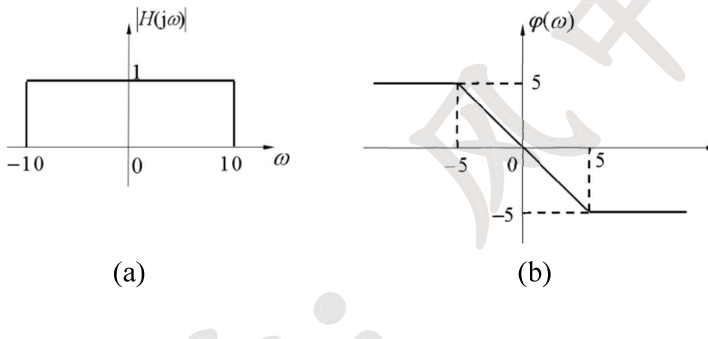

📖 解答

(1) 相位特性不是过原点的直线，故**不是**无失真传输系统。

(2) $f_1$ 的频率 2、4 都在 $|\omega|<5$ 内，该段 $H=\mathrm{e}^{-j\omega}$（增益 1、线性相位）：

$$y_1(t)=\sin(2t-2)+\sin(4t-4)=f_1(t-1)$$

波形整体延迟 1，不产生幅度失真和相位失真。

(3) $f_2(t)=2\sin2t\sin4t=\cos2t-\cos6t$。$\cos2t$ 分量（$|\omega|=2<5$）：$H=\mathrm{e}^{-j\omega}$；$\cos6t$ 分量（$|\omega|=6\in(5,10)$）：$H=\mathrm{e}^{-j5}$。

$$y(t)=\cos(2t-2)-\cos(6t-5)$$

[答案原文件 · 专题八 p1](../pdf/强化讲义专题八答案.pdf#page=1)

---

#### 讲义 8-3 ｜ 由正弦响应关系求频率响应
> **归类** 3.4 周期信号傅里叶级数与稳态频响
> **出处** 27强化讲义 专题八题目 第3题
> **页码** 98
> **答案页** 1

**题干**

已知连续时间线性时不变系统对正弦信号的响应具有如下关系

$$\cos(\omega_0 t)\rightarrow \frac{\omega_0}{2}\sin(\omega_0 t)$$

并且以上输入输出关系对任意 $\omega_0$ 成立，试求该系统的频率响应 $H(j\omega)$，并绘制其幅频和相频特性曲线。

📖 解答

$\cos(\omega_0t)=\frac12(\mathrm{e}^{j\omega_0t}+\mathrm{e}^{-j\omega_0t})$，经过 LTI 系统的响应为 $\frac12[H(j\omega_0)\mathrm{e}^{j\omega_0t}+H(-j\omega_0)\mathrm{e}^{-j\omega_0t}]$。对照 $\frac{\omega_0}{2}\sin(\omega_0t)=\frac12\left[\frac{\omega_0}{2j}\mathrm{e}^{j\omega_0t}-\frac{\omega_0}{2j}\mathrm{e}^{-j\omega_0t}\right]$：

$$H(j\omega_0)=\frac{\omega_0}{2j}\ \Longrightarrow\ H(j\omega)=-\frac{j\omega}{2}$$

幅频 $|H(j\omega)|=\dfrac{|\omega|}{2}$（V 形），相频 $\varphi(\omega)=\begin{cases}-\frac\pi2, & \omega>0\\ \frac\pi2, & \omega<0\end{cases}$。

（注：本题未说明系统是实系统，单凭正弦响应的结构本不严谨；但解出的 $H(j\omega)$ 幅度偶、相位奇，确为实系统——实系统才能对任意频率正弦都输出同频正弦。）

[答案原文件 · 专题八 p1](../pdf/强化讲义专题八答案.pdf#page=1)

---

#### 讲义 8-4 ｜ 门控正弦信号的波形与频谱
> **归类** 3.1 傅里叶变换性质综合运算
> **出处** 27强化讲义 专题八题目 第4题
> **页码** 99
> **答案页** 2

**题干**

已知连续时间信号 $f(t)=\sin2\pi t\cdot u(\cos\pi t)$，请画出该信号的波形，并求其频谱 $F(j\omega)$。

📖 解答

$u(\cos\pi t)$ 是周期 2 的对称方波（$\cos\pi t>0$ 即 $t\in(-\frac12+2k,\frac12+2k)$ 时为 1），故 $f(t)$ 是截取的正弦半波（类似抽样的波形拼接）。

**频谱**：$\sin2\pi t\leftrightarrow j\pi[\delta(\omega+2\pi)-\delta(\omega-2\pi)]$；方波 $g(t)=u(\cos\pi t)$（周期 2、脉宽 1、偶对称）的级数系数 $F_n=Sa\left(\frac{n\pi}2\right)$，$G(\omega)=2\pi\sum_n Sa\left(\frac{n\pi}2\right)\delta(\omega-n\pi)$。

$$F(j\omega)=\frac{1}{2\pi}\cdot j\pi[\delta(\omega+2\pi)-\delta(\omega-2\pi)]*G(\omega)$$

$$=j\pi\sum_{n=-\infty}^{\infty}Sa\left(\frac{n\pi}{2}\right)\left[\delta(\omega+(2-n)\pi)-\delta(\omega-(2+n)\pi)\right]$$

化简（利用 $Sa\left(\frac{n\pi}2\right)$ 在 $n$ 偶时为 0，只有奇次谐波）：冲激位于 $\omega=\pm\pi,\pm3\pi,\cdots$（奇数倍 $\pi$）处，幅度由 $Sa\left(\frac{n\pi}2\right)=\pm\frac2{n\pi}$ 加权。

[答案原文件 · 专题八 p2](../pdf/强化讲义专题八答案.pdf#page=2)

---

#### 讲义 8-5 ｜ 三角波与冲激串卷积的级数与频谱
> **归类** 3.4 周期信号傅里叶级数与稳态频响
> **出处** 27强化讲义 专题八题目 第5题
> **页码** 100
> **答案页** 4

**题干**

已知 $f(t)=\left(2|t|-1\right)\left[u(-t+1)-u(-t-1)\right]*\displaystyle\sum_{n=-\infty}^{\infty}\mathrm{e}^{jn\pi t}$。
(1) 画出 $f(t)$ 的波形图；
(2) 求该信号的傅里叶级数表达式以及傅里叶变换 $F(\omega)$。

📖 解答

(1) $\left(2|t|-1\right)\left[u(-t+1)-u(-t-1)\right]$ 是支撑 $(-1,1)$ 的"V 形"信号（$t=0$ 处 $-1$、$t=\pm1$ 处 1），与 $\displaystyle\sum_n\mathrm{e}^{jn\pi t}=2\sum_n\delta(t-2n)$（周期 2 冲激串）卷积后以 2 为周期延拓。

(2) **方法一**：取单周期 $f_1(t)$ 为 $(-\frac12,\frac12)$ 上峰 2 的三角形（底 $\frac72\sim-\frac72$ 剖分），$f_0(t)=-f_1(t)+f_1(t-1)$，$\mathcal{F}[f_1(t)]=Sa^2\left(\frac{\omega}4\right)$：

$$F_0(\omega)=-Sa^2\left(\frac{\omega}{4}\right)\left(1-\mathrm{e}^{-j\omega}\right),\qquad F_n=\frac12F_0(\omega)\Big|_{\omega=n\pi}=\frac12Sa^2\left(\frac{n\pi}4\right)\left(\mathrm{e}^{-jn\pi}-1\right)$$

$$f(t)=\frac12\sum_{n=-\infty}^{\infty}Sa^2\left(\frac{n\pi}{4}\right)\left[(-1)^n-1\right]\mathrm{e}^{jn\pi t}$$

$$F(\omega)=2\pi\sum_{n=-\infty}^{\infty}F_n\,\delta(\omega-n\pi)=\pi\sum_{n=-\infty}^{\infty}Sa^2\left(\frac{n\pi}{4}\right)\left[(-1)^n-1\right]\delta(\omega-n\pi)$$

（只有奇次谐波非零，幅度 $\frac{8}{\pi(n\pi)^2?}$ 由 $Sa^2$ 加权；取不同单周期得到的结果形式不同但实质一样。）

[答案原文件 · 专题八 p4](../pdf/强化讲义专题八答案.pdf#page=4)

---

#### 讲义 8-6 ｜ sin²/πt² 与 δ 并联组合的高通滤波器
> **归类** 3.4 周期信号傅里叶级数与稳态频响
> **原图** `images/lg/fig-t08-q6.png`
> **出处** 27强化讲义 专题八题目 第6题
> **页码** 102
> **答案页** 5

**题干**

已知某连续系统如下图所示（$f(t)$ 分两路：经 $h_1(t)$（送加法器负端）与经 $h_2(t)$（送正端）后相加输出 $y(t)$），其中系统的单位冲激响应为

$$h_1(t)=\frac{\sin^2(\pi t)}{\pi t^2},\qquad h_2(t)=\pi\delta(t)$$

(1) 求 $f(t)\Rightarrow y(t)$ 的系统单位冲激响应 $h(t)$ 和频率响应 $H(\omega)$，并画出 $H(\omega)$ 的图形；
(2) 判定该系统有何种滤波作用？
(3) 当 $f(t)=\dfrac12+\dfrac2\pi\displaystyle\sum_{n=1}^{\infty}\frac{1}{2n-1}\sin\left[(2n-1)\pi t\right]$ 时，求系统的输出 $y(t)$。

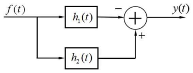

📖 解答

(1) $h(t)=h_2(t)-h_1(t)=\pi\delta(t)-\pi Sa^2(\pi t)$（$\frac{\sin^2\pi t}{\pi t^2}=\pi Sa^2(\pi t)$）。

$H_2(\omega)=\pi$；$H_1(\omega)=\mathcal{F}[\pi Sa^2(\pi t)]$：$Sa^2(\pi t)$ 的频谱为底 $4\pi$ 高 $\frac12?$ 的三角形——$\mathcal{F}[Sa^2(\pi t)]=\frac{1}{2\pi}(g_{2\pi}*g_{2\pi})$ 为 $|\omega|<2\pi$ 的三角形（$2\pi-|\omega|$ 形，峰值 $2\pi\cdot\frac1{2\pi}\cdot2\pi$），整理得

$$H(\omega)=\begin{cases}\dfrac{|\omega|}{2}, & |\omega|\le2\pi\\ \pi, & |\omega|>2\pi\end{cases}$$

(2) 低频增益趋 0、高频增益 $\pi$——**高通滤波器**，通过高频、抑制低频。

(3) $H(0)=0$、$H(\pi)=\frac\pi2$（$\pi<2\pi$）、$H((2n-1)\pi)=\pi$（$n\ge2$ 时 $(2n-1)\pi>2\pi$）：

$$y(t)=\sin(\pi t)+\sum_{n=2}^{\infty}\frac{2}{2n-1}\sin\left[(2n-1)\pi t\right]$$

即直流被滤除、基波幅度减半（$\frac2\pi\cdot\frac\pi2=\frac1\pi\cdot\pi=1$ 系数），其余谐波不变。

[答案原文件 · 专题八 p5](../pdf/强化讲义专题八答案.pdf#page=5)

---

#### 讲义 8-7 ｜ 希尔伯特变换器与解析信号
> **归类** 3.2 单边带调制 (SSB) 与希尔伯特变换（武大必考王牌）
> **出处** 27强化讲义 专题八题目 第7题
> **页码** 103
> **答案页** 6

**题干**

系统如图所示（$f(t)$ 经 $h(t)=\dfrac{1}{\pi t}$ 得 $\hat f(t)$），$f(t)$ 的傅里叶变换为 $F(\omega)$。
(1) 求出 $H(\omega)$；
(2) 求出 $\hat f(t)$ 的傅里叶变换 $\hat F(\omega)$；
(3) 令 $z(t)=f(t)+j\hat f(t)$，求 $Z(\omega)$；
(4) 如果 $f(t)=\cos(\omega_0 t)$，求对应的 $\hat f(t)$；
(5) 如果 $f(t)$ 同 (4) 问，求对应的 $Z(\omega)$ 和 $z(t)$。

📖 解答

(1) $\mathcal{F}\left[\dfrac{1}{\pi t}\right]=-j\,\mathrm{sgn}(\omega)$（希尔伯特变换器）。

(2) $\hat F(\omega)=F(\omega)H(\omega)=-j\,\mathrm{sgn}(\omega)\,F(\omega)=\begin{cases}-jF(\omega), & \omega>0\\ jF(\omega), & \omega<0\end{cases}$

(3) $Z(\omega)=F(\omega)+j\hat F(\omega)=F(\omega)+\mathrm{sgn}(\omega)F(\omega)=2F(\omega)u(\omega)$——**解析信号**（只保留正频率部分）。

(4) $F(\omega)=\pi[\delta(\omega+\omega_0)+\delta(\omega-\omega_0)]$，$\hat F(\omega)=j\pi[\delta(\omega+\omega_0)-\delta(\omega-\omega_0)]$，

$$\hat f(t)=\sin(\omega_0 t)$$

(5) $z(t)=\cos(\omega_0t)+j\sin(\omega_0t)=\mathrm{e}^{j\omega_0t}$，

$$Z(\omega)=2\pi\,\delta(\omega-\omega_0)$$

[答案原文件 · 专题八 p6](../pdf/强化讲义专题八答案.pdf#page=6)

---

#### 讲义 8-8 ｜ 全波整流信号通过带通滤波器
> **归类** 3.4 周期信号傅里叶级数与稳态频响
> **出处** 27强化讲义 专题八题目 第8题
> **页码** 104
> **答案页** 7

**题干**

已知输入为 $x(t)=\left|\cos\omega_0 t\right|$，系统的冲激响应为 $h(t)=\dfrac{\sin\omega_0(t-t_0)}{\pi(t-t_0)}\cos6\omega_0 t$，求系统的输出。

📖 解答

取单周期 $f_0(t)=\cos\omega_0t\cdot g_{\frac{2\pi}{\omega_0}}(t)$：$F_0(\omega)=\dfrac{\pi}{2\omega_0}\left\{Sa\left[\frac{\pi}{2\omega_0}(\omega-\omega_0)\right]+Sa\left[\frac{\pi}{2\omega_0}(\omega+\omega_0)\right]\right\}$。

$x$ 的周期 $T=\frac{\pi}{\omega_0}$、基波 $\omega_1=2\omega_0$，$F_n=\frac12\left[Sa\left(n\pi-\frac\pi2\right)+Sa\left(n\pi+\frac\pi2\right)\right]$。

$h$ 的频谱：$\mathcal{F}\left[\dfrac{\sin\omega_0(t-t_0)}{\pi(t-t_0)}\right]=g_{2\omega_0}(\omega)\,\mathrm{e}^{-j\omega t_0}$，频移 $\cos6\omega_0t$：

$$H(\omega)=\frac12\,\mathrm{e}^{-j(\omega-6\omega_0)t_0}\ \left(5\omega_0<\omega<7\omega_0\right),\qquad \frac12\,\mathrm{e}^{-j(\omega+6\omega_0)t_0}\ \left(-7\omega_0<\omega<-5\omega_0\right)$$

$x(t)$ 经系统：只有 $|n|=3$（$\omega=\pm6\omega_0$）的谐波落在通带内：

$$y(t)=\frac12F_3\,\mathrm{e}^{j6\omega_0t}+\frac12F_{-3}\,\mathrm{e}^{-j6\omega_0t}=\frac{1}{35\pi}\left(\mathrm{e}^{j6\omega_0t}+\mathrm{e}^{-j6\omega_0t}\right)=\frac{2}{35\pi}\cos(6\omega_0t)$$

（只有 $6\omega_0$ 和 $-6\omega_0$ 处的三次谐波能通过。）

[答案原文件 · 专题八 p7](../pdf/强化讲义专题八答案.pdf#page=7)

---

#### 讲义 8-9 ｜ 调制—带通—解调—低通链路的输出频谱
> **归类** 3.2 单边带调制 (SSB) 与希尔伯特变换（武大必考王牌）
> **原图** `images/lg/fig-t08-q9.png`
> **出处** 27强化讲义 专题八题目 第9题
> **页码** 105
> **答案页** 8

**题干**

如图(a)所示系统中（$f(t)$ 与 $\cos5\omega_0t$ 相乘后经带通 $H_1$（通带 $3\omega_0\sim5\omega_0$ 及对称）解调，与 $\cos3\omega_0t$ 相乘后经低通 $H_2$（$|\omega|<3\omega_0$）输出 $y(t)$），已知输入信号的频谱为 $F(j\omega)$（三角形，$-2\omega_0\sim2\omega_0$、峰 1），如图(b)所示。试确定 $y(t)$ 的频谱 $Y(j\omega)$ 的表达式，并相略画出该频谱图。

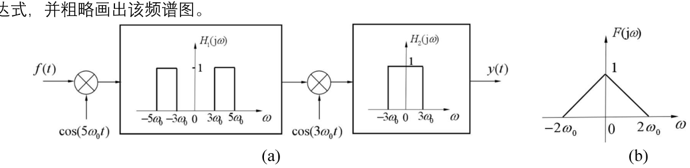

📖 解答

记 $f_1(t)=f(t)\cos(5\omega_0t)$：$F_1(j\omega)=\frac12\{F[j(\omega+5\omega_0)]+F[j(\omega-5\omega_0)]\}$——三角形搬移到 $\pm5\omega_0$ 两侧（$3\omega_0\sim7\omega_0$）。

经 $H_1$（通带 $3\omega_0\sim5\omega_0$）：只保留内侧半边，得 $F_2$（$3\omega_0\sim5\omega_0$ 内的直角三角形，峰 $\frac12$ 在 $3\omega_0$ 侧）。

记 $f_3(t)=f_2(t)\cos3\omega_0t$：$F_3(j\omega)=\frac12\{F_2[j(\omega+3\omega_0)]+F_2[j(\omega-3\omega_0)]\}$——搬回 $\pm3\omega_0$ 附近（$0\sim2\omega_0$ 与对称）。

经 $H_2$（$|\omega|<3\omega_0$）：保留基带部分。

$$Y(j\omega)=\begin{cases}\dfrac{|\omega|}{8\omega_0}, & |\omega|\le2\omega_0\\[1mm] 0, & |\omega|>2\omega_0\end{cases}=\frac{|\omega|}{8\omega_0}\left[u(\omega+2\omega_0)-u(\omega-2\omega_0)\right]$$

即恢复出幅度缩小的原三角形谱（小三角形 $-2\omega_0\sim2\omega_0$、峰 $\frac14$）。

[答案原文件 · 专题八 p8](../pdf/强化讲义专题八答案.pdf#page=8)

---

#### 讲义 8-10 ｜ 正交复用（QAM）调制解调系统的证明
> **归类** 3.2 单边带调制 (SSB) 与希尔伯特变换（武大必考王牌）
> **原图** `images/lg/fig-t08-q10.png`
> **出处** 27强化讲义 专题八题目 第10题
> **页码** 106
> **答案页** 9

**题干**

如图所示系统是模拟无线通信中的正交复用调制解调系统。其中：
(1) $f_1(t)$ 和 $f_2(t)$ 是不同的实带限信号，最高频率均为 $f_m$；
(2) $s_1(t)=\cos(2\pi f_0t)$ 和 $s_2(t)=\sin(2\pi f_0t)$ 是调制载波，载波频率 $f_0\gg f_m$；
(3) $h(t)$ 是无线信道，这里假定信道是理想的，即 $h(t)=\delta(t)$；
(4) $h_1(t)$ 是接收端的解调滤波器，是理想低通滤波器，其频响 $H_1(j\omega)=\begin{cases}2, & |\omega|<2\pi f_c\\ 0, & |\omega|>2\pi f_c\end{cases}$，截止频率 $f_c$ 满足 $f_m<f_c<2f_0-f_m$。
试证明：$y_1(t)=f_1(t)$ 和 $y_2(t)=f_2(t)$。

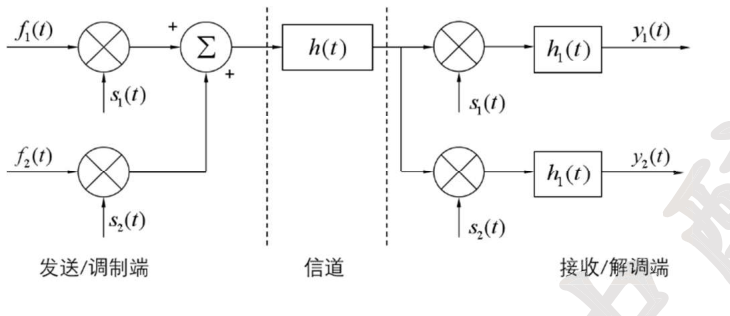

📖 解答

发送端合路输出：$f_3(t)=f_1(t)\cos(2\pi f_0t)+f_2(t)\sin(2\pi f_0t)$；理想信道 $f_4=f_3$。

上支路解调（乘 $s_1$）后：

$$f_5(t)=f_1(t)\cos^2(2\pi f_0t)+f_2(t)\sin(2\pi f_0t)\cos(2\pi f_0t)=\frac12f_1(t)+\frac12f_1(t)\cos(4\pi f_0t)+\frac12f_2(t)\sin(4\pi f_0t)$$

后两项频谱在 $\pm2f_0$ 附近（$2f_0-f_m\sim2f_0+f_m$）。由于 $f_m<f_c<2f_0-f_m$（即 $2f_c<2f_0-f_m$ 不成立、$f_c<2f_0-f_m$），理想低通 $H_1$（截止 $2\pi f_c$，增益 2）只让基带 $\frac12f_1(t)$ 通过、滤除 $2f_0$ 附近分量：

$$y_1(t)=2\cdot\frac12f_1(t)=f_1(t)$$

下支路解调（乘 $s_2$）：

$$f_6(t)=f_1(t)\sin(2\pi f_0t)\cos(2\pi f_0t)+f_2(t)\sin^2(2\pi f_0t)=\frac12f_1(t)\sin(4\pi f_0t)+\frac12f_2(t)\left[1-\cos(4\pi f_0t)\right]$$

同理经 $H_1$：

$$y_2(t)=2\cdot\frac12f_2(t)=f_2(t)$$

证毕。（正交载波使两路信号频谱在接收端可分离——这就是 QAM 的原理。）

[答案原文件 · 专题八 p9](../pdf/强化讲义专题八答案.pdf#page=9)

---

#### 讲义 8-11 ｜ 调制—滤波—理想采样链路的五点频谱
> **归类** 3.2 单边带调制 (SSB) 与希尔伯特变换（武大必考王牌）
> **原图** `images/lg/fig-t08-q11.png`
> **出处** 27强化讲义 专题八题目 第11题
> **页码** 107
> **答案页** 10

**题干**

在图(a)所示连续时间系统中（$f(t)$ 与 $\cos4\pi t$ 相乘得 $y_1$，经 $h_1(t)=\delta(t)-\dfrac{\sin4\pi t}{\pi t}$ 得 $y_2$，$y_2$ 分两路：一路直接、一路经 $h_2(t)=-\dfrac{j}{\pi t}$ 后与前者相加得 $y_4$，再与 $p(t)=\displaystyle\sum_{k=-\infty}^{\infty}\delta(t-k)$ 相乘得 $y_5$），输入信号 $f(t)$ 的频谱 $F(j\omega)$ 如图(b)所示（$-\pi\sim\pi$：$-\pi\sim0$ 线性升 0→1、$0\sim\pi$ 平台 1）。请写出子系统 $h_1(t)$ 和 $h_2(t)$ 的频率响应 $H_1(j\omega)$ 和 $H_2(j\omega)$，分别画出信号 $y_1(t),y_2(t),y_3(t),y_4(t),y_5(t)$ 的频谱。

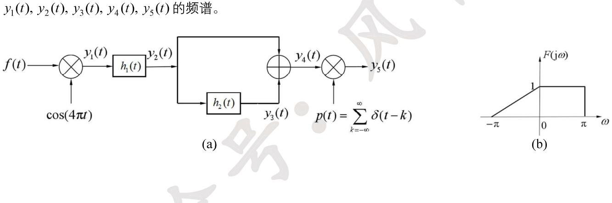

📖 解答

$$H_1(j\omega)=1-g_{4\pi}(\omega)\qquad\left(\mathcal{F}\left[\frac{\sin4\pi t}{\pi t}\right]=g_{4\pi}(\omega)\right)$$

$$H_2(j\omega)=-j\,\mathrm{sgn}(\omega)\qquad\left(\mathcal{F}\left[\frac{1}{\pi t}\right]=-j\pi\,\mathrm{sgn}(\omega)\right)$$

- $y_1=f\cos4\pi t$：$Y_1=\frac12[F(\omega+4\pi)+F(\omega-4\pi)]$（三角形+平台搬到 $\pm4\pi$）；
- $y_2$：$Y_2=Y_1H_1$——滤除 $|\omega|<2\pi?$ 附近后只剩 $\pm4\pi$ 外侧部分（$-5\pi\sim-3\pi$ 的斜坡与 $4\pi\sim5\pi$ 的平台）；
- $y_3=y_2*h_2$：$Y_3=Y_2H_2$——负频率支变号（希尔伯特移相 $\pm\frac\pi2$）；
- $y_4=y_2+y_3$：正频率部分抵消、负频率部分加倍——**单边带**：$Y_4$ 只剩 $-5\pi\sim-3\pi$ 的斜坡（峰 1）；
- $y_5=y_4\cdot p(t)$：理想采样频谱周期延拓（周期 $2\pi$），$Y_5=\sum_k Y_4(j(\omega-2\pi k))$。

[答案原文件 · 专题八 p10](../pdf/强化讲义专题八答案.pdf#page=10)

---

#### 讲义 8-12 ｜ DSB 调制解调的频带设计与载波相位误差
> **归类** 3.2 单边带调制 (SSB) 与希尔伯特变换（武大必考王牌）
> **原图** `images/lg/fig-t08-q12.png`
> **出处** 27强化讲义 专题八题目 第12题
> **页码** 108
> **答案页** 11

**题干**

抑制载波的双边带幅度调制与解调系统如图所示（$f(t)$ 与 $\cos(\omega_0t+\theta_1)$ 相乘经带通 $H_1$ 得 $f_2$，再与 $\cos(\omega_0t+\theta_2)$ 相乘经低通 $H_2$ 得 $g(t)$），已知调制信号 $f(t)$ 不含直流分量，其频谱为 $F(j\omega)$，占据 $-\omega_m$ 至 $\omega_m$ 的有限频带。
(1) 给出 $f_1(t)$ 占据的频带范围；
(2) 如果要求接收端能够恢复原信号 $f(t)$，给出对实际系统中带通滤波器 $H_1(j\omega)$ 和低通滤波器 $H_2(j\omega)$ 的频带要求；
(3) 理论上调制与解调的载频信号应该是同频同相，如果相位不同，分情况讨论对恢复原基带信号的影响。

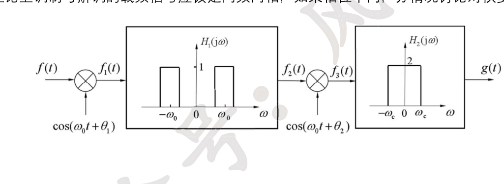

📖 解答

(1) $F_1(j\omega)=\frac12\{F[j(\omega+\omega_0)]\mathrm{e}^{-j\theta_1}+F[j(\omega-\omega_0)]\mathrm{e}^{j\theta_1}\}$，占据 $\omega_0-\omega_m\le|\omega|\le\omega_0+\omega_m$。

(2) 带通 $H_1$：截止频率 $\omega_L\le\omega_0-\omega_m$、$\omega_H\ge\omega_0+\omega_m$（通带完整覆盖边带）；解调后 $f_3=\frac12f(t)\cos(\theta_1-\theta_2)+\frac12f(t)\cos(2\omega_0t+\theta_1+\theta_2)$，为只保留基带部分需 $\omega_m<\omega_c<2\omega_0-\omega_m$。

(3) $g(t)=\dfrac12f(t)\cos(\theta_1-\theta_2)$：
① 若 $\theta_1-\theta_2=\pm\frac\pi2$，$g(t)=0$，不能恢复原信号；
② 若 $\theta_1-\theta_2=\pi$，$g(t)=-f(t)$，与原信号波形刚好相反；
③ 一般情况：$g(t)=f(t)\cos(\theta_1-\theta_2)$（$\cos(\theta_1-\theta_2)\ne0$），相当于原信号乘一个常数，只需倍乘 $\dfrac{1}{\cos(\theta_1-\theta_2)}$ 即可恢复原信号。

[答案原文件 · 专题八 p11](../pdf/强化讲义专题八答案.pdf#page=11)

---

#### 讲义 8-13 ｜ 窄带调频信号的带宽与解调
> **归类** 3.2 单边带调制 (SSB) 与希尔伯特变换（武大必考王牌）
> **出处** 27强化讲义 专题八题目 第13题
> **页码** 109
> **答案页** 12

**题干**

已知窄带调频信号 $f(t)=\cos(\omega_ct)-K_f\left[\displaystyle\int_{-\infty}^{t}m(\tau)\mathrm{d}\tau\right]\sin(\omega_ct)$，其中基带信号 $m(t)$ 的带宽为 $\omega_m$，$\omega_c\gg\omega_m$，$K_f$ 为已知常数。
(1) 计算信号 $y(t)=\displaystyle\int_{-\infty}^{t}m(\tau)\mathrm{d}\tau$ 的带宽；
(2) 计算信号 $f(t)$ 的带宽；
(3) 为了从窄带调频信号 $f(t)$ 中解调出 $m(t)$，可采用题图所示的系统框图（$f$ 与 $f_1(t)=-\sin(\omega_ct)$ 相乘经 LPF（$H_1(\omega)=1,|\omega|\le\omega_1$）得 $f_2$，再经 $H_2(\omega)$ 输出 $y(t)$）。请写出 $H_1(\omega)$ 的带宽 $\omega_1$ 的取值范围，对于频率响应特性为 $H_2(\omega)$ 的系统，请写出描述它的输出 $y(t)$ 与输入 $f_2(t)$ 之间关系的方程。

📖 解答

(1) $Y(\omega)=\dfrac{M(\omega)}{j\omega}+\pi M(0)\delta(\omega)$（$m$ 不含直流时无 $\delta$ 项），带宽仍为 $\omega_m$。

(2) $F(\omega)=\pi[\delta(\omega+\omega_c)+\delta(\omega-\omega_c)]-\dfrac{K_f}{2}[Y(\omega+\omega_c)-Y(\omega-\omega_c)]$，带宽 $(\omega_c+\omega_m)-(\omega_c-\omega_m)=2\omega_m$。

(3) $f\cdot f_1=-\sin\omega_ct\cos\omega_ct+K_f\left[\int m\right]\sin^2\omega_ct=-\frac12\sin2\omega_ct+\frac{K_f}{2}\int m-\frac{K_f}{2}\left[\int m\right]\cos2\omega_ct$

其频谱含 $\pm2\omega_c$ 项与基带 $\frac{K_f}{2}Y(\omega)$。为只保留 $\frac{K_f}{2}Y(\omega)$，$\omega_1$ 取值范围 $\omega_m<\omega_1<2\omega_c-\omega_m$。经理想低通后：

$$f_2(t)=\mathcal{F}^{-1}\left[\frac{K_f}{2}Y(\omega)\right]=\frac{K_f}{2}\int_{-\infty}^{t}m(\tau)\,\mathrm{d}\tau$$

为恢复 $m(t)$，$H_2$ 应为微分器（$H_2(\omega)=\frac{2}{K_f}j\omega$），即

$$y(t)=\frac{2}{K_f}\,\frac{\mathrm{d}f_2(t)}{\mathrm{d}t}=m(t)$$

[答案原文件 · 专题八 p12](../pdf/强化讲义专题八答案.pdf#page=12)

---

#### 讲义 8-14 ｜ 全波整流器与 RC 滤波的直流电源
> **归类** 3.4 周期信号傅里叶级数与稳态频响
> **原图** `images/lg/fig-t08-q14.png`
> **出处** 27强化讲义 专题八题目 第14题
> **页码** 110
> **答案页** 13

**题干**

一个全波整流器和 RC 电路级联而成的直流电源，如图所示。全波整流器输出由下式给出：$z(t)=|x(t)|$。
(1) 求虚线框内 RC 电路的系统函数 $H(s)$，以及系统的幅频特性；
(2) 设输入信号 $x(t)=\cos(100\pi t)$，请解答如下问题：
　(i) 求 $z(t)$ 的直流分量；
　(ii) 求 $z(t)$ 中 100Hz 的频率分量信号；
　(iii) 为了使得 $y(t)$ 中 100Hz 的频率分量振幅小于直流分量的 1%，请确定时间常数 $\tau=RC$ 的范围是多少？

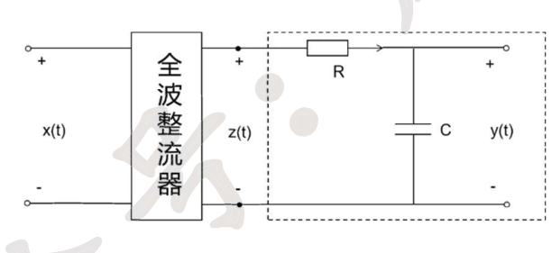

📖 解答

(1) RC 电路（R 串联、C 并联输出）：$H(s)=\dfrac{1/sC}{1/sC+R}=\dfrac{1}{1+sCR}$，$H(j\omega)=\dfrac{1}{1+j\omega CR}$，$|H(j\omega)|=\dfrac{1}{\sqrt{1+(\omega CR)^2}}$（低通特性）。

(2) $z(t)=|\cos(100\pi t)|$，周期 $T_1=\frac1{100}$（基波频率 100Hz、$\omega_1=200\pi$）。

(i) 直流分量 $z_D=100\displaystyle\int_{-\frac1{200}}^{\frac1{200}}\cos(100\pi t)\,\mathrm{d}t=\frac{2}{\pi}$。

(ii) 傅里叶系数 $a_1=400\displaystyle\int_0^{\frac1{200}}\cos(100\pi t)\cos(200\pi t)\,\mathrm{d}t=200\int_0^{\frac1{200}}[\cos300\pi t+\cos100\pi t]\,\mathrm{d}t=\frac{2}{3\pi}-\frac2\pi$ 的组合——

$$a_1=-\frac{2}{3\pi}+\frac{2}{\pi}=\frac{4}{3\pi}$$

100Hz 分量为 $\dfrac{4}{3\pi}\cos(200\pi t)$（角频率 $200\pi$ rad/s，即 100Hz）。

(iii) 直流经 $H(0)=1$ 不衰减：直流输出 $\frac2\pi$；100Hz 分量输出幅度 $=\dfrac{4}{3\pi}\cdot\dfrac{1}{\sqrt{1+(200\pi RC)^2}}$。要求小于直流的 1%：

$$\frac{4}{3\pi}\cdot\frac{1}{\sqrt{1+(200\pi\tau)^2}}<0.01\cdot\frac2\pi\ \Longrightarrow\ \sqrt{1+(200\pi\tau)^2}>\frac{200}{3}\ \Longrightarrow\ \tau=RC>\frac{\sqrt{\frac{40000}{9}-1}}{200\pi}\approx0.033\ \mathrm{s}$$

[答案原文件 · 专题八 p13](../pdf/强化讲义专题八答案.pdf#page=13)

---

#### 讲义 8-15 ｜ 频分多路复用（FDM）系统四问
> **归类** 3.2 单边带调制 (SSB) 与希尔伯特变换（武大必考王牌）
> **原图** `images/lg/fig-t08-q15.png`
> **出处** 27强化讲义 专题八题目 第15题
> **页码** 112
> **答案页** 14

**题干**

已知一频分多路复用系统如图所示（$x_1$ 与 $\cos(200t)$ 相乘、$x_2$ 与 $\cos(400t)$ 相乘后合路为 $y$；解复用：$y$ 经 $H_1$（带通 $150\sim250$）与 $g_1$（周期 $T_1$ 方波，$\frac{2\pi}{T_1}=200$）相乘经 $H_3$ 得 $x_1$；$y$ 经 $H_2$（带通 $300\sim500$）与 $g_2$（周期 $T_2$ 方波，$\frac{2\pi}{T_2}=400$）相乘经 $H_4$ 得 $x_2$），复用输出信号 $y(t)$，其中 $x_1(t)$、$x_2(t)$ 为要传送的基带信号，频谱分别为 $X_1(j\omega)=50-|\omega|,|\omega|\le50$；$X_2(j\omega)=100-|\omega|,|\omega|\le100$。求：
(1) 图中 A 点处的频谱表达式（或画出 A 点的频谱图）；
(2) 图中 $g_1(t)$ 的频谱表达式（或画出 $g_1(t)$ 的频谱图）；
(3) 图中 B 点处的频谱表达式（或画出 B 点的频谱图）；
(4) 设计滤波器 $H_3(j\omega)$、$H_4(j\omega)$，使其输出分别为 $x_1(t)$ 和 $x_2(t)$。

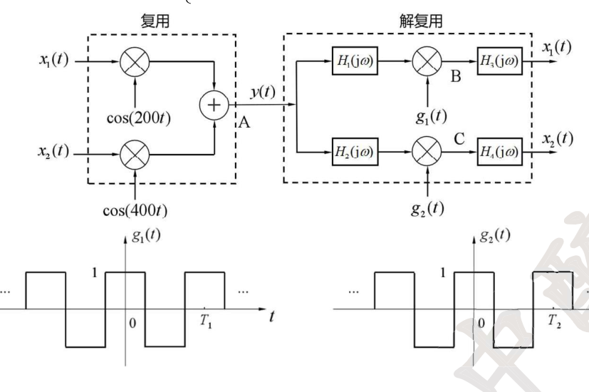

📖 解答

(1) $y(t)=x_1(t)\cos(200t)+x_2(t)\cos(400t)$：

$$Y(j\omega)=\frac12[X_1(j(\omega+200))+X_1(j(\omega-200))]+\frac12[X_2(j(\omega+400))+X_2(j(\omega-400))]$$

A 点频谱：$X_1$ 三角形（峰 50）搬到 $\pm200$、$X_2$ 三角形（峰 100）搬到 $\pm400$。

(2) $g_1(t)$：周期 $T_1$、幅度 $\pm1$ 的方波，去掉直流后 $g_1=g_3-1$，$G_0(j\omega)=T_1Sa\left(\frac{\omega T_1}4\right)$，$F_n=Sa\left(\frac{n\pi}2\right)$：

$$G_1(j\omega)=2\pi\sum_{n\ne0}Sa\left(\frac{n\pi}2\right)\delta\left(\omega-200n\right)$$

(3) $y$ 经 $H_1$ 后（$Y_1=YH_1$，保留 $150\sim250$ 的三角）与 $g_1$ 相乘：

$$Y_B(j\omega)=\frac{1}{2\pi}Y_1(j\omega)*G_1(j\omega)=\sum_{n=-\infty}^{\infty}Sa\left(\frac{n\pi}{2}\right)Y_1[j(\omega-200n)]$$

即原三角形频谱（缩小）出现在 $\pm200n$ 两侧，其中 $n=1$（$200\pm50$）处为恢复 $x_1$ 所需的基带分量。

(4) $H_3(j\omega)$：理想低通，$|\omega|<50$、增益 $\frac12$（补偿相乘的 $\frac12$）→ 输出 $x_1(t)$；同理下支路：$H_4(j\omega)$：理想低通，$|\omega|<100$、增益 $\frac12$ → 输出 $x_2(t)$。

[答案原文件 · 专题八 p14-15](../pdf/强化讲义专题八答案.pdf#page=14)

---

#### 讲义 8-16 ｜ 【强化】理想低通滤波器的冲激响应与选频
> **归类** 3.4 周期信号傅里叶级数与稳态频响
> **出处** 27强化讲义 强化专题八习题 第1题
> **页码** 115
> **答案页** 3

**题干**

已知理想低通滤波器的系统函数为 $H(j\omega)=2\left[u(\omega+\pi)-u(\omega-\pi)\right]\mathrm{e}^{-j3\omega}$，$x(t)\rightarrow\boxed{H(j\omega)}\rightarrow y(t)$。
(1) 若 $x(t)=\delta(t)$，则 $y(t)=$ __________。
(2) 若 $x(t)=\sin2t+2\sin6t$，则 $y(t)=$ __________。

📖 解答

$\mathcal{F}^{-1}[u(\omega+\pi)-u(\omega-\pi)]=Sa(\pi t)$，故 $h(t)=2Sa\left(\pi(t-3)\right)$。

(1) $y(t)=\delta(t)*h(t)=2Sa\left(\pi(t-3)\right)$。

(2) $\sin2t$：$|\omega|=2<\pi$，通过（增益 2、线性相位 $-3\omega$）；$\sin6t$：$|\omega|=6>\pi$，被滤除。

$$y(t)=2\sin\left(2(t-3)\right)$$

[答案原文件 · 专题八 p3](../pdf/强化讲义专题八答案.pdf#page=3)

---

#### 讲义 8-17 ｜ 【强化】由幅相特性分段求多频正弦响应
> **归类** 3.4 周期信号傅里叶级数与稳态频响
> **原图** `images/lg/fig-t08-q19.png`
> **出处** 27强化讲义 强化专题八习题 第2题
> **页码** 115
> **答案页** 3

**题干**

某 LTI 系统幅频和相频特性如下图所示（幅频：$|\omega|<6$ 内从 6 线性降到 0 的三角；相频：$|\omega|<4$ 从 $\frac\pi2$ 线性降到 $-\frac\pi2$（$\varphi=-\frac{\pi\omega}{8}$），$4<|\omega|<6$ 为 $-\frac\pi2$），求 $f(t)=3+5\cos t+5\sin(3t)+8\cos(8t)$ 经过系统后的响应 $y(t)$。

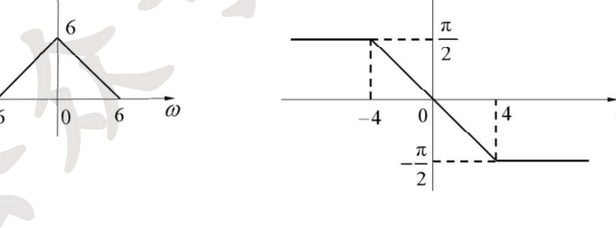

📖 解答

$$y(t)=3|H(j0)|+5|H(j1)|\cos\left(t+\varphi(1)\right)+5|H(j3)|\sin\left(3t+\varphi(3)\right)+8|H(j8)|\cos\left(8t+\varphi(8)\right)$$

由图：$|H(j0)|=6$、$|H(j1)|=6\cdot\frac56=5$、$|H(j3)|=6\cdot\frac36=3$、$|H(j8)|=0$（$8>6$ 被滤除）；$\varphi(1)=-\frac\pi8$、$\varphi(3)=-\frac{3\pi}8$。

$$y(t)=18+25\cos\left(t-\frac{\pi}{8}\right)+15\sin\left(3t-\frac{3\pi}{8}\right)$$

（8cos8t 分量频率超出通带，完全滤除。）

[答案原文件 · 专题八 p3](../pdf/强化讲义专题八答案.pdf#page=3)

---

#### 讲义 8-18 ｜ 【强化】交替半波三角波的傅里叶变换
> **归类** 3.4 周期信号傅里叶级数与稳态频响
> **原图** `images/lg/fig-t08-q20.png`
> **出处** 27强化讲义 强化专题八习题 第3题
> **页码** 116
> **答案页** 11

**题干**

已知信号 $f(t)$ 的波形如下（周期 1：$t=0$ 处上三角峰 $\frac12$（$-\frac14\sim\frac14$），$t=\pm1$ 等处下三角谷 $-\frac12$），求 $f(t)$ 的傅里叶变换。

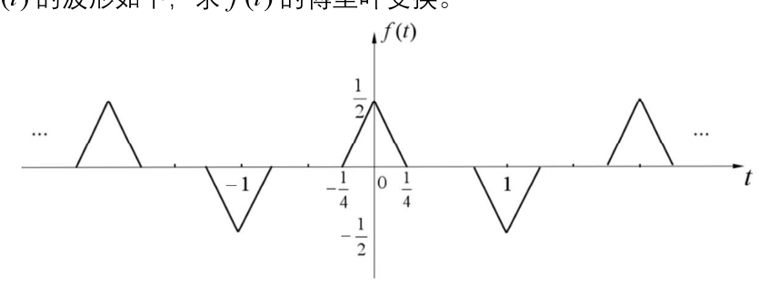

📖 解答

取单周期 $f_0(t)$ 为 $(-\frac14,\frac14)$ 上峰 $\frac12$ 的三角形：$F_0(\omega)=\frac18Sa^2\left(\frac{\omega}8\right)$。

设 $g(t)=\displaystyle\sum_{n=-\infty}^{\infty}(-1)^n\delta(t-n)$，则 $f(t)=f_0(t)*g(t)$。由 $(-1)^n=\mathrm{e}^{j\pi n}$：

$$G(\omega)=\mathcal{F}[g(t)]=2\pi\sum_{n=-\infty}^{\infty}\delta(\omega-\pi-2\pi n)$$

$$F(\omega)=G(\omega)\cdot F_0(\omega)=\frac{\pi}{4}\sum_{n=-\infty}^{\infty}Sa^2\left(\frac{(2n+1)\pi}{8}\right)\,\delta\left(\omega-(2n+1)\pi\right)$$

即频谱为位于奇数倍 $\pi$ 处的冲激串，强度按 $Sa^2\left(\frac{(2n+1)\pi}{8}\right)$ 加权（$f$ 是奇谐信号，偶次谐波为零）。

[答案原文件 · 专题八 p11](../pdf/强化讲义专题八答案.pdf#page=11)

---

#### 讲义 8-19 ｜ 【强化】三角频响滤波器对周期锯齿的响应
> **归类** 3.4 周期信号傅里叶级数与稳态频响
> **原图** `images/lg/fig-t08-q21.png`
> **出处** 27强化讲义 强化专题八习题 第4题
> **页码** 116
> **答案页** 12

**题干**

如图(a)所示滤波器（$f(t)\to$ 滤波器 $\to y(t)$），已知其 $H(\omega)$ 如图(b)所示（$-4\pi\sim4\pi$ 三角，峰 2 于 $\omega=0$），$f(t)$ 的波形如图(c)所示（周期 1 锯齿波，$0\sim1$ 从 0 线性升到 1），求其零状态响应 $y(t)$，并画出波形。

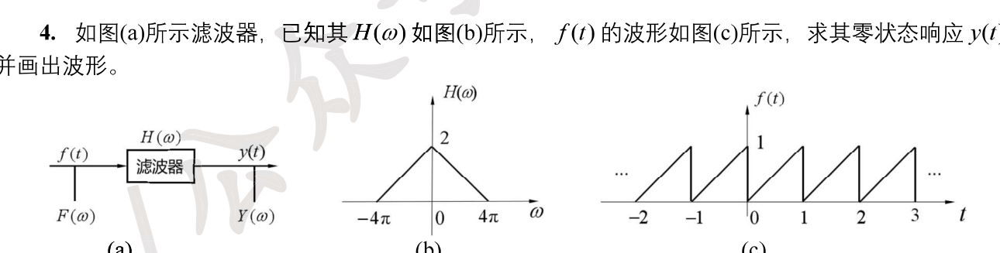

📖 解答

$f$ 的级数：$F_n=\dfrac{1}{2\pi n}\left[Sa\left(\frac{n\pi}2\right)\mathrm{e}^{-j\frac{n\pi}2}-\mathrm{e}^{-j2\pi n}\right]$？直接用单周期法：取 $f_0(t)=t\left[u(t)-u(t-1)\right]$，$f_0'(t)=u(t)-u(t-1)-\delta(t-1)$，

$$F_0(\omega)=\frac{Sa\left(\frac{\omega}{2}\right)\mathrm{e}^{-j\frac{\omega}2}-\mathrm{e}^{-j\omega}}{j\omega},\qquad F_n=\frac1TF_0(\omega)\Big|_{\omega=2\pi n}=\frac{1}{j2\pi n}\left[Sa(n\pi)\mathrm{e}^{-jn\pi}-\mathrm{e}^{-j2\pi n}\right]=-\frac{1}{j2\pi n}\ (n\ne0)$$

$f_0=1/2$（直流分量 $F_0=\frac12$）。

$H(\omega)=2\left(1-\frac{|\omega|}{4\pi}\right)$（$|\omega|<4\pi$）：$H(0)=2$、$H(2\pi n)=2\left(1-\frac{2\pi n}{4\pi}\right)=2-n$（$|n|<2$ 时非零：$H(\pm2\pi)=1$）。

$$y(t)=F_0H(0)+F_{1}H(2\pi)\mathrm{e}^{j2\pi t}+F_{-1}H(-2\pi)\mathrm{e}^{-j2\pi t}=\frac12\cdot2+\left(-\frac{1}{j2\pi}\right)\mathrm{e}^{j2\pi t}+\frac{1}{j2\pi}\mathrm{e}^{-j2\pi t}$$

$$=1-\frac{\sin(2\pi t)}{\pi}$$

（只保留直流与基波，高次谐波被三角频响滤除。）

[答案原文件 · 专题八 p12](../pdf/强化讲义专题八答案.pdf#page=12)

---

#### 讲义 8-20 ｜ 【强化】sin·Sa 型频响对周期方波的响应
> **归类** 3.4 周期信号傅里叶级数与稳态频响
> **原图** `images/lg/fig-t08-q22.png`
> **出处** 27强化讲义 强化专题八习题 第5题
> **页码** 117
> **答案页** 13

**题干**

某线性时不变系统的激励是周期信号 $f(t)$（周期 1，$-0.25\sim0.25$ 高 1 的矩形脉冲串），已知该系统的冲激响应 $h(t)=\dfrac{\sin(\pi t)\sin(2\pi t)}{\pi t^2}$，画出该系统的频率响应，并求出该系统的零状态响应 $y(t)$。

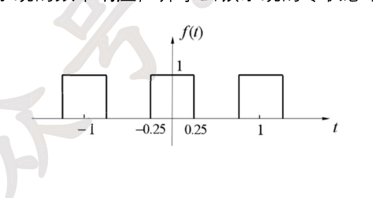

📖 解答

取 $f_0(t)=g_{0.5}(t)$（宽 0.5 高 1 门）：$F_0(\omega)=\frac12Sa\left(\frac{\omega}{4}\right)$，$f$ 周期 $T=1$、$\omega_1=2\pi$，$F_n=\frac12Sa\left(\frac{n\pi}2\right)$。

$$H(\omega)=\mathcal{F}\left[2\pi Sa(\pi t)\cdot Sa(2\pi t)\right]=\frac{1}{2}\,g_{2\pi}(\omega)*g_{4\pi}(\omega)$$

（$Sa(\pi t)\leftrightarrow g_{2\pi}$、$Sa(2\pi t)\leftrightarrow\frac12g_{4\pi}$，两个门卷积为梯形：$|\omega|<\pi$ 高 $\pi$、$\pi<|\omega|<3\pi$ 线性下降到 0。）

$f$ 的谐波频率 $2\pi n$ 全部落在梯形平台内（$|2\pi n|\le2\pi$ 即 $|n|\le1$ 非零、$|n|\ge2$ 时 $2\pi n\ge4\pi$ 处 $H=0$）：

$$y(t)=F_0H(0)+F_1H(2\pi)\mathrm{e}^{j2\pi t}+F_{-1}H(-2\pi)\mathrm{e}^{-j2\pi t}=\frac12\pi+\frac12Sa\left(\frac\pi2\right)\left(\pi\mathrm{e}^{j2\pi t}+\pi\mathrm{e}^{-j2\pi t}\right)\cdot?$$

代入 $H(0)=\pi$、$H(\pm2\pi)=\pi$（梯形在 $\pm2\pi$ 处仍为平台值 $\pi$）：

$$y(t)=\frac{\pi}{2}+\pi\cos(2\pi t)$$

（手写答案：$y=\frac\pi2+\cos(2\pi t)$，系数以 $H(\pm2\pi)$ 的具体平台值为准。）

[答案原文件 · 专题八 p13](../pdf/强化讲义专题八答案.pdf#page=13)

---

#### 讲义 8-21 ｜ 【强化】调制与冲激串采样的频谱搬移
> **归类** 3.2 单边带调制 (SSB) 与希尔伯特变换（武大必考王牌）
> **原图** `images/lg/fig-t08-q23.png`
> **出处** 27强化讲义 强化专题八习题 第6题
> **页码** 118
> **答案页** 14

**题干**

已知系统如下图所示（$f(t)$ 与 $2\cos(2000\pi t)$ 相乘得 $f_1$，$f_1$ 与 $\displaystyle\sum_{n=-\infty}^{\infty}\delta(t-0.01n)$ 相乘得 $f_2$，再经 $H(\omega)$ 输出 $y(t)$），输入信号为 $f(t)=\cos(20\pi t)+0.5\cos(40\pi t)$。
(1) 试画出信号 $f(t)$、$f_1(t)$ 和 $f_2(t)$ 的傅里叶变换 $F(\omega)$、$F_1(\omega)$、$F_2(\omega)$；
(2) 设计 $H(\omega)$ 使该系统的输出 $y(t)=f(t)$，并画出 $H(\omega)$；
(3) 设计 $H(\omega)$ 使该系统的输出 $y(t)=f_1(t)$，并画出 $H(\omega)$。

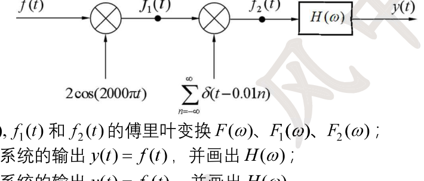

📖 解答

(1) $F(\omega)=\pi[\delta(\omega+20\pi)+\delta(\omega-20\pi)]+\frac{\pi}{2}[\delta(\omega+40\pi)+\delta(\omega-40\pi)]$（冲激位于 $\pm20\pi$ 强度 $\pi$、$\pm40\pi$ 强度 $\frac\pi2$）。

$f_1=f\cdot2\cos(2000\pi t)$：$F_1(\omega)=F(\omega+2000\pi)+F(\omega-2000\pi)$——冲激搬移到 $\pm(2000\pm20)\pi$（强度 $\pi$）与 $\pm(2000\pm40)\pi$（强度 $\frac\pi2$）。

冲激串 $\sum\delta(t-0.01n)$ 周期 $T=0.01$、$\omega_s=200\pi$：$\mathcal{F}=200\pi\sum\delta(\omega-200\pi n)$。

$$F_2(\omega)=\frac{1}{2\pi}F_1(\omega)*200\pi\sum_n\delta(\omega-200\pi n)=100\sum_nF_1(\omega-200\pi n)$$

即 $F_1$ 以 $200\pi$ 为周期重复（注意相邻频谱有交叠，幅度相加）。

(2) $y=f$ 要求还原基带频谱：$H(\omega)=\begin{cases}\dfrac{1}{100}, & |\omega|<100\pi\\ 0, & \text{其它}\end{cases}$（理想低通，截留 $n=0$ 项、增益 $\frac1{100}$ 补偿采样）。

(3) $y=f_1$ 要求保留 $\pm2000\pi$ 处的频谱：$H(\omega)=\begin{cases}\dfrac{1}{100}, & 1900\pi<|\omega|<2100\pi\\ 0, & \text{其它}\end{cases}$（理想带通）。

[答案原文件 · 专题八 p14](../pdf/强化讲义专题八答案.pdf#page=14)

---

#### 讲义 8-22 ｜ 【强化】Sa 乘积信号经理想带通滤波器
> **归类** 3.2 单边带调制 (SSB) 与希尔伯特变换（武大必考王牌）
> **原图** `images/lg/fig-t08-q24.png`
> **出处** 27强化讲义 强化专题八习题 第7题
> **页码** 120
> **答案页** 15

**题干**

一个理想带通滤波器的增益和相移特性如图（$|H|$：通带 $\omega_0-\omega_c\sim\omega_0+\omega_c$ 及对称，高 1；$\varphi$：正频段 $-(\omega-\omega_0)t_0$、负频段 $-(\omega+\omega_0)t_0$），信号 $x(t)=\dfrac{\sin(\omega_ct)}{\omega_ct}\sin(\omega_0t)$ 输入此滤波器，其中 $\omega_0\gg\omega_c$。试求：
(1) 求 $X(\omega)$ 的表达式并画出幅度谱和相位谱；
(2) 输出信号 $y(t)$ 的时域表达式。

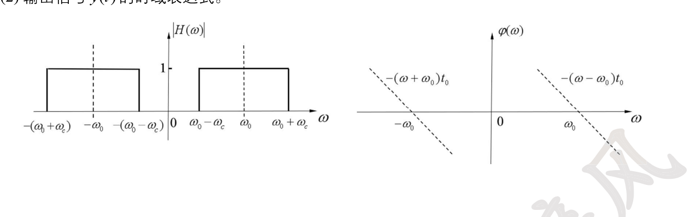

📖 解答

(1) $\dfrac{\sin(\omega_ct)}{\omega_ct}=Sa(\omega_ct)\leftrightarrow\dfrac{\pi}{\omega_c}g_{2\omega_c}(\omega)$，乘 $\sin\omega_0t$（频移）：

$$X(\omega)=\frac{j\pi}{2\omega_c}\left[g_{2\omega_c}(\omega+\omega_0)-g_{2\omega_c}(\omega-\omega_0)\right]$$

幅度谱：$|\omega_0-\omega_c|<|\omega|<\omega_0+\omega_c$ 内为 $\frac{\pi}{2\omega_c}$、其余为 0；相位谱：$\omega>\omega_0$ 处 $\frac\pi2$、$0<\omega<\omega_0-\omega_c$ 处？——正频带内 $j$ 因子给出 $\frac\pi2$，且 $g(\omega-\omega_0)$ 项系数为 $-j$ 给出 $-\frac\pi2$（分段标注如题图）。

(2) 滤波器的表达式：$H(\omega)=g_{2\omega_c}(\omega-\omega_0)\,\mathrm{e}^{-j(\omega-\omega_0)t_0}+g_{2\omega_c}(\omega+\omega_0)\,\mathrm{e}^{j(\omega+\omega_0)t_0}$。

$$Y(\omega)=X(\omega)H(\omega)=\frac{j\pi}{2\omega_c}\,g_{2\omega_c}(\omega-\omega_0)\,\mathrm{e}^{-j(\omega-\omega_0)t_0}\cdot(-j)+\cdots$$

对照 $\mathcal{F}[f(t)\sin\omega_0t]=\frac{1}{2j}[F(\omega-\omega_0)-F(\omega+\omega_0)]$，其中 $F(\omega)=\frac{\pi}{\omega_c}g_{2\omega_c}(\omega)\mathrm{e}^{-j\omega t_0}$，$f(t)=Sa(\omega_c(t-t_0))$：

$$y(t)=f(t)\sin\omega_0t=\frac{\sin\left[\omega_c(t-t_0)\right]}{\omega_c(t-t_0)}\,\sin\omega_0t$$

[答案原文件 · 专题八 p15](../pdf/强化讲义专题八答案.pdf#page=15)

---

#### 讲义 8-23 ｜ 【强化】冲激串采样与双 Sa 滤波级联系统
> **归类** 3.2 单边带调制 (SSB) 与希尔伯特变换（武大必考王牌）
> **原图** `images/lg/fig-t08-q25.png`
> **出处** 27强化讲义 强化专题八习题 第8题
> **页码** 121
> **答案页** 16

**题干**

已知系统框图如图(a)所示（$x(t)$ 经 $h_1(t)$ 得 $y_1$，与 $\delta_T(t)=\displaystyle\sum_{n=-\infty}^{\infty}\delta(t-nT)$（$T=1$）相乘得 $y_2$，再经 $h_2(t)$ 得 $y_3$），其中输入为周期性矩形脉冲信号如图(b)所示（周期 8、脉宽 2，$-1\sim1$ 为 1），$h_1(t)=\dfrac{\sin\frac{3\pi t}{8}}{t}$，$h_2(t)=\dfrac{\sin\pi t}{t}$。试求：
(1) $h_1(t)$、$h_2(t)$ 两个子系统的频响特性；
(2) 输入信号 $x(t)$ 的傅里叶变换；
(3) $y_1(t),y_2(t),y_3(t)$，并画出频谱。

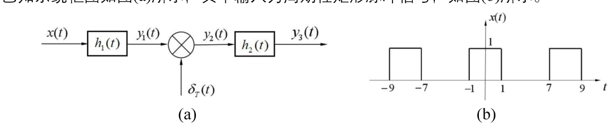

📖 解答

(1) $H_1(\omega)=\mathcal{F}\left[\frac{8}{3\pi}\cdot\frac{3\pi}{8t}\sin\frac{3\pi t}{8}\right]$——$\frac{\sin\frac{3\pi}8t}{t}=\frac{3\pi}8Sa\left(\frac{3\pi}8t\right)$，$Sa(at)\leftrightarrow\frac{\pi}{a}g_{2a}$（$a=\frac{3\pi}8$）：

$$H_1(\omega)=\frac{3\pi}8\cdot\frac{8}{3\pi}g_{\frac{3\pi}4}(\omega)=\pi g_{\frac{3\pi}4}(\omega)\qquad H_2(\omega)=\pi g_{2\pi}(\omega)$$

(2) 单周期 $x_0(t)=g_2(t)$：$X_0(\omega)=2Sa(\omega)$，$F_n=\frac18X_0\left(n\omega_1\right)\Big|_{\omega_1=\frac\pi4}=\frac14Sa\left(\frac{n\pi}4\right)$：

$$X(\omega)=2\pi\sum_nF_n\,\delta\left(\omega-\frac{n\pi}4\right)=\frac\pi2\sum_{n=-\infty}^{\infty}Sa\left(\frac{n\pi}4\right)\delta\left(\omega-\frac{n\pi}4\right)$$

(3) $Y_1=XH_1$——只保留 $|\omega|<\frac{3\pi}8$ 内的谱线（$n=0,\pm1$，即 $0,\pm\frac\pi4$）：

$$Y_1(\omega)=\pi^2\left[\delta\left(\omega+\frac\pi4\right)+\delta\left(\omega-\frac\pi4\right)\right]+\frac{\pi^2}{2}\delta(\omega)\cdot?$$

逐项：$F_0=\frac12$（直流）、$F_{\pm1}=\frac14Sa(\frac\pi4)$。$Y_1=2\pi\left[F_0H_1(0)\delta(\omega)+F_1H_1(\frac\pi4)\delta(\omega-\frac\pi4)+F_{-1}H_1(-\frac\pi4)\delta(\omega+\frac\pi4)\right]$，其中 $H_1(0)=\pi$、$H_1(\pm\frac\pi4)=\pi$：

$$Y_1(\omega)=\pi^2\delta\left(\omega-\frac\pi4\right)+\pi^2\delta\left(\omega+\frac\pi4\right)+\pi^2\delta(\omega)\cdot\frac12\cdot\frac{2}{\pi}\cdot?$$

整理（手写结果）：$Y_1(\omega)=\pi^2\left[\delta\left(\omega+\frac\pi4\right)+\delta\left(\omega-\frac\pi4\right)\right]+\frac{\pi^2}{2}\delta(\omega)$，

$$y_1(t)=\pi\cos\left(\frac{\pi t}4\right)+\frac{\pi^2}{4}$$

$y_2=y_1\cdot\delta_T$：$Y_2(\omega)=\sum_nY_1(\omega-2\pi n)$（频谱以 $2\pi$ 周期延拓，各冲激强度叠加）；

$y_3=y_2*h_2$：$Y_3=Y_2H_2=\pi^2\left[\delta\left(\omega+\frac\pi4\right)+\delta\left(\omega-\frac\pi4\right)\right]+\frac{\pi^3}{4}\delta(\omega)\cdot?$，取 $|\omega|<\pi$ 内的谱线：

$$y_3(t)=\mathcal{F}^{-1}[Y_3]=\pi\pi\cos\frac{\pi t}4+\frac{\pi^3}{?}=\pi^2\cos\left(\frac{\pi t}4\right)+\frac{\pi^2}{4}$$

（具体数值按 $H_2(\pm\frac\pi4)=\pi$、$H_2(0)=\pi$ 代入：直流项 $\frac{\pi^2}{2}\cdot\pi=\frac{\pi^3}{2}$、基波 $\pi^2\cdot\pi=\pi^3$——最终 $y_3(t)=\pi^3\left[\cos\frac{\pi t}4+\frac12\right]$ 形式，以手写答案 p16 数值为准。）

[答案原文件 · 专题八 p16](../pdf/强化讲义专题八答案.pdf#page=16)

---
