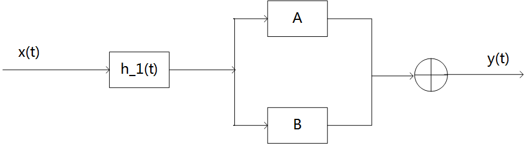
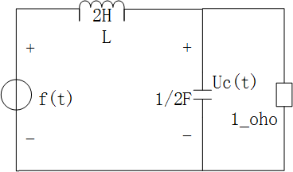
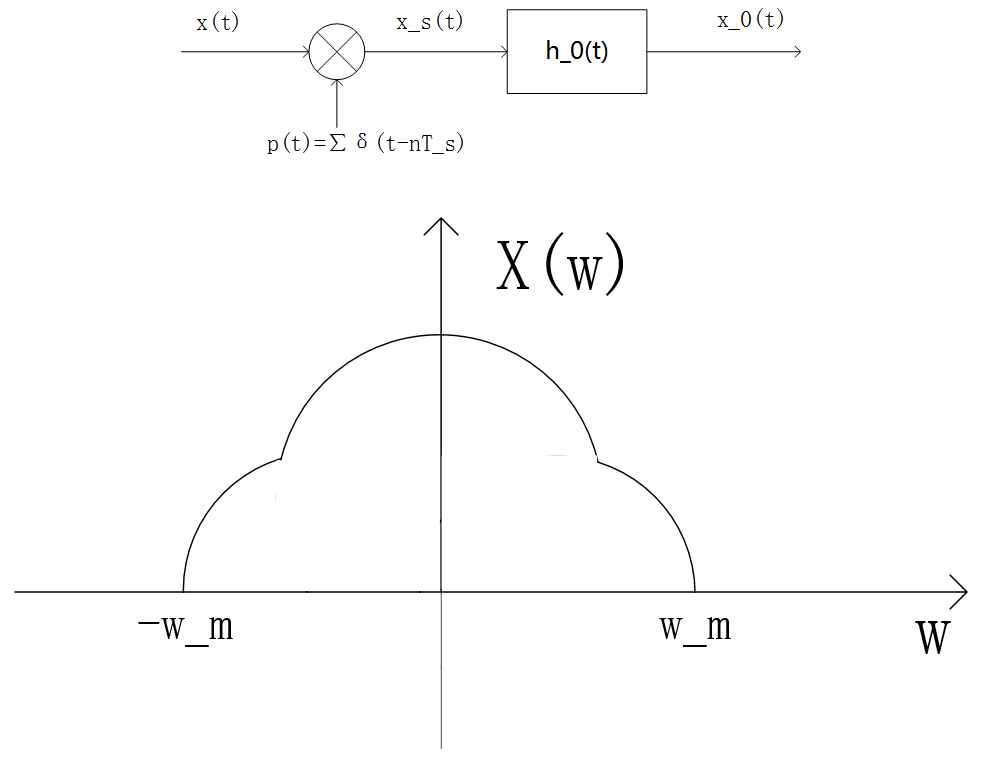
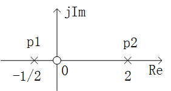
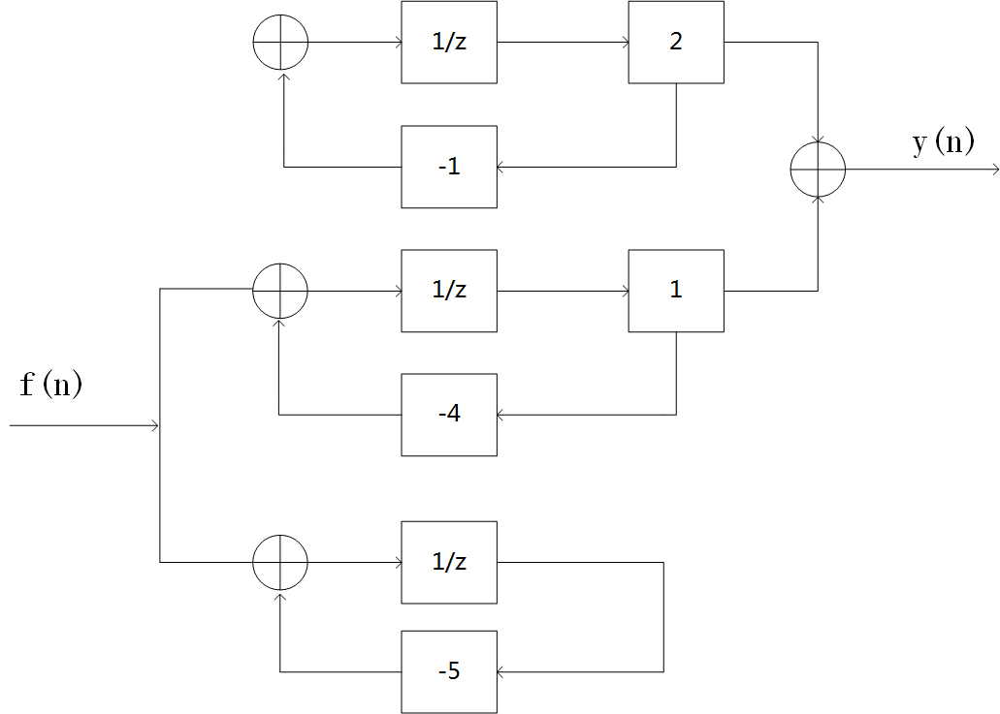

# 2018 年武汉大学 936 信号与系统全国硕士研究生入学考试真题及解析

> **试卷科目代码**：936 · 信号与系统  
> **PDF 来源**：[信号与系统题库（含部分答案）.pdf](https://drive.google.com/file/d/1XyTh-Uzk3k61MYIEKftnfNL6467Wa-4X/view)

---

### 第四题 · 复杂反馈系统冲激响应求解
* **分类**：`模块二 2.2.2 复合系统冲激响应`

### 第五题 · 电路系统函数及冲激响应、全响应
* **分类**：`模块四 4.1.2 节点/回路法求解全响应`

### 第八题 · 最高角频率连续信号频谱与无失真恢复滤波器设计
* **分类**：`模块三 3.3.3 抽样后滤波器恢复设计`

### 第十一题 · 零极点分布图讨论不同收敛域下的因果性与稳定性
* **分类**：`模块五 5.2.2 全极点收敛域划分与因果稳定性判定`

### 第十二题 · 离散系统流图状态方程、转移矩阵、可控性可观性
* **分类**：`模块六 6.2.2 可控性与可观性判据`

