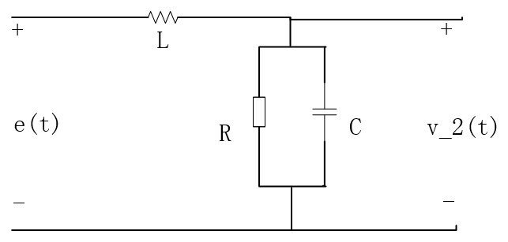
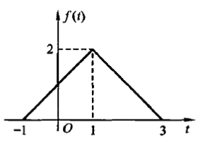
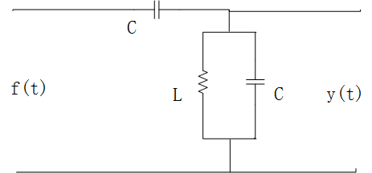
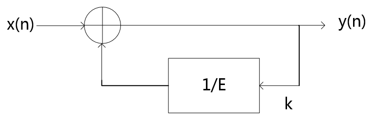
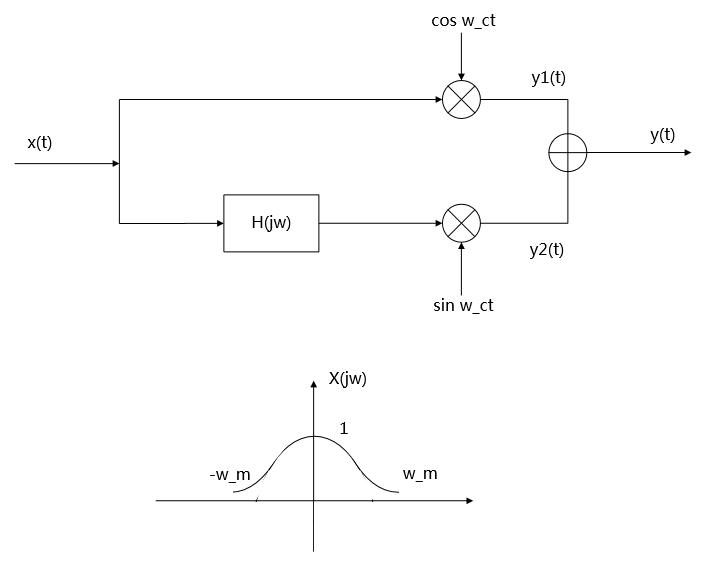

# 2020 年武汉大学 936 信号与系统全国硕士研究生入学考试真题及解析

> **试卷科目代码**：936 · 信号与系统  
> **PDF 来源**：[信号与系统题库（含部分答案）.pdf](https://drive.google.com/file/d/1XyTh-Uzk3k61MYIEKftnfNL6467Wa-4X/view)

---

## 核心真题题目精选

### 第五题 · 串并联理想低通/高通滤波器冲激响应
* **分类**：`模块二 2.2.2 复合系统冲激响应`

### 第六题 · RLC 电路冲激响应、阶跃响应与正弦稳态响应
* **分类**：`模块四 4.1.2 节点/回路法求解全响应`

### 第八题 · 对称三角波傅里叶变换性质速算
* **分类**：`模块三 3.1.1 对偶性与对称性反推时域波形`

### 第十题 · 动态电路微分方程与冲激响应
* **分类**：`模块四 4.1.2 节点/回路法求解全响应`

### 第十一题 · 因果差分方程、结构图与频率响应
* **分类**：`模块五 5.2.1 $z^{-1}$ 框图反推系统传递函数`

### 第十四题 · 离散系统状态方程与闭式解
* **分类**：`模块六 6.2.1 状态转移矩阵与传递函数矩阵求解`

### 第十五题 · 希尔伯特变换单边带 (SSB) 调制与恢复
* **分类**：`模块三 3.2.1 移相法 SSB 调制流图分析`

