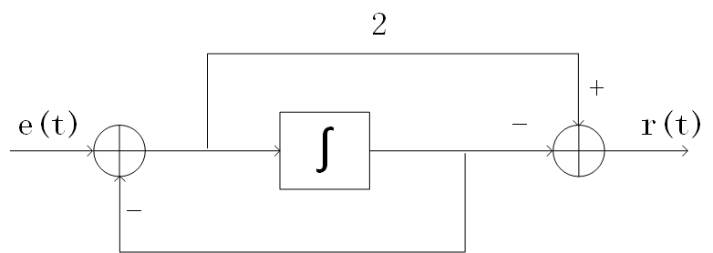
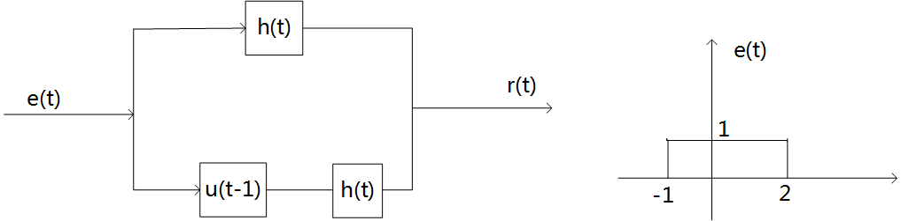
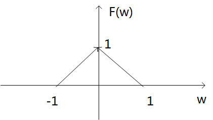
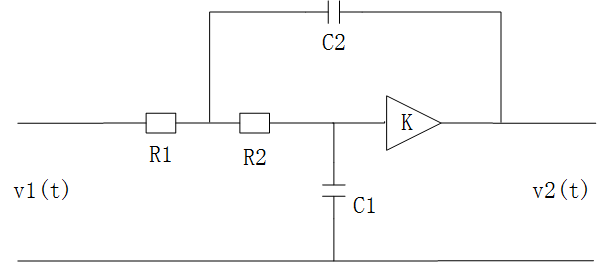
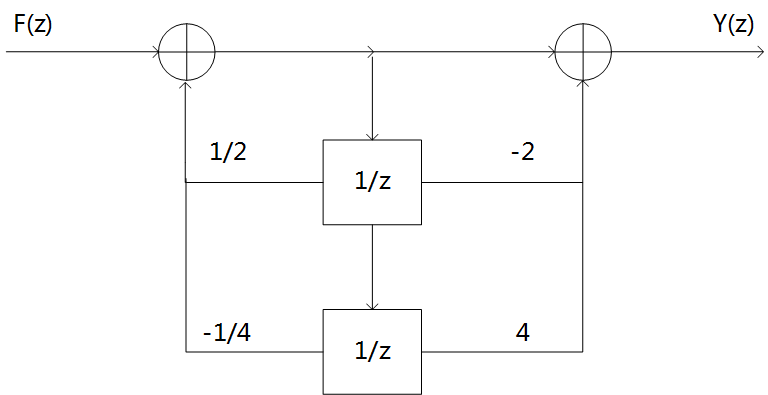
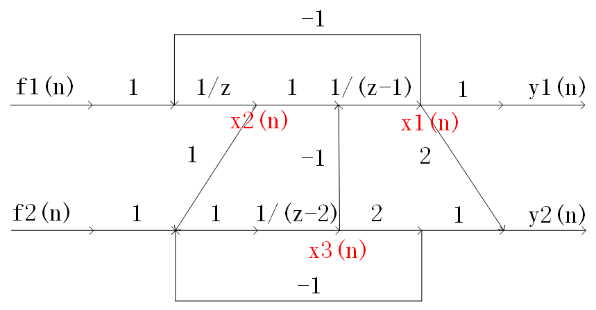

# 2021 年武汉大学 936 信号与系统全国硕士研究生入学考试真题及解析

> **试卷科目代码**：936 · 信号与系统  
> **PDF 来源**：[信号与系统题库（含部分答案）.pdf](https://drive.google.com/file/d/1XyTh-Uzk3k61MYIEKftnfNL6467Wa-4X/view)

---

## 第一题 · 基础小题（周期、奈奎斯特采样率、傅氏变换）
* **分类**：`模块一 时域运算` & `模块三 抽样定理`

## 第二题 · 波形分段表示与画图
* **分类**：`模块一 1.2.1 信号尺度与移位波形作图`
* **题干**：已知波形，分段表示下列信号并画出其波形图。

## 第三题 · 系统框图阶跃响应与零状态响应
* **分类**：`模块二 2.1.3 零状态响应分段波形叠加`

## 第四题 · 复杂串并联系统冲激响应
* **分类**：`模块二 2.2.2 多级级联系统逆推与复合系统响应`

## 第六题 · 周期信号与傅氏变换
* **分类**：`模块三 3.4.1 指数傅氏级数系数 Fn 求解`

## 第七题 · 运放电路系统函数、稳定范围与幅频特性
* **分类**：`模块四 4.2.1 虚短虚断列写节点方程求传递函数`
* **题干**：运放电路如图所示，求系统函数 $H(s)$，系统稳定时增益参数范围，临界稳定冲激响应及 3dB 带宽点。

## 第九题 · 离散系统信号流图零极点与幅频特性
* **分类**：`模块五 5.3.1 零极点几何矢量法粗略绘制幅频特性`

## 第十题 · 双输入双输出 (MIMO) 离散流图列写状态方程与特征根
* **分类**：`模块六 6.1.2 离散系统状态方程列写`

