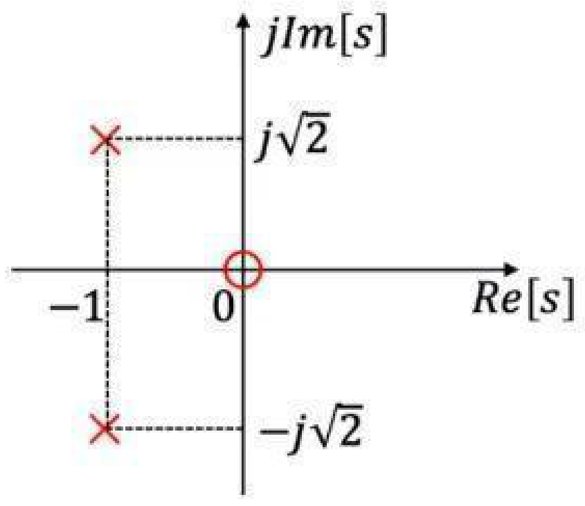
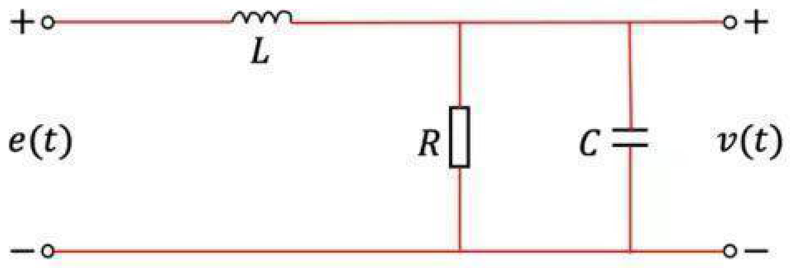
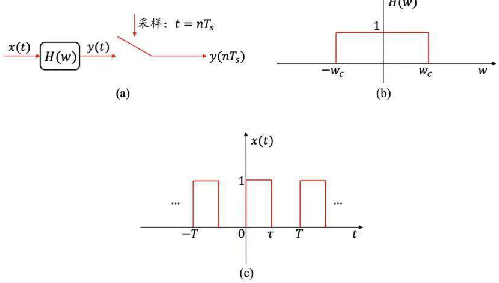
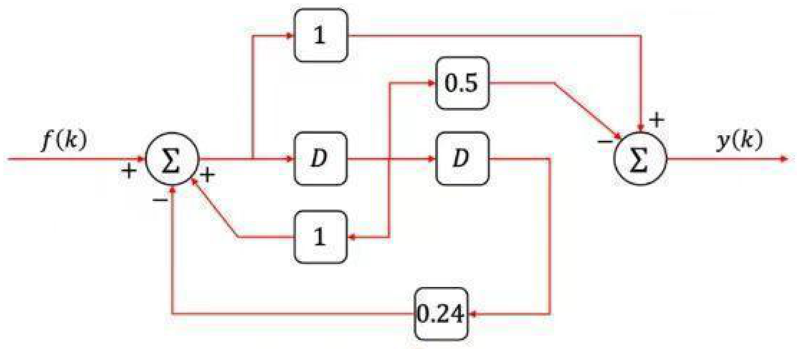

# 2022 年武汉大学 936 信号与系统全国硕士研究生入学考试初试试题及参考解析

> **试卷科目代码**：936 · 信号与系统  
> **满分**：150 分  
> **原卷 PDF 来源**：[2022年武汉大学936信号与系统真题.pdf](https://drive.google.com/file/d/13Ua6Ogtsw4Oqme-dlbvB_UUK1PEpSTTA/view)  
> **详解 PDF 来源**：[2022年武汉大学936信号与系统真题答案.pdf](https://drive.google.com/file/d/1ud0XcenyOpNF-MXEbXKkOgScM-ucTa7f/view)

---

## 第一题（12 分）· 系统性质判定
* **分类**：`模块一 时域运算与LTI性质` > `1.1.3 时变调制系数项型`
* **题干**：判断下列系统是否线性、时不变、因果和稳定的，并给出理由：
  (1) $r(t) = e(t)\cos(t)$；（6分）
  (2) $r[n] = e[n] - e[n-1]$。（6分）
* **解析**：
  (1) 满足叠加性为线性；$\cos(t)$ 随时间变化为时变；即时系统为因果；有界输入必有有界输出为 BIBO 稳定。结论：线性、时变、因果、稳定系统。
  (2) 满足可加性与齐次性为线性；时移满足时不变；当前只依赖 $n$ 与 $n-1$ 为因果；脉冲响应绝对可和为 BIBO 稳定。结论：线性、时不变、因果、稳定系统。

---

## 第二题（10 分）· 时域性质与门脉冲正弦波卷积积分
* **分类**：`模块二 连续与离散时域响应` > `2.1.1 脉冲图解“反褶-平移-相乘-积分”`
* **题干**：连续 LTI 系统对激励 $e(t) = u(t)-u(t-1)$ 的零状态响应为 $r_{zs}(t) = t[u(t)-u(t-2)] + 2[u(t-2)-u(t-3)] + (1-t)[u(t-1)-u(t-3)]$：
  (1) 求单位冲激响应 $h(t)$；
  (2) 求系统对激励 $e_2(t) = \sin(\pi t)[u(t)-u(t-2)]$ 的零状态响应。
* **解析**：
  (1) 零状态响应整理化为 $u(t)*u(t)$ 与冲激串的卷积，对比输入求得 $h(t) = u(t)-u(t-2)$。
  (2) 利用正弦门函数积分公式计算卷积，时移项分段叠加求出闭式解。

---

## 第三题（18 分）· 溶液稀释循环物理模型差分方程建模
* **分类**：`模块二 连续与离散时域响应` > `2.3.2 循环稀释与物理浓度混合模型`
* **题干**：容器内原有 800L 混合液，每次倒入 $x[n]$ 升 A 溶液和 $200-x[n]$ 升 B 溶液，搅拌均匀后倒出 200L。第 $n$ 次循环结束时 A 的百分比为 $y[n]$：
  (1) 列写差分方程；（6分）
  (2) 若 $x[n] = 100, y[0]=0$，求解 $y[n]$，并指出自由响应、强迫响应与终值 $y(\infty)$。（12分）
* **解析**：
  (1) A 的总质量守恒：$1000 y[n] = 800 y[n-1] + x[n] \implies y[n] - 0.8 y[n-1] = 0.001 x[n]$。
  (2) 齐次解通解为 $C(0.8)^n$，特解代入求得稳态常数 0.5。代入初值 $y[0]=0$ 解得 $C = -0.5$。
  $y[n] = [-0.5(0.8)^n + 0.5]u[n]$。自由分量为 $-0.5(0.8)^n$，强迫分量为 $0.5$，终值为 $0.5$（浓度平衡达到 50%）。

---

## 第四题（10 分）· S 域零极点分布图求冲激响应与滤波器类型
* **分类**：`模块四 拉氏变换与S域分析` > `4.3.1 零极点配置与系统函数`
* **题干**：因果系统零极点分布如图所示，零点在原点，极点位于 $-1 \pm j\sqrt{2}$，且 $h(0^+) = 3$：
  (1) 求冲激响应 $h(t)$；
  (2) 求幅频特性 $|H(j\omega)|$ 并判断是何种滤波器。

* **解析**：
  (1) $H(s) = rac{As}{(s+1)^2+2}$，由初值定理 $\lim sH(s) = A = 3$。配方展开反变换求得 $h(t) = 3e^{-t}\cos(\sqrt{2}t)u(t) - rac{3}{\sqrt{2}}e^{-t}\sin(\sqrt{2}t)u(t)$。
  (2) 代入 $s=j\omega$ 求模值，$\omega=0$ 时为 0，$\omega 	o \infty$ 时为 0，在中间频率存在峰值，判定为**带通滤波器**。

---

## 第五题（10 分）· RLC 交流并联电路系统函数与全响应
* **分类**：`模块四 拉氏变换与S域分析` > `4.1.2 节点/回路法求解全响应`
* **题干**：电路如图所示，参数 $R=5\,\Omega, C=0.1\,	ext{F}, L=2\,	ext{H}$：
  (1) 求 $H(s) = rac{V(s)}{E(s)}$；
  (2) 输入 $e(t) = e^{-4t}u(t)$ 时求响应 $v(t)$。

* **解析**：
  (1) 并联阻抗 $Z_{RC}(s) = rac{5}{0.5s+1}$，分压公式得 $H(s) = rac{5}{s^2+2s+5}$。
  (2) $V(s) = rac{5}{(s+4)(s^2+2s+5)}$，部分分式展开求逆变换。

---

## 第六题（15 分）· 周期信号低通滤波与奈奎斯特抽样
* **分类**：`模块三 傅里叶变换与抽样系统` > `3.3.1 冲激抽样定理与最大抽样间隔` & `3.4.1 傅里叶级数`
* **题干**：系统如图，输入周期矩形波通过截止频率为 $\omega_c = rac{\pi}{2} 	imes 10^6\,	ext{rad/s}$ 的低通滤波器：求傅氏变换、奈奎斯特采样率及输出序列。

---

## 第七题（15 分）· 连续正弦信号相乘与理想低通滤波
* **分类**：`模块三 傅里叶变换与抽样系统` > `3.2.1 移相法 SSB 调制流图分析`
* **题干**：$x(t) = \sin(200\pi t) + 2\sin(400\pi t), g(t) = x(t)\sin(400\pi t)$，若 $g(t)\sin(400\pi t)$ 通过截止频率为 $399\pi$、通带增益为 2 的理想低通滤波器，求输出信号 $y(t)$。
* **解析**：利用积化和差公式展开高频与低频拍频项，对照截止频率精确筛选滤除成分。

---

## 第八题（20 分）· 连续理想带通滤波器冲激响应
* **分类**：`模块三 傅里叶变换与抽样系统` > `3.1.1 对偶性与对称性反推时域波形`
* **题干**：理想带通滤波器频响频域函数为矩形频带，冲激响应为 $h(t)$，求函数 $g(t)$ 使得 $h(t) = rac{\sin(\omega_c t)}{\pi t} - g(t)$。

---

## 第九题（20 分）· 离散时间因果系统框图分析
* **分类**：`模块五 Z变换与离散系统` > `5.2.1 $z^{-1}$ 框图反推系统传递函数`
* **题干**：离散因果系统框图如图所示，求系统函数 $H(z)$、输入输出差分方程及零状态响应。

---

## 第十题（20 分）· 离散时间系统状态方程求解
* **分类**：`模块六 状态变量分析法` > `6.2.1 状态转移矩阵与传递函数矩阵求解`
* **题干**：已知离散 LTI 系统状态方程与输出方程，初始状态与阶跃输入，试用 Z 变换方法求解系统的零状态响应、零输入响应和完全响应。
