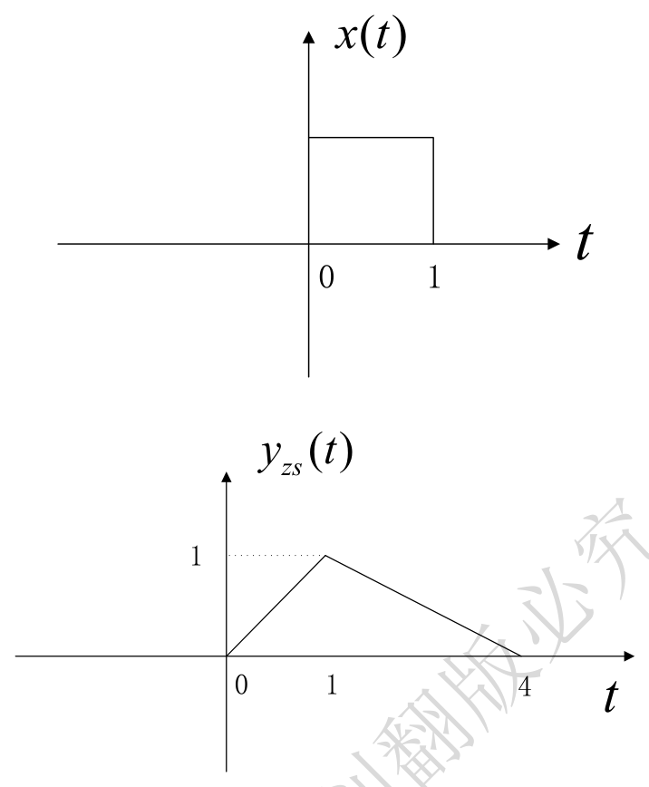
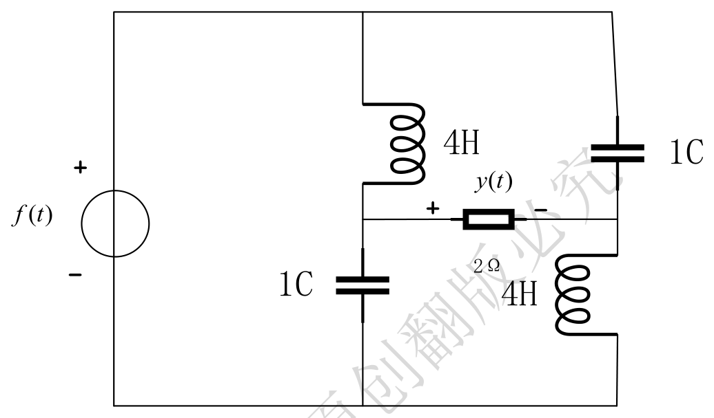
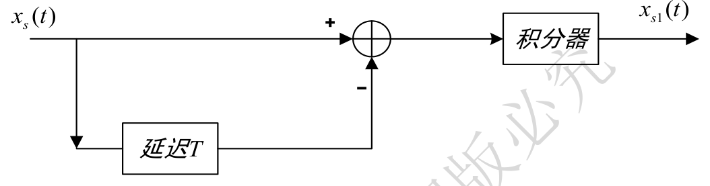
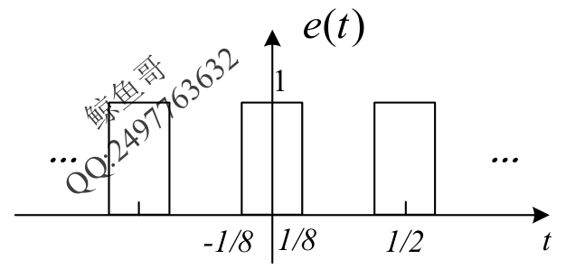
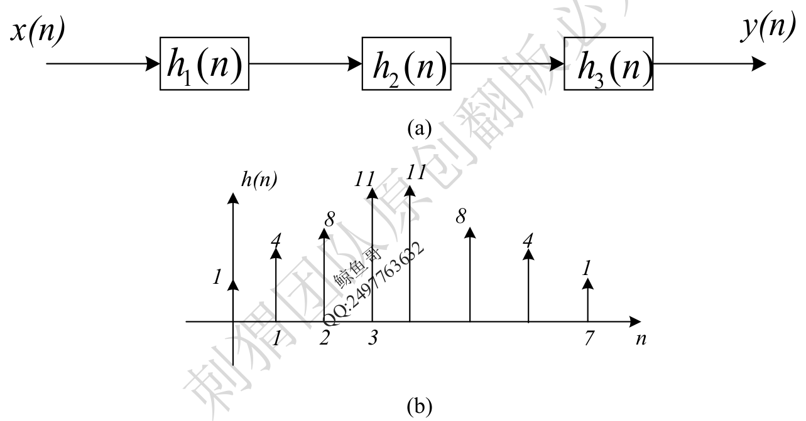
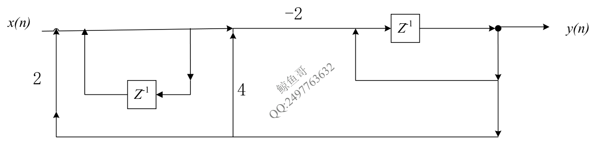

# 2023 年武汉大学 936 信号与系统全国硕士研究生入学考试自命题试题及解析

> **试卷科目代码**：936 · 信号与系统  
> **满分**：150 分  
> **原卷 PDF 来源**：[2023年武汉大学936信号与系统真题.pdf](https://drive.google.com/file/d/1TSdi3NXh4svK4x6RfJjLK4FLdseyzXkV/view)  
> **详解 PDF 来源**：[2023年武汉大学936信号与系统真题答案.pdf](https://drive.google.com/file/d/1Qgkjn714pZsezgMPPXX7erXRVFEhxrOG/view)

---

## 第一题 · 基础概念判断题（15 分）
* **分类**：`综合概念与系统性质`
1. 因果稳定信号的极点都在 s 域左半平面。（√）
2. 任何 $H(s)$ 只要将 $s=j\omega$ 代入就是频谱函数。（×，系统必须稳定，收敛域包含虚轴时才能直接代入）
3. 非周期抽样信号的傅里叶变换是离散周期的。（×，时域非周期离散抽样其频谱为连续周期函数）
4. 零状态响应就是输入为零的响应。（×，零状态响应是初始状态为零时的响应）
5. 自由响应就是零输入响应。（×，自由响应是自然模态，由齐次解构成，部分来源于零状态响应）

---

## 第二题 · 基础概念填空题（15 分）
* **分类**：`综合概念与频域特性`
1. 稳定系统的特性是由系统本身决定的，与**激励 / 输入**无关。
2. 全通系统的幅频响应是**常数**。
3. 功率谱密度函数是**自相关函数**的傅里叶变换。
4. 即时系统可以用代数方程表示，动态系统可以用**微分方程 / 差分方程**表示。
5. 周期为 $T$ 的信号 $f(t)$ 傅里叶级数系数为 $F_n$，则 $f'(t)$ 的傅里叶级数系数为 **$jn\Omega F_n$**。

---

## 第三题（12 分）· 连续 LTI 系统冲激响应图解与 S 域求解
* **分类**：`模块二 连续与离散时域响应` > `2.1.3 复合系统零状态响应分段波形叠加`
* **题干**：已知某 LTI 系统，输入为 $x(t)$ 时零状态输出为 $y_{zs}(t)$，波形如图所示，求系统的冲激响应 $h(t)$ 并画出其图像。

* **解析**：
  法一（S 域法）：$X(s) = rac{1 - e^{-s}}{s}$。求导 $y'_{zs}(t) = u(t) - rac{4}{3}u(t-1) + rac{1}{3}u(t-4)$，做拉普拉斯变换除以 $X(s)$ 反变换得：
  $$h(t) = u(t) - rac{1}{3}u(t-1) - rac{1}{3}u(t-2) - rac{1}{3}u(t-3)$$
  法二（卷积图解法）：$y_{zs}(t)$ 在各区间的斜率变化直接对应 $h(t)$ 的阶梯分段常数值。

---

## 第四题（12 分）· 零极点配置初值定理与正弦稳态响应
* **分类**：`模块四 拉氏变换与S域分析` > `4.3.1 零极点镜像对称判定全通网络`
* **题干**：LTI 系统函数 $H(s)$ 只有唯一零点 1，有 $n$ 阶 $-1$ 极点，同时 $h(0^+) = 4$：
  (1) 求 $n$ 以及 $H(s)$ 表达式；
  (2) 求系统幅频特性 $|H(j\omega)|$ 与相频特性 $arphi(\omega)$；
  (3) 若激励 $f(t) = 2\sin(\sqrt{3}t)u(t)$，求系统的稳态响应 $y_{ss}(t)$。
* **解析**：
  由初值定理 $\lim_{s	o\infty} sH(s) = 4$，当 $n=2$ 时分母阶数比分子高 1，系数 $K=4$。
  $H(s) = rac{4(s-1)}{(s+1)^2}$。代入 $s = j\sqrt{3}$ 计算复数模值与相角，相乘即得正弦稳态响应。

---

## 第五题（12 分）· 交流电桥网络戴维南等效与全通系统
* **分类**：`模块四 拉氏变换与S域分析` > `4.3.1 零极点镜像对称判定全通网络`
* **题干**：电路如图所示，求系统函数 $H(s) = rac{Y(s)}{F(s)}$，判断是否为全通系统，并求指数输入响应。

* **解析**：
  利用戴维南等效定理以负载电阻为端口开路，等效阻抗与开路电压化简得：
  $$H(s) = rac{s - 0.5}{s + 0.5}$$
  零点在 $0.5$，极点在 $-0.5$，零极点关于虚轴互为镜像对称，故为**全通系统**，幅频特性恒为 1。输入 $e^{0.5t}u(t)$ 时极点零点对消，快速求出响应。

---

## 第六题（12 分）· 傅里叶变换性质综合运算
* **分类**：`模块三 傅里叶变换与抽样系统` > `3.1.1 对偶性与对称性反推时域波形`
* **题干**：已知 $x(t) \leftrightarrow X(j\omega)$，利用性质求下列信号的傅里叶变换：
  (1) $x_1(t) = x(3-t) + x(-2-t)$；
  (2) $x_2(t) = x(2t-7)$；
  (3) $x_3(t) = rac{\mathrm{d}^2}{\mathrm{d}t^2} x(2t-3)$。
* **解析**：
  (1) 时移与反折性质：$X_1(j\omega) = X(-j\omega)(e^{-j3\omega} + e^{j2\omega})$；
  (2) 尺度与时移：$X_2(j\omega) = rac{1}{2} X\left(rac{j\omega}{2}
ight) e^{-jrac{7}{2}\omega}$；
  (3) 结合频域二次微分因子 $(j\omega)^2$ 与尺度变换展开。

---

## 第七题（12 分）· 冲激抽样定理与时域恢复系统
* **分类**：`模块三 傅里叶变换与抽样系统` > `3.3.1 冲激抽样定理与最大抽样间隔`
* **题干**：输入信号带限于 $\pm f_m$，以冲激序列抽样得到 $x_s(t)$，通过延迟器与积分器系统，求时域表达式、傅氏变换及恢复滤波系统传输函数。

---

## 第八题（12 分）· 微分滤波器与周期脉冲稳态响应
* **分类**：`模块三 傅里叶变换与抽样系统` > `3.4.2 周期激励通过线性系统稳态响应`
* **题干**：滤波器频响 $H(j\omega) = jrac{\omega}{2\pi}, -6\pi \le \omega \le 6\pi$。求输入 $\cos(4\pi t+	heta)$、$\cos(8\pi t+	heta)$ 及周期脉冲波 $e(t)$ 时的输出。

* **解析**：
  $\omega = 4\pi$ 在通带内，微分相移并放大；$\omega = 8\pi$ 超出截止带宽 $6\pi$，输出为 0。周期脉冲波展开为傅氏级数后逐次谐波滤波。

---

## 第九题（12 分）· 离散三级级联系统逆推与卷积和
* **分类**：`模块二 连续与离散时域响应` > `2.2.2 多级级联系统逆推与复合系统响应`
* **题干**：三个子系统级联，已知 $h_1[n] = u[n]-u[n-3], h_3[n] = u[n]-u[n-4]$，总系统冲激响应为 $h[n]$（如图），求 $h_2[n]$ 及输入为脉冲时的零状态响应。

* **解析**：
  $H(z) = H_1(z) H_2(z) H_3(z)$，先求出 $h_1 * h_3$ 的卷积序列，采用多项式长除法（反卷积）逆推求出未知序列 $h_2[n]$。

---

## 第十题（12 分）· 二阶离散全通系统零极点与幅频特性
* **分类**：`模块五 Z变换与离散系统` > `5.3.1 零极点几何矢量法粗略绘制幅频特性`
* **题干**：差分方程 $y[n] + rac{1}{2}y[n-1] + rac{1}{4}y[n-2] = 2x[n] + 4x[n-1] + 8x[n-2]$：画零极点图，求幅频相频，并求抽样正弦稳态响应。

---

## 第十一题（12 分）· 离散系统函数因果稳定条件
* **分类**：`模块五 Z变换与离散系统` > `5.2.2 全极点收敛域划分与因果稳定性判定`
* **题干**：$H(z) = rac{z^2+z+3}{z^2+13z+k}$，讨论参数 $k$ 使得系统因果稳定的充要条件。
* **解析**：由朱利准则 (Jury Test) 或特征根模长小于 1 确定极点在单位圆内的约束条件。

---

## 第十二题（12 分）· 离散系统框图状态变量分析
* **分类**：`模块六 状态变量分析法` > `6.1.2 离散系统状态方程列写`
* **题干**：离散系统框图如下，求状态方程、输出方程与系统函数 $H(z)$。

