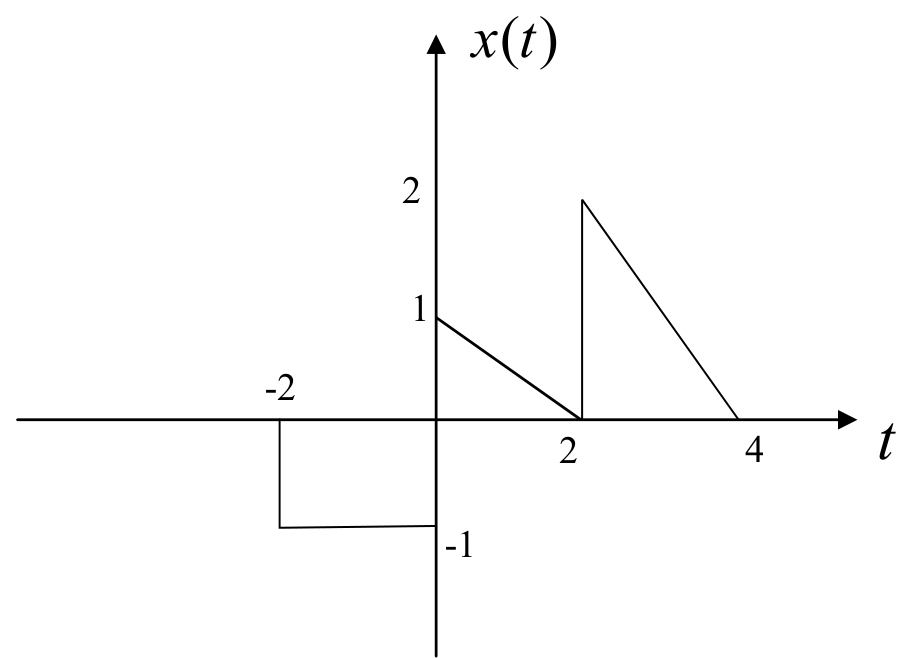
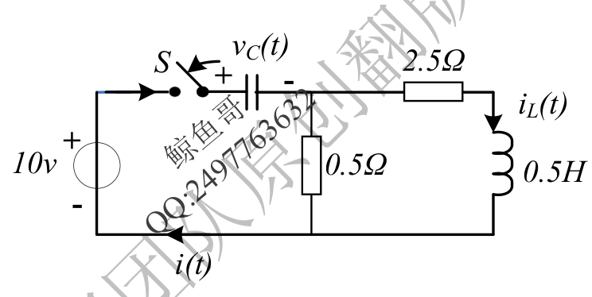
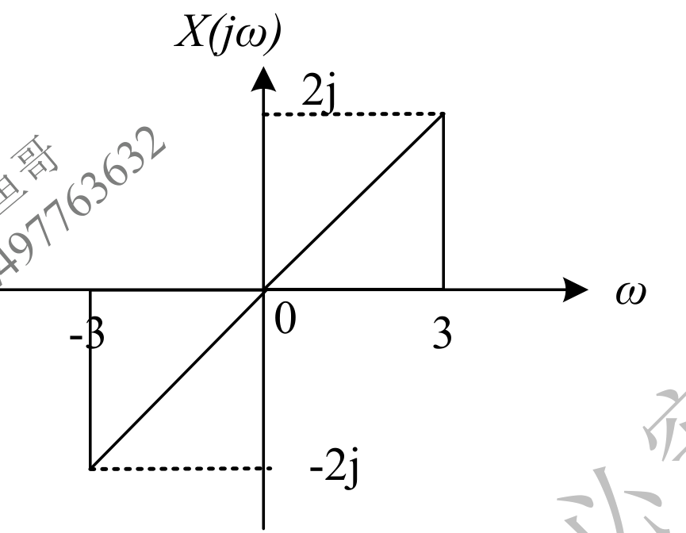
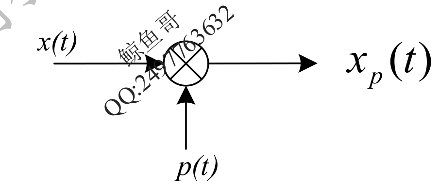
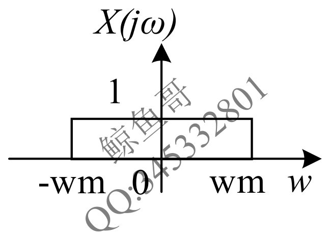
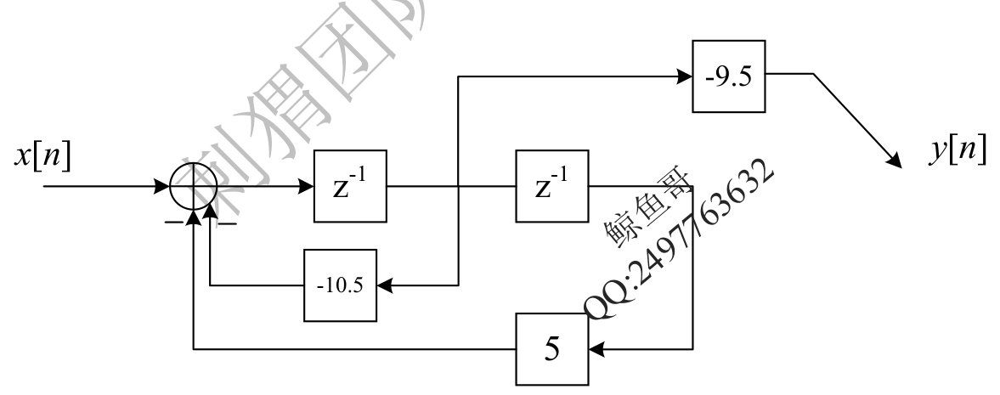
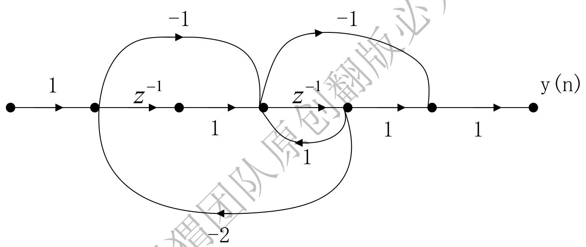

# 2024 年武汉大学 936 信号与系统全国硕士研究生入学考试自命题试题及解析

> **试卷科目代码**：936 · 信号与系统  
> **满分**：150 分  
> **原卷 PDF 来源**：[2024年武汉大学936信号与系统真题.pdf](https://drive.google.com/file/d/1ZyIueuDStq-Aq4DGihMFjBaaV7NhImuS/view)  
> **详解 PDF 来源**：[2024年武汉大学936信号与系统答案.pdf](https://drive.google.com/file/d/1sp7hxdAwXZBly-JnLy3BthvZzvxNygZG/view)

---

## 第一题（12 分）· 实际工程问题差分方程建模
* **分类**：`模块二 连续与离散时域响应` > `2.3.1 生物生长/繁衍离散递推模型`
* **题干**：假定每对兔子每月可以生育 4 对小兔叽，新生的小兔子要隔一个月才有生育能力。若第一个月只有一对新生小兔子，求第 $n$ 个月兔子对的数目是多少？
* **解析**：
  设第 $n$ 个月兔子总对数为 $y[n]$。第 $n$ 个月兔子总数等于上月已有兔子 $y[n-1]$ 加上由成熟兔子（即两月前就存在的兔子 $y[n-2]$）生育的新生兔子 $4y[n-2]$。
  差分方程为：
  $$y[n] - y[n-1] - 4y[n-2] = 0$$
  结合初始条件 $y[0]=0, y[1]=1$，递推可得各月兔子数量。

---

## 第二题（12 分）· 连续系统线性、时不变性判定与波形作图
* **分类**：`模块一 时域运算与LTI性质` > `1.1.1 复合尺度与抽取反折型` & `1.2.1 信号尺度与移位波形作图`
* **题干**：$f(t) = x(t) - x(t-2)$：
  (1) $f(t)$ 是否为线性的？
  (2) $f(t)$ 是否为时不变的？
  (3) $x(t)$ 如图所示，作出 $f(t)$ 的图像。

* **解析**：
  (1) 满足齐次性与可加性，为**线性系统**。
  (2) 对延迟输入 $x(t-t_0)$，输出为 $x(t-t_0)-x(t-t_0-2) = f(t-t_0)$，为**时不变系统**。
  (3) 波形为原波形与右移 2 个单位取反后的折线叠加。

---

## 第三题（12 分）· 全响应线性分解与零输入/零状态响应
* **分类**：`模块二 连续与离散时域响应` > `2.1.3 复合系统零状态响应分段波形叠加`
* **题干**：某 LTI 系统，输入 $u(t)$ 时输出为 $(4e^{-t}-3e^{-2t})u(t)$；输入为 $3u(t)$ 时输出为 $(6e^{-t}-5e^{-2t})u(t)$。求冲激响应 $h(t)$、阶跃响应 $g(t)$ 及零输入响应 $y_{zi}(t)$。
* **解析**：
  零状态响应满足齐次性，$y_{zs,2}(t) = 3y_{zs,1}(t) = 3g(t)$，而零输入响应不随输入激励改变。
  两方程相减得阶跃响应 $g(t) = (e^{-t}-e^{-2t})u(t)$；
  求导得冲激响应 $h(t) = (-e^{-t}+2e^{-2t})u(t)$；
  代回得零输入响应 $y_{zi}(t) = (3e^{-t}-2e^{-2t})u(t)$。

---

## 第四题（12 分）· 含初值动态电路 S 域模型与全响应
* **分类**：`模块四 拉氏变换与S域分析` > `4.1.1 动态元件附加初值源等效模型` & `4.1.2 节点/回路法求解全响应`
* **题干**：电路如图所示，其中 $u_C(0^-)=8\,	ext{V}, i_L(0^-)=4\,	ext{A}$，$t=0$ 时开关 S 闭合。求 S 域电路模型及 $t \ge 0$ 时的全响应 $i(t)$。

* **解析**：
  电容附加初值源 $rac{8}{s}$，电感附加初值源 $Li_L(0^-)=2$。
  回路阻抗 $Z(s) = 3 + 0.5s + rac{2}{s}$，电源代数和 $E(s) = rac{18-2s}{s}$。
  解得 $I(s) = rac{36-4s}{s^2+6s+4}$，反变换得时域全响应 $i(t)$。

---

## 第五题（12 分）· 余弦信号傅里叶变换与频带特性
* **分类**：`模块一 时域运算与LTI性质` > `1.3.1 周期性判据与基波周期计算` & `模块三 3.4.1`
* **题干**：已知 $x(t) = \cos(4\pi t)$，求周期、傅里叶变换，并判断频带是否有限。
* **解析**：
  周期 $T = rac{2\pi}{4\pi} = 0.5\,	ext{s}$；
  傅里叶变换为一对冲激 $X(j\omega) = \pi[\delta(\omega-4\pi) + \delta(\omega+4\pi)]$；
  最高频率为 $\omega_m = 4\pi$，频谱在有限区间外为 0，频带是严格有限的。

---

## 第六题（15 分）· 傅里叶变换性质综合运用
* **分类**：`模块三 傅里叶变换与抽样系统` > `3.1.2 频域微分与时域积分性质速算`
* **题干**：利用性质求解：
  (1) $f(t) = t e^{-3|t-1|}$；
  (2) $f(t) = \int_{-\infty}^t rac{\sin(2\pi	au)}{\pi	au}\mathrm{d}	au$；
  (3) 已知频谱 $X(j\omega)$ 如图，求 $x(t)$。

* **解析**：
  (1) $e^{-3|t|} \leftrightarrow rac{6}{9+\omega^2}$，先时移后乘 $t$（对应频域微分乘 $j$）；
  (2) 利用时域积分性质：$rac{X_1(j\omega)}{j\omega} + \pi X_1(0)\delta(\omega)$；
  (3) 频域折线求导化为两段矩形门函数，对偶求解时域反变换。

---

## 第七题（15 分）· 脉冲抽样系统流图与最大采样间隔
* **分类**：`模块三 傅里叶变换与抽样系统` > `3.3.2 脉冲抽样（非理想抽样）与孔径效应`
* **题干**：脉冲序列抽样系统流图如下，输入为带限信号 $X(j\omega)$：
  (1) 写出 $p(t)$ 时域表达式；
  (2) 求 $P(j\omega)$；
  (3) 求不发生频谱混叠的最大采样周期 $T_{\max}$。

* **解析**：
  (1) $p(t) = \sum_{n=-\infty}^{+\infty} [u(t-nT)-u(t-nT-	au)]$；
  (2) 展开为傅里叶级数后做傅氏变换：$P(j\omega) = 2\pi\sum F_n\delta(\omega-n\omega_s)$；
  (3) 频谱无混叠要求 $\omega_s \ge 2\omega_m \implies T_{\max} = rac{\pi}{\omega_m}$。

---

## 第八题（12 分）· 离散 LTI 系统指数响应
* **分类**：`模块五 Z变换与离散系统` > `5.1.1 单边 Z 变换解差分方程`
* **题干**：$H(z) = rac{z}{z-5}$，输入 $x[n] = (0.2)^n u[n]$，求零状态响应 $y_{zs}[n]$。
* **解析**：
  $Y_{zs}(z) = rac{z^2}{(z-5)(z-0.2)}$，部分分式展开：
  $$rac{Y_{zs}(z)}{z} = rac{25/24}{z-5} - rac{1/24}{z-0.2} \implies y_{zs}[n] = \left[rac{25}{24}(5)^n - rac{1}{24}(0.2)^n
ight]u[n]$$

---

## 第九题（15 分）· 离散系统框图系统函数与收敛域因果稳定性讨论
* **分类**：`模块五 Z变换与离散系统` > `5.2.1 $z^{-1}$ 框图反推系统传递函数` & `5.2.2 全极点收敛域划分与因果稳定性判定`
* **题干**：离散系统框图如图所示：
  (1) 求系统函数 $H(z)$；
  (2) 讨论不同收敛域情况下系统的稳定性和因果性。

* **解析**：
  (1) 梅森公式或节点法：$H(z) = rac{-9.5z}{z^2-10.5z+5} = rac{-9.5z}{(z-10)(z-0.5)}$。
  (2) 极点在 $0.5$ 与 $10$：
  - $|z|>10$：外圆，因果，不稳定（不包含单位圆）；
  - $0.5<|z|<10$：环状，非因果，稳定（包含单位圆）；
  - $|z|<0.5$：内圆，反因果，不稳定。

---

## 第十题（15 分）· 二阶离散全通系统零极点分布与几何矢量幅频特性
* **分类**：`模块五 Z变换与离散系统` > `5.3.1 零极点几何矢量法粗略绘制幅频特性`
* **题干**：差分方程 $y[n] - rac{1}{5}y[n-1] + rac{1}{25}y[n-2] = x[n] - 5x[n-1] + 25x[n-2]$：
  (1) 画出零极点分布图；
  (2) 粗略画出幅频响应曲线图 $|H(e^{j\Omega})|$。
* **解析**：
  零点为 $5e^{\pm j\pi/3}$，极点为 $0.2e^{\pm j\pi/3}$。零极点关于单位圆互为倒数共轭，属于典型离散全通系统，单位圆上任意频率矢量模长比恒定，幅频特性恒为常数 25。

---

## 第十一题（15 分）· 离散系统信号流图列写状态方程与输出方程
* **分类**：`模块六 状态变量分析法` > `6.1.2 离散系统状态方程列写`
* **题干**：选取延时器输出为状态变量，写出系统的矩阵形式状态方程与输出方程。

* **解析**：
  设延时器输出为 $x_1[n], x_2[n]$：
  $$egin{bmatrix} x_1[n+1] \ x_2[n+1] \end{bmatrix} = egin{bmatrix} 3 & 1 \ -2 & 0 \end{bmatrix}egin{bmatrix} x_1[n] \ x_2[n] \end{bmatrix} + egin{bmatrix} -1 \ 1 \end{bmatrix}x[n]$$
  $$y[n] = egin{bmatrix} 1 & 1 \end{bmatrix}egin{bmatrix} x_1[n] \ x_2[n] \end{bmatrix} + [0]x[n]$$
