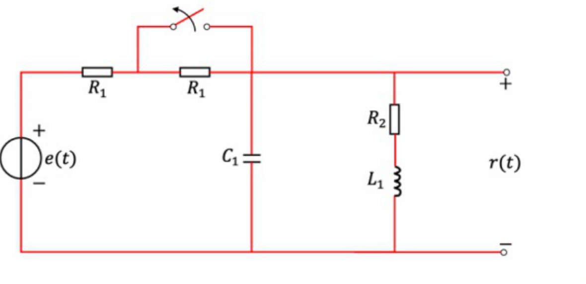
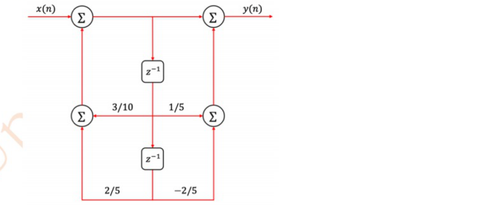
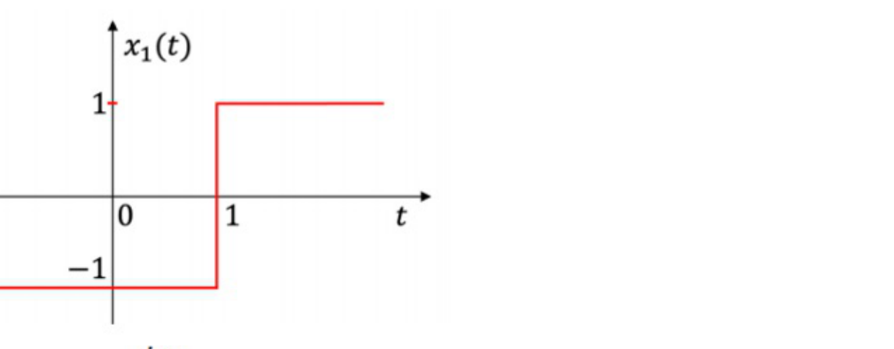
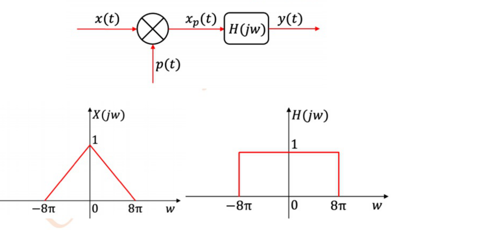
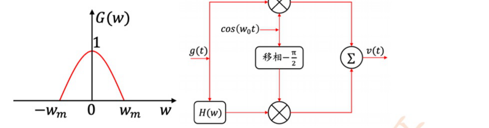
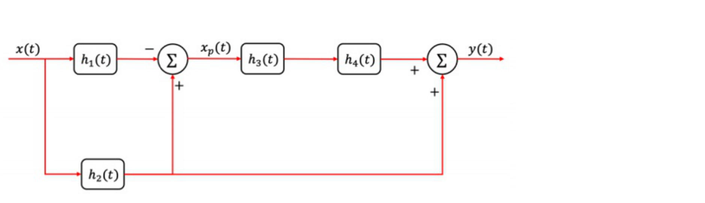

# 2025 年武汉大学 936 信号与系统全国硕士研究生入学考试初试试题及参考解析

> **试卷科目代码**：936 · 信号与系统  
> **满分**：150 分  
> **适用专业**：信息与通信工程、电子信息等  
> **原卷 PDF 来源**：[2025真题和答案.pdf](https://drive.google.com/file/d/1e-4CJ0g4kAiEILXFGLesua_CRgM2SL7A/view)

---

## 第一题（12 分）· 系统性质判别
* **题型分类**：`模块一 时域运算与LTI性质` > `1.1.2 绝对值与非线性乘积型` & `1.1.3 时变调制系数项型`
* **考查内容**：离散系统的线性、时变性、因果性严格代数判别。

### 【题目内容】
某系统输入信号为 $x[n]$，输出信号为 $y[n]$，起始状态为零，判断系统的线性、时变性、因果性，并写出判断过程：
1. $y[n] = 2|x[n]| + x(2n)$；（6分）
2. $y[n] = 5\sin(n)x[n]$。（6分）

### 【参考答案与核心考点】
#### (1) 系统 $y[n] = 2|x[n]| + x(2n)$
* **线性判定**：
  若输入 $x_1[n] 	o y_1[n] = 2|x_1[n]| + x_1(2n)$。
  当常数 $a = -1$ 时，$T\{a x_1[n]\} = 2|-x_1[n]| - x_1(2n) = 2|x_1[n]| - x_1(2n) 
e a y_1[n]$。不满足齐次性，故系统为**非线性系统**。
* **时变性判定**：
  延迟输入 $x_d[n] = x[n-n_0]$，其输出为 $y_d[n] = 2|x[n-n_0]| + x(2n-n_0)$。
  而原始输出延迟为 $y[n-n_0] = 2|x[n-n_0]| + x(2(n-n_0)) = 2|x[n-n_0]| + x(2n-2n_0)$。
  由于 $y_d[n] 
e y[n-n_0]$，故系统为**时变系统**。
* **因果性判定**：
  取 $n = 1$ 时，$y[1] = 2|x[1]| + x[2]$，当前输出取决于未来的输入 $x[2]$，输出超前于输入，故系统为**非因果系统**。

#### (2) 系统 $y[n] = 5\sin(n)x[n]$
* **线性判定**：
  $T\{a x_1[n] + b x_2[n]\} = 5\sin(n)[a x_1[n] + b x_2[n]] = a y_1[n] + b y_2[n]$，满足叠加原理，为**线性系统**。
* **时变性判定**：
  延迟输入对应输出 $y_d[n] = 5\sin(n)x[n-n_0]$；
  原始输出延迟 $y[n-n_0] = 5\sin(n-n_0)x[n-n_0]$。两者不相等，故为**时变系统**。
* **因果性判定**：
  任意时刻 $n$ 的输出仅与当前时刻输入 $x[n]$ 相关，为即时系统，故为**因果系统**。

---

## 第二题（12 分）· 信号基本运算
* **题型分类**：`模块一 时域运算与LTI性质` > `1.2.2 信号导数/差分与跳变波形作图` & `1.3.2 能量信号与功率信号判定及能量积分`
* **考查内容**：对称三角波波形图、能量积分定义、一阶求导跳变波形及复合变换 $x(2t-1)$。

### 【题目内容】
某系统函数为 $x(t) = (1 - 0.5|t|)[u(t+2) - u(t-2)]$：
1. 画出 $x(t)$ 的波形图。（3分）
2. 判断 $x(t)$ 是否为能量信号，如果是请计算出该能量值，如果不是请给出证明。（3分）
3. 画出 $rac{\mathrm{d}x(t)}{\mathrm{d}t}$ 的波形图。（3分）
4. 画出 $x(2t-1)$ 的波形图。（3分）

### 【参考答案与核心考点】
1. **$x(t)$ 波形**：以 $t=0$ 偶对称的等腰三角形脉冲，顶点位于 $(0, 1)$，两底角在 $t = -2$ 和 $t = 2$ 处交于 0。
2. **能量计算**：
   $$E = \int_{-\infty}^{+\infty} |x(t)|^2 \mathrm{d}t = 2 \int_{0}^{2} (1 - 0.5t)^2 \mathrm{d}t = 2 \left[ -rac{2}{3}(1 - 0.5t)^3 
ight]_0^2 = rac{4}{3}$$
   因为 $0 < E < \infty$，所以 $x(t)$ 为**有限能量信号**。
3. **导数波形**：在 $(-2, 0)$ 区间斜率为 $+0.5$；在 $(0, 2)$ 区间斜率为 $-0.5$；区间外为 0，波形为双极性方波门脉冲。
4. **复合变换 $x(2t-1)$ 波形**：先右移 1 个单位得 $x(t-1)$（中心移至 $t=1$，底宽 $[-1, 3]$），再展缩压缩 2 倍，中心移至 $t = 0.5$，底宽变为 $[-0.5, 1.5]$。

---

## 第三题（12 分）· 卷积积分
* **题型分类**：`模块二 连续与离散时域响应` > `2.1.1 脉冲图解“反褶-平移-相乘-积分”`
* **考查内容**：门函数阶跃展开法快速求解连续时域零状态卷积响应。

### 【题目内容】
某线性时不变系统冲激响应为 $h(t) = u(t-1) - u(t-4)$，求该系统对输入信号 $x(t) = u(t) + u(t-1) - 2u(t-2)$ 的零状态响应 $y(t)$。

### 【参考答案与核心考点】
利用标准阶跃卷积公式：$u(t-t_1) * u(t-t_2) = (t - t_1 - t_2)u(t - t_1 - t_2)$。
逐项卷积展开：
$$y(t) = (t-1)u(t-1) + (t-2)u(t-2) - 2(t-3)u(t-3) - (t-4)u(t-4) - (t-5)u(t-5) + 2(t-6)u(t-6)$$
按区间分段整理：
$$y(t) = egin{cases} t-1, & 1 < t < 2 \ 2t-3, & 2 < t < 3 \ 3, & 3 < t < 4 \ 7-t, & 4 < t < 5 \ 12-2t, & 5 < t < 6 \ 0, & 	ext{其他} \end{cases}$$

---

## 第四题（12 分）· 电路分析
* **题型分类**：`模块四 拉氏变换与S域分析` > `4.1.2 节点/回路法求解全响应`
* **考查内容**：换路初值分析、S 域等效模型、节点电压法与系统传递函数 $H(s)$。

### 【题目内容】
如图所示，电路系统参数如下：$R_1 = 1\,\Omega, R_2 = 1\,\Omega, L = 1\,	ext{H}, C = 1\,	ext{F}$，激励信号为 $e(t) = 2\,	ext{V}$。设 $t = 0$ 前开关 K 闭合，$t = 0$ 时开关断开，断开前电路已处于稳定状态，系统响应为电压 $r(t)$：
1. 求开关断开后，系统全响应 $r(t)$、零输入响应 $r_{zi}(t)$ 与零状态响应 $r_{zs}(t)$。（6分）
2. 求系统函数 $H(s)$ 与系统单位冲激响应 $h(t)$。（6分）

### 【参考答案与核心考点】
1. **初值分析**：$t < 0$ 处于直流稳态，电感短路，电容开路：$i_L(0^-) = 1\,	ext{A}, u_C(0^-) = 1\,	ext{V}$。换路定则保证初值守恒。
2. **S 域等效模型与全响应**：电感转化为阻抗 $sL = s$ 串联冲击源 $L i_L(0^-) = 1$；电容转化为阻抗 $rac{1}{s}$ 串联初值源 $rac{u_C(0^-)}{s} = rac{1}{s}$。列写节点方程解出 $R(s)$，分解得零输入响应分量与零状态响应分量，部分分式反变换即得时域响应。

---

## 第五题（12 分）· Z 变换响应求解
* **题型分类**：`模块五 Z变换与离散系统` > `5.1.1 单边 Z 变换解差分方程`
* **考查内容**：双边非因果输入激励下的 Z 域响应分析与零极点对消。

### 【题目内容】
某线性时不变因果系统函数为 $H(z) = rac{z+1}{z - 0.5}$。如果输入信号为 $x[n] = (-1)^n u[n] - \left(rac{1}{3}
ight)^n u[-n-1]$，求系统的零状态响应 $y_{zs}[n]$。

### 【参考答案与核心考点】
因输入为因果右边序列与反因果左边序列的组合，利用线性性质分别求解：
- 右边项：$X_1(z) = rac{z}{z+1}$，与 $H(z)$ 级联后分子分母零极点 $(z+1)$ 发生**精确对消**！直接得 $Y_1(z) = rac{z}{z - 0.5}$，因果反变换为 $y_1[n] = (0.5)^n u[n]$。
- 左边项：$X_2(z) = rac{z}{z - 1/3}$，反变换在左边序列收敛域 $|z| < 0.5$ 内展开为反因果响应。

---

## 第六题（12 分）· 离散系统框图分析
* **题型分类**：`模块五 Z变换与离散系统` > `5.2.1 $z^{-1}$ 框图反推系统传递函数` & `5.3.2 离散滤波器属性判定`
* **考查内容**：由延时器框图列写传递函数 $H(z)$、冲激样值响应 $h[n]$ 及余弦稳态响应。

### 【题目内容】
如图是某离散线性时不变因果系统框图：
1. 求系统函数 $H(z)$。（4分）
2. 求系统单位样值响应 $h[n]$。（4分）
3. 如果 $x[n] = 10 + 10\cos\left(\pi n + rac{\pi}{4}
ight)$，试求 $x[n]$ 通过系统的稳态响应。（4分）

### 【参考答案与核心考点】
1. 设加法器中间状态变量列写前向与反馈回路代数方程，解得 $H(z)$。
2. 因系统极点位于单位圆内，因果反变换得几何衰减指数序列 $h[n]$。
3. 稳态响应利用特征函数法：对直流分量代入 $\Omega = 0$，对交变分量代入 $\Omega = \pi$，振幅乘 $|H(e^{j\pi})|$，相位加 $rg H(e^{j\pi})$。

---

## 第七题（15 分）· 傅里叶变换性质定理
* **题型分类**：`模块三 傅里叶变换与抽样系统` > `3.1.1 对偶性与对称性反推时域波形` & `3.1.2 频域微分与时域积分性质速算`
* **考查内容**：三角脉冲傅氏变换、频域有理分式反变换及抽样函数频移定理。

### 【题目内容】
利用傅里叶变换性质计算：
1. 已知一个时间信号 $x(t)$ 如下图所示，求该时间信号的傅里叶变换 $X(j\omega)$；（5分）
2. 已知一个信号的傅里叶变换为 $X(j\omega) = rac{j\omega}{(1+j\omega)^2}$，求其时域表达式 $x(t)$；（5分）
3. 已知一个信号傅氏变换为 $X(j\omega) = rac{4\sin(2\omega - 4)}{2\omega - 4} + rac{4\sin(2\omega + 4)}{2\omega + 4}$，求其时域表达式 $x(t)$。（5分）

### 【参考答案与核心考点】
1. 对称三角波直接查基本对：$\Lambda(t) \leftrightarrow 	ext{Sa}^2(\omega/2)$。
2. 频域微分性质：$t e^{-t}u(t) \leftrightarrow rac{1}{(1+j\omega)^2}$，乘以 $j\omega$ 对应时域一阶导数：$x(t) = rac{\mathrm{d}}{\mathrm{d}t}[t e^{-t}u(t)] = (1-t)e^{-t}u(t)$。
3. 频移定理与门函数对偶：$4	ext{Sa}(2\omega)$ 对应宽度为 4 的门函数 $g_4(t)$，左右搬移 $\omega_0 = 2$ 对应时域调制项 $2\cos(2t)$，得 $x(t) = 2[u(t+2)-u(t-2)]\cos(2t)$。

---

## 第八题（12 分）· 傅里叶变换应用于通信抽样系统
* **题型分类**：`模块三 傅里叶变换与抽样系统` > `3.3.1 冲激抽样定理与最大抽样间隔`
* **考查内容**：冲激串抽样周期延拓、奈奎斯特采样间隔、低通无失真恢复。

### 【题目内容】
某系统如下所示，若 $x(t)$ 的频谱具有低通特性，其频谱图如下所示，$p(t) = \sum_{n=-\infty}^{+\infty} \delta(t - nT)$，$H(j\omega)$ 截止角频率为 $8\pi$：
1. 求最大抽样间隔 $T_{\max}$，使 $X_p(j\omega)$ 不会发生混频；（4分）
2. 当抽样周期满足 $T = 1/10$ 时，写出 $X_p(j\omega), Y(j\omega)$ 的表达式；（4分）
3. 若输入信号改为 $x(t) = 2\sin(10\pi t)$，求最大抽样周期 $T_{\max}$，使得 $X_p(j\omega)$ 不会发生混频，并求出 $T_{\max}$ 下的输出 $y(t)$。（4分）

### 【参考答案与核心考点】
1. 原信号带宽 $\omega_m = 8\pi$，无混叠条件 $\omega_s \ge 2\omega_m = 16\pi$，故 $T_{\max} = rac{2\pi}{16\pi} = rac{1}{8}\,	ext{s}$。
2. $T = 0.1\,	ext{s}$ 时 $\omega_s = 20\pi > 16\pi$ 不发生混频，抽样频谱为周期延拓，经低通滤波器后只留 $n=0$ 基带，增益恢复为原频谱的 10 倍。
3. 单一频率正弦波最高频率为 $10\pi$，由抽样定理求 $T_{\max} = rac{1}{10}\,	ext{s}$。

---

## 第九题（12 分）· 单边带 (SSB) 调制与希尔伯特变换
* **题型分类**：`模块三 傅里叶变换与抽样系统` > `3.2.1 移相法 SSB 调制流图分析`
* **考查内容**：希尔伯特变换器 $H(j\omega) = -j\,	ext{sgn}(\omega)$、移相法产生下边带 SSB 信号证明。

### 【题目内容】
试着证明下图所示之系统可以产生单边带信号。图中，信号 $g(t)$ 之频谱 $G(\omega)$ 受限于 $-\omega_m \sim +\omega_m$ 之间，$\omega_0 > \omega_m$，$H(j\omega) = -j\,	ext{sgn}(\omega)$。设 $v(t)$ 的频谱为 $V(\omega)$：
1. 写出 $V(\omega)$ 的表达式，并画出图形，说明下边带调制的作用；
2. 如果 $g(t)$ 的频谱如下所示，说明此时是否能进行下边带调制。

### 【参考答案与核心考点】
1. 上支路余弦调制产生双边带频谱 $rac{1}{2}[G(\omega-\omega_0) + G(\omega+\omega_0)]$；下支路通过希尔伯特正交移相产生正负频率正交分量，与正弦相乘后，上边带相互反相抵消，下边带同相叠加，完美保留下边带频谱，带宽减半。
2. 只要基带信号无直流分量且 $\omega_0 > \omega_m$，下边带调制均可成立。

---

## 第十题（12 分）· 离散系统差分方程求解
* **题型分类**：`模块五 Z变换与离散系统` > `5.1.1 单边 Z 变换解差分方程`
* **考查内容**：二阶常系数线性差分方程初值条件下单边 Z 变换求解全响应。

### 【题目内容】
已知某线性时不变因果系统的差分方程为：
$$y[n] + a y[n-1] - b y[n-2] = x[n] + x[n-1]$$
系统初始条件为：$y[-1] = 4, y[-2] = -2$。系统输入信号为：$x[n] = (-1)^n u[n]$。求系统的零输入响应 $y_{zi}[n]$、零状态响应 $y_{zs}[n]$、完全响应 $y[n]$。（各4分）

### 【参考答案与核心考点】
利用单边 Z 变换时移性质引入初始状态 $y[-1]$ 与 $y[-2]$，分离零输入分式与零状态分式，经部分分式展开求逆变换。

---

## 第十一题（12 分）· 连续时间 LTI 系统级联与并联
* **题型分类**：`模块二 连续与离散时域响应` > `2.2.2 复合系统冲激响应`
* **考查内容**：子系统串联卷积、并联相加化简与复合系统冲激响应求解。

### 【题目内容】
如图所示，线性时不变系统输入为 $x(t)$、输出为 $y(t)$。该系统中，子系统的冲激响应分别为：
$h_1(t) = \delta(t-1), h_2(t) = e^{-2t}u(t), h_3(t) = \delta(t-3), h_4(t) = e^{-3(t+2)}u(t+2)$。试求该系统冲激响应 $h(t)$。

### 【参考答案与核心考点】
串联时域卷积：$h_1(t) * h_2(t) = e^{-2(t-1)}u(t-1)$；与前向和旁路支路根据拓扑代数相加合成总响应。

---

## 第十二题（15 分）· 状态变量分析法
* **题型分类**：`模块六 状态变量分析法` > `6.1.2 离散系统状态方程列写`
* **考查内容**：直接II型规范流图绘制、延迟器选定状态变量、标准矩阵状态方程。

### 【题目内容】
已知某因果离散线性时不变系统的系统函数为：
$$H(z) = rac{3z + 1}{z^2 + 5z + 3}$$
1. 画出离散系统的信号流图；（5分）
2. 写出系统矩阵形式的状态方程；（5分）
3. 写出系统矩阵形式的输出方程。（5分）

### 【参考答案与核心考点】
化为负幂次直接II型结构 $H(z) = rac{3z^{-1} + z^{-2}}{1 + 5z^{-1} + 3z^{-2}}$，选延时器输出为状态变量 $x_1[n], x_2[n]$：
$$egin{bmatrix} x_1[n+1] \ x_2[n+1] \end{bmatrix} = egin{bmatrix} -5 & -3 \ 1 & 0 \end{bmatrix} egin{bmatrix} x_1[n] \ x_2[n] \end{bmatrix} + egin{bmatrix} 1 \ 0 \end{bmatrix} x[n]$$
$$y[n] = egin{bmatrix} 3 & 1 \end{bmatrix} egin{bmatrix} x_1[n] \ x_2[n] \end{bmatrix} + [0]x[n]$$
